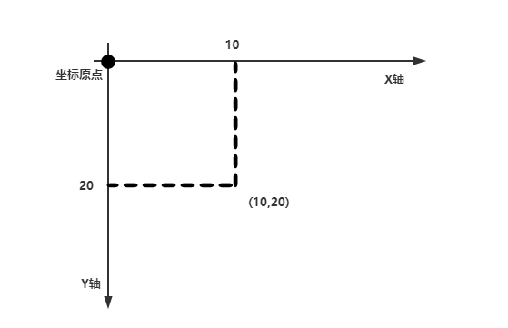

## 坐标体系-介绍

坐标原点位于左下角，以像素为单位，X轴表示当前位置为水平方向，举例坐标原点x个像素，Y轴表示当前位置为垂直方向，距离坐标原点y个像素



## 坐标体系-像素

计算机在屏幕上显示的内容都是由屏幕上的每一个像素组成


## 绘图原理	

- Component类提供了两个和绘图相关最重要的方法
- paint(Graphics g)绘制组件的外观
- repaint()刷新组件的外观


当组件第一次在屏幕显示的时候，程序会自动调用paint()方法绘制组件

以下情况下paint()将会被调用：

1. 窗口最小化，在最大化
2. 窗口的大小发生变化
3. repaint方法被调用


## 定义窗口

```java
public class DrawCircle extends JFrame{		//JFrame就是一个窗口
	public static void main(String[] args) {
		new DrawCircle();
	}

	public DrawCircle(){
		//定义一个面板
		MyPanel myPanel = new MyPanel();
		//将面板放入到窗口中
		this.add(myPanel);
		//定义窗口的大小
		this.setSize(500,500);
		//显示窗口
		this.setVisible(true);
        //点击关闭则程序退出执行
		this.setDefaultCloseOperation(JFrame.EXIT_ON_CLOSE);
	}
}
```


## 实现绘制方法

```java
//先定义一个MyPanel类，继承JPanel类，画图形，就在这个类中画
class MyPanel extends JPanel{
	//说明：
	//1、MyPanel对象就是一个花瓣
	//2、Graphics g 可以将g理解成一支画笔
	//3、Graphics提供的绘图的方法
	@Override
	public void paint(Graphics g) {		//绘图方法
		super.paint(g);	//调用父类的方法完成初始化
		g.drawOval(0,0,100,100);
	}
}
```


## 绘图方法

Graphics类可以理解成画笔，提供了各种绘制图形的方法

1、画直线 drawLine()

```java
//画直线
g.drawLine(10,10,100,100);
```

2、画矩形边框 drawRect()

```java
//画矩形边框
g.drawRect(100,100,200,200);
```

3、画椭圆边框 drawOval()

```java
//画矩形边框
g.drawRect(100,100,200,200);
```

4、填充矩形 fillRect()

```java
//1、设置画笔的颜色
g.setColor(Color.black);
//2、画矩形
g.fillRect(100,100,200,200);
```

5、填充椭圆 fillOval

```java
//1、设置画笔的颜色
g.setColor(Color.black);
//2、画椭圆
g.fillOval(100,100,200,200);
```

6、画图片 drawImage()

```java
//1、加载图片资源, /m01.jpg表示在该项目的根目录去获取m01.jpg图片资源
Image image = Toolkit.getDefaultToolkit().getImage(Panel.class.getResource("/m01.jpg"));
//2、显示图片
g.drawImage(image,10,10,500,500,this);
```

7、画字符串 drawString()

8、设置画笔的字体 setFont()

9、设置画笔的颜色 setColor()


## JFrame类方法

- add()：将面板放入到窗口中
- setSize()：定义窗口的大小
- setVisible()：显示窗口
- setDefaultCloseOperation()：点击关闭则程序退出执行
- addKeyListener()：可以监听键盘事件，即可以监听到面板放生的键盘事件