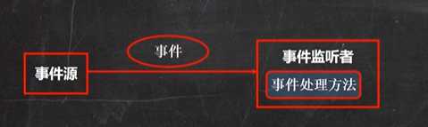
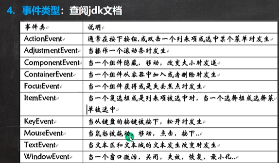

## KeyListener接口

监听器，可以监听事件

### 基本说明

Java事件处理时采用"委派事件模型"。当事件发生时，产生事件的对象，会把此"信息"传递给"事件的监听者"处理，这里所说的"信息"实际商就是Java.awt.event事件类库里某个类所创建的对象，把它称为"事件的对象"。



- 事件源：一个产生事件的对象，比如按钮，窗口等

- 事件：事件就是承载事件源状态改变时的对象，比如当键盘事件、鼠标事件、窗口事件等等，会生成一个事件对象，该对象保存着当前事件很多信息，比如KeyEvent对象含有被按下键的Code值。

- 事件监听器：
  
  - 当事件源产生一个事件，可以传送给事件监听者处理
  - 事件监听者实际上就是一个类，该类实现了某个事件监听者接口
  - 事件监听器接口有多种，不同的事件监听器接口可以监听不同的事件，一个类可以实现多个监听接口
  - 这些接口在java.awt.event包和javax.swing.event包中定义

```java
//有字符输出时，该方法就会触发
@Override
public void keyTyped(KeyEvent e) {

}

//当某个键按下，该方法会触发
@Override
public void keyPressed(KeyEvent e) {
    //处理小球移动
    if (e.getKeyCode() == KeyEvent.VK_DOWN){        //向下箭头
        y++;
    }else if(e.getKeyCode() == KeyEvent.VK_UP){        //向上箭头
        y--;
    }else if (e.getKeyCode() == KeyEvent.VK_LEFT){    //向左箭头
        x--;
    }else if (e.getKeyCode() == KeyEvent.VK_RIGHT){    //向右箭头
        x++;
    }
    //面板重绘
    this.repaint();
}

//当某个键释放（松开），该方法会触发
@Override
public void keyReleased(KeyEvent e) {

}
```

KeyEvent常用属性：

- VK_DOWN：向下箭头
- VK_UP：向上箭头
- VK_LEFT：向左箭头
- VK_RIGHT：向右箭头

### 事件类型

