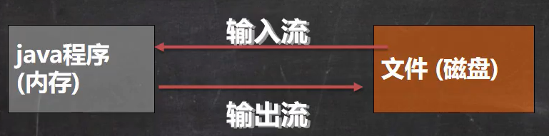
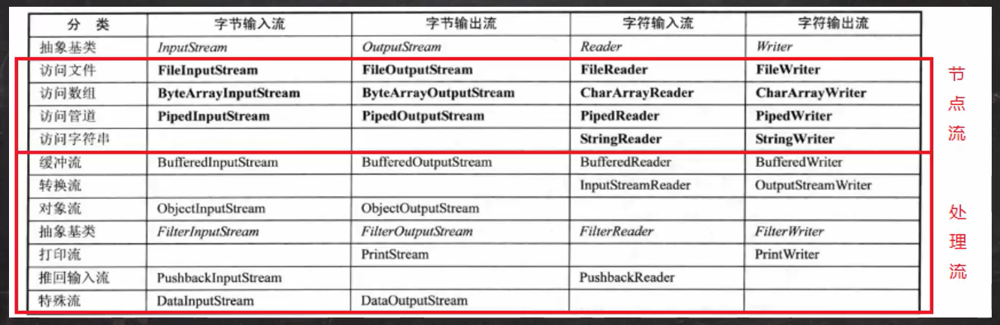
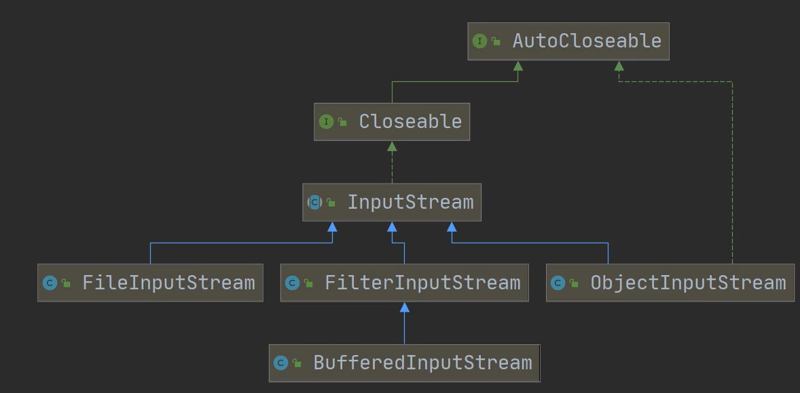
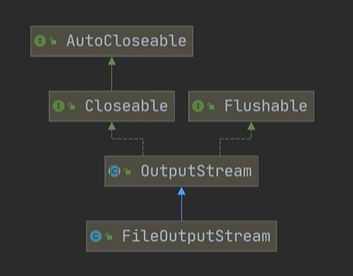
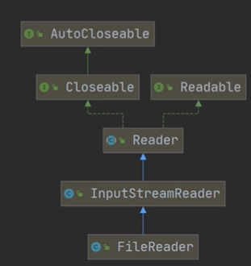
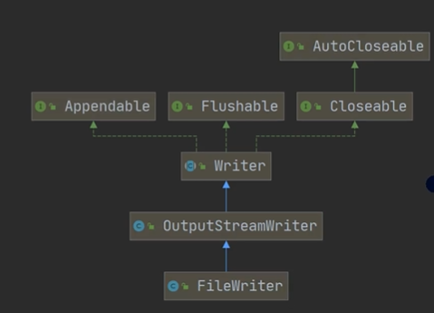
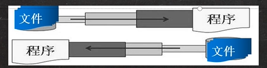

## 文件

文件是保存数据的地方，比如经常使用的word文档

### 文件流

文件在程序中是以流的形式操作的



- 输入流：数据从数据源（文件）到程序（内存）的路径
- 输出流：数据从程序（内存）到数据源（文件）的路径

### 常用文件操作-创建文件

- new File(String pathname) ：根据路径构建一个File对象
- new File(File parent, String child)：根据父目录文件 + 子路径构建
- new FIle(String parent, String child)：根据父目录 + 子路径构建

### 常用文件操作-获取文件的相关信息

- getName：获取文件的名字
- getAbsolutePath：获取文件绝对路径
- getParent：获取文件父级目录
- length：获取文件的字节
- exists：判断是否存在某个文件
- isFile：判断是否是一个文件
- isDirectory：判断是否是一个目录

### 常用文件操作-目录的操作和文件删除

- mkdir：创建一级目录
- mkdirs：创建多级目录
- delete：删除空目录或文件

### IO流原理

I/O技术是非常实用的技术，用于处理数据传输。如：读/写文件，网络通讯等

输入input：读取外部数据（磁盘、光盘等存储设备的数据）到程序（内存）中

输出output：将程序（内存）数据输出到磁盘、光盘等存储设备中

### 流的分类

- 按操作数据单位不同分为**字节流（8 bit），字符流（按字符）**
- 按数据流的流向不同分为：**输入流，输出流**
- 按流的角色的不同分为：**节点流，处理流/包装流**

| 抽象基类 | 字节流          | 字符流    |
| ---- | ------------ | ------ |
| 输入流  | InputStream  | Reader |
| 输出流  | OutputStream | Writer |



### InputStream字节输入流

#### 常用子类

- FileInputStream：文件输入流
- BufferedInputStream：缓冲字节输入流
- ObjectInputstream：对象字节输入流



#### FileInputStream类

##### 创建 FileInputStream 对象

```java
FileInputStream fileInputStream = null;
try {
    //创建 FileInputStream 对象, 用于读取文件
     fileInputStream = new FileInputStream(filePath);
} catch (FileNotFoundException e) {
    e.printStackTrace();
}finally {
    //关闭文件流, 释放资源
    try {
        fileInputStream.close();
    } catch (IOException e) {
        e.printStackTrace();
    }
}
```

##### 常用方法

- read()：从输入流中读取一个字节数据, 如果没有输入, 该方法则会终止。返回-1, 表示读取完毕【效率低】
- read(byte[] b)：从输入流读取最多b.length字节的数据到字节数组。返回-1, 表示读取完毕，读取正常则返回实际读取的字节数【效率高】

### OutputStream字节输出流

常用子类：FileOutputStream



#### FileOutputStream类

##### 创建 FileOutputStream 对象

```java
FileOutputStream fileOutputStream = null;

try {
    //创建 FileOutputStream 对象，默认会覆盖原来的内容，如果想以追加的方式写入可以在第二个参数为true
    fileOutputStream = new FileOutputStream(filePath);
} catch (IOException e) {
    e.printStackTrace();
}finally {
    try {
        fileOutputStream.close();
    } catch (IOException e) {
        e.printStackTrace();
    }
}
```

##### 常用方法：write

### Reader字符输入流



#### FileReader类

##### 常用方法

- new FileReader(File/String)
- read：每次读取单个字符，返回该字符，如果到文件末尾，返回-1
- read(char[])：批量读取多个字符到数组，返回读取到的字符数，如果到文件末尾，返回-1

### Write字符输出流

#### FileWrite类



##### 常用方法

- new FileWriter(File/String)：覆盖模式，相当于流的指针在首端
- new FileWriter(File/String,true)：追加模式，相当于流的指针在尾端
- write(int)：写入单个字符
- write(char[])：写入指定数组
- write(char[]，off，len)：写入指定数组的指定部分
- write(String)：写入整个字符串
- write(String，off，len)：写入字符串的指定部分

#### 注意：FileWrite使用后，必须要关闭（close）或者刷新（flush），否则写入不到指定的文件

### 节点流和处理流

- 节点流可以从一个特定的数据源读写数据，如：FileReader、FileWriter


- 处理流（也叫包装流）是"连接"在已存在的流（节点流或处理流）之上，为程序提供更为强大的读写功能，如：BufferedReader、BufferedWriter，关闭处理流时，只需关闭外层流



#### 节点流和处理流的区别和联系

- 节点流是底层流/低级流，直接跟数据源相接
- 处理流包装节点流，既可以消除不同节点流的实现差异，也可以提供更方便的方法来完成输入输出
- 处理流（也叫包装流）对节点流进行包装，使用了修饰器设计模式，不会直接与数据源相连

#### 处理流的功能主要体现

- 性能的提高：主要以增加缓冲的方式来提高输入输出的效率
- 操作的便捷：处理流可能提供了一系列便捷的方法来一次输入输出大批量的数据，使用更加灵活方便

### BufferedReader类和BufferedWriter类

只用用于读取文本文件，并显示在控制台

#### BufferedReader类

```java
BufferedReader bufferedReader = null;
try {
    //创建BufferedReader对象
    bufferedReader = new BufferedReader(new FileReader(filePath));
} catch (IOException e) {
    e.printStackTrace();
}finally {
    try {
        //关闭流, 只需关闭 BufferedReader, 因为底层会自动关闭节点流
        bufferedReader.close();
    } catch (IOException e) {
        e.printStackTrace();
    }
}
```

#### BufferedWriter类

```java
BufferedWriter bufferedWriter = null;
try {
    //创建BufferedWriter对象
    bufferedWriter = new BufferedWriter(new FileWriter(filePath));
    bufferedWriter.write("hello1, world");
    bufferedWriter.newLine();
    bufferedWriter.write("hello2, world");
    bufferedWriter.newLine();
    bufferedWriter.write("hello3, world");
} catch (IOException e) {
    e.printStackTrace();
} finally {
    try {
        bufferedWriter.close();
    } catch (IOException e) {
        e.printStackTrace();
    }
}
```

### BufferedInputStream和BufferedOutputStream

字节流，实现缓冲的输出流，可以将多个字节写入底层输出流中，而不必对每次字节写入调用底层系统

### 对象流-ObjectInputStream和ObjectOutputStream

功能：提供了对基本类型或对象类型的序列化和反序列化方法

ObjectOutputStream：提供序列化功能

ObjectInputStream：提供反序列化功能

#### 序列化和反序列化

- 序列化：保存数据时，保存数据的值和数据类型
- 反序列化：恢复数据时，恢复数据的值和数据类型
- 需要让某个对象支持序列化机制，则必须让其类是可序列化的，为了让某个类是可序列化，该类必须实现如下两个接口之一：
  - Serializable    //这是个标记接口，没有任何方法【推荐使用】
  - Externalizable

#### 注意事项和细节说明

- 读写顺序要一致
- 实现序列化或反序列化对象，需要实现Serializable
- 序列化的类中建议添加SerialVersionUID，为了提高版本的兼容性
- 序列化对象时，默认将里面所有属性都进行序列化，除了Static或transient修饰的成员
- 序列化对象时，要求里面属性的类型也需要实现序列化接口
- 序列化具备可继承性，如果某类已经实现序列化，则它的所有子类也默认实现序列化

### 标准输入输出流

|                | 类型          | 默认设备 |
| -------------- | ----------- | ---- |
| System.in标准输入  | InputStream | 键盘   |
| system.out标准输出 | PrintStream | 显示器  |

### 转换流-InputStreamReader和OutputStreamWriter

#### 介绍

- InputStreamReader：Reader的子类，可以将InputStream（字节流）包装成Reader（字符流）
- OutputStreamWriter：Writer的子类，实现将OutputStream（字节流）包装成Writer（字符流）
- 当处理纯文本数据时，使用字符流效率更高，并且可以有效解决中文问题，所有建议将字节流转换成字符流
- 可以在使用时指定编码格式

### 打印流-PrintStream 和 PrintWriter

只有输出流，没有输入流

| 打印流         | 字节/字符 |
| ----------- | ----- |
| PrintStream | 字节流   |
| PrintWriter | 字符流   |

### Properties类

专门用于读写配置文件的集合类

配置文件的格式：

键=值

键=值

#### 常见方法

- load：加载配置文件的键值对到Properties对象
- list：将数据显示到指定设备
- getProperty(ket)：根据键获取值
- setProperty(key，value)：设置键值对到Properties对象
- store：将Properties中的键值对存储到配置文件中，如果含有中文，会存储为Unicode编码