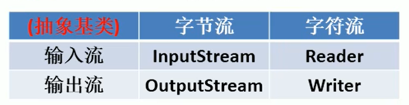
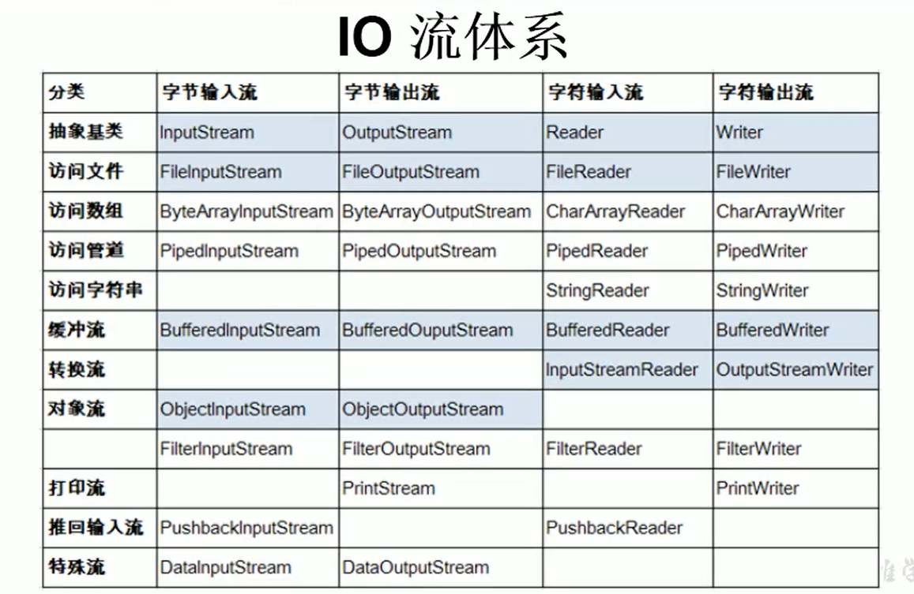

## IO流

I/O是Input/Output的缩写，I/O技术是非常实用的技术，用于处理设备之间的数据传输。如：读/写文件，网络通讯等

- **输入Input：** 读取外部数据（磁盘、光盘等存储设备的数据）到程序（内存）中

- **输出Output：** 将程序（内存）数据输出到磁盘、光盘等存储设备中



### 流的分类

- 按操作数据单位不同分为：字节流（8 bit）、字符流（16 bit）

- 按数据流的流向不同分为：输入流、输出流

- 按流的角色不同分为：节点流、处理流

### IO体系



### File类

java.io.file类：文件和文件目录路径的抽象表示形式，与平台无关

**File类对象，可以代表一个文件或者一个文件目录**

File类**可以实现新建、删除、重命名文件和目录等操作，但是File类不能直接访问文件内容本身**

如果需要访问文件内容本身，需要使用输入流/输出流

#### 创建File类实例

- public File(String pathname)：以pathname为路径创建File对象，可以是绝对或相对路径，如果是相对路径，则默认为当前路径在系统属性user.dir中存储

- public File(String parent, String child)：以parent为父路径，child为子路径创建File对象

- public File(File parent, String child)：根据一个父File对象和子路径创建File对象

```java
//创建实例方式一
File relativePath = new File("hello.txt");  //相对路径
File absolutelyPath = new File("D:\\hello.txt");    //绝对路径
System.out.println("相对路径：" + relativePath);     //输出：相对路径：hello.txt
System.out.println("绝对路径：" + absolutelyPath);   //输出：绝对路径：D:\hello.txt

//创建实例方式二
File path = new File("D:\\", "java");
System.out.println("第二种方式：" + path);    //输出：第二种方式：第二种方式：D:\java

//创建实例方式三
File file = new File(path, "hello.txt");
System.out.println("第三种方式：" + file);    //输出：第三种方式：D:\java\hello.txt
```

#### 路径分隔符

路径中每级目录之间使用一个路径分隔符隔开

路径分隔符与系统相关：

- Window和DOS系统默认使用 "\" 来表示

- UNIX和URL使用 "/" 来表示

Java程序支持跨平台运行，因此路径分隔符要慎用

为了解决这个隐患，File类提供了一个常量：

public static final String separator：根据操作系统，动态的提供分隔符，代码如下：

```java
File file = new File("d:" + File.separator + "hello.txt");
```

#### 常用方法

- 获取
  
  - public String getAbsolutePath()：获取绝对路径
  
  - public String getPath()：获取路径
  
  - public String getName()：获取名字
  
  - public String getParent()：获取上层文件目录路径。若无，则返回null
  
  - public long length()：获取文件长度（字节），不能获取目录的长度
  
  - public long lastModified()：获取最后一次的修改时间，毫秒数
  
  - public String[] list()：获取指定目录下的所有文件或者文件目录的名称数组
  
  - public File[] listFiles()：获取指定目录下的所有文件或者文件目录的File数组

- 重命名
  
  - public boolean renameTo(File dest)：将文件重命名为指定的文件路径，需要保证重命名的文件存在，且dest不能在硬盘中存在

- 判断
  
  - public boolean isDirectory()：判断是否是文件目录
  
  - public boolean isFile()：判断是否是文件
  
  - public boolean exists()：判断是否存在
  
  - public boolean canRead()：判断是否可读
  
  - public boolean canWrite()：判断是否可写
  
  - public boolean isHidden()：判断是否隐藏

- 创建
  
  - public boolean createNewFile()：创建文件，若文件存在，则不创建，返回false
  
  - public boolean mkdir()：创建文件目录，如果此文件目录存在，则不创建，如果此文件目录的上层目录不存在，也不创建
  
  - public boolean mkdirs()：创建文件目录，如果上层文件目录不存在，则一起创建了

- 删除
  
  - public boolean delete()：删除文件或者文件夹

**注意：如果要删除一个文件目录，注意该文件目录下面不能包含文件或者文件目录**

### FileReader类

- 用于读取文件字符

- 为了保证流资源一定执行关闭操作，需要使用 ---> try-catch-finally

#### read()方法

- 读取文件一定要存在，否则就会报FileNotFoundException异常

- read()方法表示每次读入一个字符

- read()方法，返回读入的一个字符，如果达到文件末尾，返回-1
  
  ```java
  @Test
      public void testFileReader1(){
          FileReader fileReader = null;
          try {
              // 1.实例化File类的对象，指明要操作的文件
              File file = new File("hello.txt");
  
              // 2.提供具体的流
              fileReader = new FileReader(file);
  
              // 3.数据的读入，使用空参read()方法
              int data = 0;
              while ((data = fileReader.read()) != -1){
                  System.out.print((char) data);
              }
          } catch (IOException e) {
              e.printStackTrace();
          } finally {
              // 4.流的关闭
              if (fileReader != null){
                  try {
                      fileReader.close();
                  } catch (IOException e) {
                      e.printStackTrace();
                  }
              }
          }
      }
  ```

#### read(char[] cbuf)方法

- 解决效率问题
  
  ```java
      @Test
      public void testFileReader2(){
          FileReader fileReader = null;
          try {
              // 1.实例化File类的对象，指明要操作的文件
              File file = new File("hello.txt");
  
              // 2.提供具体的流
              fileReader = new FileReader(file);
  
              // 3.数据的读入，使用空参read()方法
              char[] chars = new char[1024];
              int len = 0;
              while ((len = fileReader.read(chars)) != -1){
                  // 方式一
                  //for (int i = 0; i < len; i++) {
                  //    System.out.print(chars[i]);
                  //}
  
                  // 方式二
                  String s = new String(chars, 0, len);
                  System.out.print(s);
              }
          } catch (IOException e) {
              e.printStackTrace();
          } finally {
              // 4.流的关闭
              if (fileReader != null){
                  try {
                      fileReader.close();
                  } catch (IOException e) {
                      e.printStackTrace();
                  }
              }
          }
      }
  ```

### FileWriter类

- 从内存中写出数据到硬盘的文件中

#### write()方法

- 对应的File可以不存在，并不会报异常
  
  - 如果对应的File不存在，在输出的过程中，会自动创建文件
  
  - 如果对应的File存在：
    
    - 使用流的构造器：FileWriter(file, false); 或者 FileWriter(file);   // 对原有文件的覆盖
    
    - 使用流的构造器：FileWriter(file, true); // 对原有文件的追加
  
  ```java
      @Test
      public void testFileWriter1(){
          FileWriter fileWriter = null;
          try {
              // 1.提供File类的对象，指明要写出到的文件
              File file = new File("hello1.txt");
  
              // 2.提供FileWriter的对象，用于数据的写出
              fileWriter = new FileWriter(file);
  
              // 3.写出的操作
              fileWriter.write("我爱Java".toCharArray());
              fileWriter.write("我爱学习");
          } catch (IOException e) {
              e.printStackTrace();
          } finally {
              // 4.流资源的关闭
              if (fileWriter != null){
                  try {
                      fileWriter.close();
                  } catch (IOException e) {
                      e.printStackTrace();
                  }
              }
          }
      }
  ```

### 实现文本文件的复制

```java
    @Test
    public void testFileReaderWriter(){
        FileReader fileReader = null;
        FileWriter fileWriter = null;
        try {
            // 1.创建File类的对象，指明读入和写出的文件
            File srcFile = new File("hello.txt");
            File destFile = new File("copyFile.txt");

            // 2.创建字符输入流和字符输出流的对象
            fileReader = new FileReader(srcFile);
            fileWriter = new FileWriter(destFile);

            // 3.数据的读入和写出操作
            char[] chars = new char[1024];
            int len; // 记录每次读入到chars数组中的数据长度
            while ((len = fileReader.read(chars)) != -1){
                fileWriter.write(chars, 0 , len);
            }
        } catch (IOException e) {
            e.printStackTrace();
        } finally {
            // 4.关闭资源
            if (fileReader != null){
                try {
                    fileReader.close();
                } catch (IOException e) {
                    e.printStackTrace();
                }
            }
            if (fileWriter != null){
                try {
                    fileWriter.close();
                } catch (IOException e) {
                    e.printStackTrace();
                }
            }
        }
    }
```

### 字符流的缺点

- 不能使用字符流来处理图片等字节数据

### FileInputStream类

- 和FileReader类类似

- 对中文字符读入时，可能会出现乱码的情况
  
  ```java
      @Test
      public void testFileInputStream1(){
          FileInputStream fileInputStream = null;
          try {
              //1. File类的实例化
              File file = new File("hello.txt");
  
              //2. FileInputStream的实例化
              fileInputStream = new FileInputStream(file);
  
              byte[] bytes = new byte[5];
              int len;
              while ((len = fileInputStream.read(bytes)) != -1){
  
                  String value = new String(bytes, 0, len);
                  System.out.print(value);
              }
  
          } catch (IOException e) {
              e.printStackTrace();
          }finally {
              try {
                  if (fileInputStream != null){
                      fileInputStream.close();
                  }
              } catch (IOException e) {
                  e.printStackTrace();
              }
          }
      }
  ```

### FileOutputStream类

- 和FileWriter类类似

- 对于中文字符写入时可能出现乱码情况
  
  ```java
      @Test
      public void testFileOutStream(){
          FileOutputStream fileOutputStream = null;
          try {
              //1. File类的实例化
              File file = new File("hello.txt");
  
              //2. FileOutputStream实例化
              fileOutputStream = new FileOutputStream(file);
  
              //3. 写入操作
              fileOutputStream.write("this is FileOutputStream".getBytes());
  
          } catch (IOException e) {
              e.printStackTrace();
          }finally {
  
              //4. 关闭当前流
              try {
                  if (fileOutputStream != null){
                      fileOutputStream.close();
                  }
              } catch (IOException e) {
                  e.printStackTrace();
              }
          }
      }
  ```

### 复制图片

```java
    @Test
    public void test(){
        FileInputStream fileInputStream = null;
        FileOutputStream fileOutputStream = null;
        try {
            // 1.创建File类的对象，指明读入和写出的文件
            File srcFile = new File("image.jpg");
            File destFile = new File("copyImage.jpg");

            // 2.创建字符输入流和字符输出流的对象
            fileInputStream = new FileInputStream(srcFile);
            fileOutputStream = new FileOutputStream(destFile);

            // 3.数据的读入和写出操作
            byte[] bytes = new byte[1024];
            int len;
            while ((len = fileInputStream.read(bytes)) != -1){
                fileOutputStream.write(bytes, 0, len);
            }
        } catch (IOException e) {
            e.printStackTrace();
        } finally {
            // 4.关闭资源
            if (fileInputStream != null){
                try {
                    fileInputStream.close();
                } catch (IOException e) {
                    e.printStackTrace();
                }
            }
            if (fileOutputStream != null){
                try {
                    fileOutputStream.close();
                } catch (IOException e) {
                    e.printStackTrace();
                }
            }
        }
    }
```

### 字符流和字节流的使用场景

- 对于文本文件（.txt、.c、.cpp、.java等），使用字符流处理

- 对于非文本文件（.jpg、.mp3、.mp4等），使用字节流处理

### 缓冲流

- 主要用来提供流的读取、写入的速度，主要有四个类：
  
  - BufferedInputStream类
  
  - BufferedOutputStream类
  
  - BufferedReader类
  
  - BufferedWriter类

- 关闭流的时候，只需关闭缓冲流即可，缓冲流内部自动会关闭其他流

#### 使用缓冲流实现图片的复制

```java
    @Test
    public void test1(){
        BufferedInputStream bufferedInputStream = null;
        BufferedOutputStream bufferedOutputStream = null;
        try {
            // 1.创建File类的对象
            File srcFile = new File("image.jpg");
            File destFile = new File("bufferCopyImage.jpg");

            // 2.创建流
            // 2.1 创建字节流
            FileInputStream fileInputStream = new FileInputStream(srcFile);
            FileOutputStream fileOutputStream = new FileOutputStream(destFile);
            // 2.2 创建缓存流
            bufferedInputStream = new BufferedInputStream(fileInputStream);
            bufferedOutputStream = new BufferedOutputStream(fileOutputStream);

            // 3.读取、写入
            byte[] bytes = new byte[1024];
            int len;
            while ((len = bufferedInputStream.read(bytes)) != -1){
                bufferedOutputStream.write(bytes, 0, len);
            }
        } catch (IOException e) {
            e.printStackTrace();
        } finally {
            // 4.资源关闭
            if (bufferedInputStream != null){
                try {
                    bufferedInputStream.close();
                } catch (IOException e) {
                    e.printStackTrace();
                }
            }
            if (bufferedOutputStream != null){
                try {
                    bufferedOutputStream.close();
                } catch (IOException e) {
                    e.printStackTrace();
                }
            }
        }
    }
```

#### 使用缓冲流实现文本文件的复制

```java
    @Test
    public void test2(){
        BufferedReader bufferedReader = null;
        BufferedWriter bufferedWriter = null;
        try {
            // 1.创建File类的对象
            File srcFile = new File("hello.txt");
            File destFile = new File("bufferCopyTxt.txt");

            // 2.创建流
            bufferedReader = new BufferedReader(new FileReader(srcFile));
            bufferedWriter = new BufferedWriter(new FileWriter(destFile));

            // 3.读取、写入
            char[] chars = new char[1024];
            int len;
            while ((len = bufferedReader.read(chars)) != -1){
                bufferedWriter.write(chars, 0, len);
            }
        } catch (IOException e) {
            e.printStackTrace();
        } finally {
            // 4.资源关闭
            if (bufferedReader != null){
                try {
                    bufferedReader.close();
                } catch (IOException e) {
                    e.printStackTrace();
                }
            }
            if (bufferedWriter != null){
                try {
                    bufferedWriter.close();
                } catch (IOException e) {
                    e.printStackTrace();
                }
            }
        }
    }
```

### 转换流

- 提供了字节流和字符流之间的转换，主要有两个转换流：
  
  - InputStreamReader：将InputStream转换成Reader
  
  - OutputStreamWriter：将Writer转换成成OutputStream

- 当字节流中数据都是字符时，转成字符流操作更加高效

#### InputStreamReader类

```java
    @Test
    public void test1(){
        InputStreamReader inputStreamReader = null;
        try {
            FileInputStream fileInputStream = new FileInputStream("hello.txt");

            // 使用默认字符集
            inputStreamReader = new InputStreamReader(fileInputStream);
            // 参数2指定了字符集
            //InputStreamReader inputStreamReader = new InputStreamReader(fileInputStream, "UFT-8");

            char[] chars = new char[1024];
            int len;
            while ((len = inputStreamReader.read(chars)) != -1){
                System.out.print(new String(chars, 0, len));
            }
        } catch (IOException e) {
            e.printStackTrace();
        } finally {
            if (inputStreamReader != null){
                try {
                    inputStreamReader.close();
                } catch (IOException e) {
                    e.printStackTrace();
                }
            }
        }
    }
```

### 标准输入、输出流

- System.in和System.out分别代表了系统标准的输入和输入设备

- 默认输入设备：键盘，输出设备：显示器

- System.in的类型：InputStream

- System.out的类型：PrintStream

- 可以使用System类中的setIn()或者setOut()方式重新指定输入和输出的流

```java
public class InputTest {
    public static void main(String[] args) {
        BufferedReader bufferedReader = null;
        try {
            InputStreamReader inputStreamReader = new InputStreamReader(System.in);
            bufferedReader = new BufferedReader(inputStreamReader);
            while (true){
                String s = bufferedReader.readLine();
                if ("e".equalsIgnoreCase(s) || "exit".equalsIgnoreCase(s)){
                    System.out.println("退出程序");
                    break;
                }
            }
        } catch (IOException e) {
            e.printStackTrace();
        } finally {
            if (bufferedReader != null){
                try {
                    bufferedReader.close();
                } catch (IOException e) {
                    e.printStackTrace();
                }
            }
        }
    }
}
```

### 打印流

- 实现将基本数据类型的数据格式转换成字符串输出

- PrintStream和PrintWriter
  
  - 提供一系列重载的print()和printIn()方法，用于多种数据类型的输出
  
  - PrintStream和PrintWriter的输出不会抛出IOException异常
  
  - PrintStream和PrintWriter有自动flush功能
  
  - PrintStream打印的所有字符都是平台的默认字符编码转换成字节
  
  - 在需要写入字符时，使用PrintWriter类

### 数据流

- DataInputStream和DataOutputStream

- 主要用于读取和写出基本数据类型、String类的数据

- 读取不同类型的顺序需要和写入文件时的顺序保持一致

#### DataInputStream

- byte readByte()

- short readShort()

- char readChar()

- int readInt()

- long readLong()

- float readFloat()

- double readDouble()

- boolean readBoolean()

- String readUTF()

- void readFully(byte[] b)

#### DataOutputStream

- byte writeByte()

- short writeShort()

- char writeChar()

- int writeInt()

- long writeLong()

- float writeFloat()

- double writeDouble()

- boolean writeBoolean()

- String writeUTF()

- void writeFully(byte[] b)

```java
public class DataTest {
    @Test
    public void test1(){
        DataOutputStream dataOutputStream = null;
        try {
            dataOutputStream = new DataOutputStream(new FileOutputStream("data.txt"));
            dataOutputStream.writeUTF("张三");
            dataOutputStream.writeInt(18);
        } catch (IOException e) {
            e.printStackTrace();
        } finally {
            if (dataOutputStream != null){
                try {
                    dataOutputStream.close();
                } catch (IOException e) {
                    e.printStackTrace();
                }
            }
        }
    }

    @Test
    public void test2(){
        DataInputStream dataInputStream = null;
        try {
            dataInputStream = new DataInputStream(new FileInputStream("data.txt"));
            String s = dataInputStream.readUTF();
            int i = dataInputStream.readInt();

            System.out.println("读取到的姓名：" + s + ",读取到的年龄：" + i);
        } catch (IOException e) {
            e.printStackTrace();
        } finally {
            if (dataInputStream != null){
                try {
                    dataInputStream.close();
                } catch (IOException e) {
                    e.printStackTrace();
                }
            }
        }
    }
}
```

### 对象流

- 用于存储和读取基本数据类型数据或者对象的处理流

- ObjectInputStream和ObjectOutputStream

- 可以将Java中的对象写入到数据源中，也能把对象从数据源中还原回来

- **反序列：** 用ObjectOutputStream类保存基本数据类型或者对象的机制

- **反序列化：** 用ObjectInputStream类读取基本数据类型或者对象的机制

- ObjectInputStream和ObjectOutputStream不能序列化static和transient修饰的成员变量


#### 对象序列化机制

允许把内存中的Java对象转换成平台无关的二进制流，从而允许把这种二进制流持久地保存在磁盘上，或者通过网络将这种二进制传输到另一个网络节点。当其他程序获取到这种二进制，就可以恢复成原来的Java对象。

如果需要让某个对象支持序列化机制，则必须实现如下两个接口之一：

- **Serializable接口**

- **Externalizable接口**


#### 序列化

- 将内存中的Java对象保存到磁盘中或者通过网络传输出去

- 使用ObjectOutputStream实现
  
  ```java
      @Test
      public void test1(){
          ObjectOutputStream objectOutputStream = null;
          try {
              objectOutputStream = new ObjectOutputStream(new FileOutputStream("object.dat"));
  
              objectOutputStream.writeObject(new String("我爱Java"));
              objectOutputStream.flush(); // 刷新操作
          } catch (IOException e) {
              e.printStackTrace();
          } finally {
              if (objectOutputStream != null){
                  try {
                      objectOutputStream.close();
                  } catch (IOException e) {
                      e.printStackTrace();
                  }
              }
          }
      }
  ```

#### 反序列化

- 将磁盘中或者网络获取的Java对象解析

- 使用ObjectInputStream实现
  
  ```java
      @Test
      public void test2(){
          ObjectInputStream objectInputStream = null;
          try {
              objectInputStream = new ObjectInputStream(new FileInputStream("object.dat"));
  
              String str = (String) objectInputStream.readObject();
              System.out.println(str); // 输出：我爱Java
          } catch (IOException e) {
              e.printStackTrace();
          } catch (ClassNotFoundException e) {
              e.printStackTrace();
          } finally {
              try {
                  objectInputStream.close();
              } catch (IOException e) {
                  e.printStackTrace();
              }
          }
      }
  ```

#### 自定义类实现序列化和反序列化

- 如果想一个类是可序列化的，需要满足以下条件：
  
  - 需要实现序列化接口Serializable或者Externalizable
  
  - 自定义类需要提供一个全局常量：serialVersionUID
  
  - 除了自定义类需要实现接口外，还必须保证内部所有属性也是可序列化的（默认情况下，基本数据类型可序列化）

- 全局常量SerialVersionUID：
  
  - 用来表明类的不同版本间的兼容性。目的是以序列化对象进行版本控制，有关各个版本反序列化时是否兼容
  
  - 如果类没有显示定义这个变量，它的值是Java运行时环境根据类的内部细节自动生成。**若类的实例变量做了修改，serialVersionUID可能发生变化，所以反序列化时内容可能不同**

- 被static和transient修饰的成员变量不能被序列化
  
  - transient：被修饰的成员变量不能被序列化

```java
public class Person implements Serializable {

    public static final long serialVersionUID = 421L;

    private String name;
    private int age;
    private Account account;
    private static String sex;
    private transient String hobby;

    public Person() {
    }

    public Person(String name, int age, Account account) {
        this.name = name;
        this.age = age;
        this.account = account;
    }

    public static void setSex(String sex) {
        Person.sex = sex;
    }

    public void setHobby(String hobby) {
        this.hobby = hobby;
    }

    public String getName() {
        return name;
    }

    public void setName(String name) {
        this.name = name;
    }

    public int getAge() {
        return age;
    }

    public void setAge(int age) {
        this.age = age;
    }

    @Override
    public String toString() {
        return "Person{" +
                "name='" + name + '\'' +
                ", age=" + age +
                ", account=" + account +
                ", hobby='" + hobby + '\'' +
                ", sex='" + Person.sex + "\'" +
                '}';
    }
}

class Account implements Serializable{

    public static final long serialVersionUID = 422L;

    private double balance;

    public Account(double balance) {
        this.balance = balance;
    }

    @Override
    public String toString() {
        return "Account{" +
                "balance=" + balance +
                '}';
    }
}
```


### 随机存取文件流

- RandomAccessFile类声明在java.io包下，但是直接继承于Object类，并且实现了DataInput、DataOutput两个接口

- RandomAccessFile类支持“随机访问”的方式，程序可以直接跳到文件的任意地方来读、写文件
  
  - 支持只访问文件的部分内容
  
  - 可以向已存在的文件后追加内容

- RandomAccessFile对象包含一个记录指针，用于标识当前读写处的位置

- RandomAccessFile类对象可以自由移动记录指针
  
  - long getFilePointer()：获取文件记录指针的当前位置
  
  - void seek(long pos)：将文件记录指针定位到pos位置

- 创建RandomAccessFile类实例需要指定一个mode参数，该参数指定RandomAccessFile的访问模式：
  
  - r：以只读方式打开
  
  - rw：打开以便读取和写入
  
  - rwd：打开以便读取和写入，同步文件内容的更新
  
  - rws：打开以便读取和写入，同步文件内容和元数据的更新

- 如果模式为 r，则不会创建文件，而是会读取一个已经存在的文件，如果读取的文件不存在则会出现一场

- 如果默认是为rw读写，如果文件不存在则会创建文件，如果存在则不会创建，并且对原有内容进行覆盖操作
  
  ```java
      @Test
      public void test1(){
          RandomAccessFile randomAccessFile1 = null;
          RandomAccessFile randomAccessFile2 = null;
          try {
              randomAccessFile1 = new RandomAccessFile(new File("image.jpg"), "r");
              randomAccessFile2 = new RandomAccessFile(new File("image2.jpg"), "rw");
  
              byte[] bytes = new byte[1024];
              int len;
              while ((len = randomAccessFile1.read(bytes)) != -1){
                  randomAccessFile2.write(bytes, 0, len);
              }
          } catch (IOException e) {
              e.printStackTrace();
          } finally {
              if (randomAccessFile1 != null){
                  try {
                      randomAccessFile1.close();
                  } catch (IOException e) {
                      e.printStackTrace();
                  }
              }
              if (randomAccessFile2 != null){
                  try {
                      randomAccessFile2.close();
                  } catch (IOException e) {
                      e.printStackTrace();
                  }
              }
          }
      }
  ```
