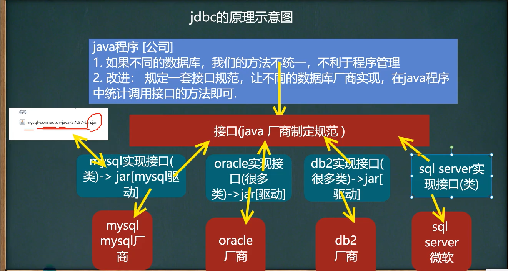
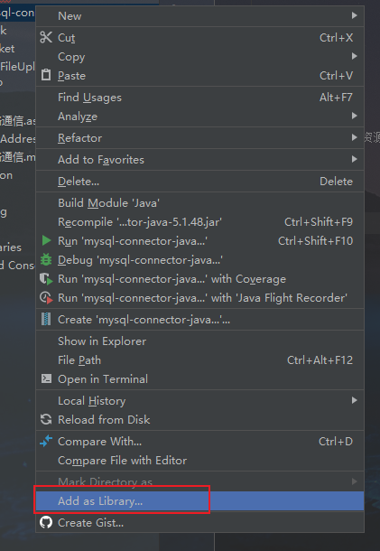
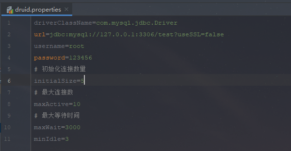
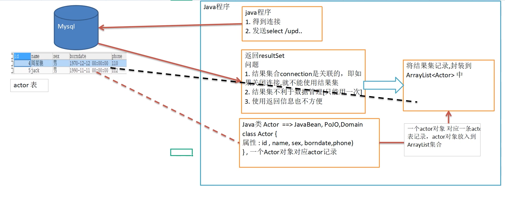

### JDBC概述

为访问不同数据库提供统一接口，为使用者屏蔽了细节

可以连接任何提供了JDBC驱动程序的数据库系统，完成对数据库的各种操作  

### JDBC原理



### JDBC编写步骤

1. 注册驱动 - 加载Driver类
2. 获取连接 - 得到Connection
3. 执行增删改查 - 发送SQL给mysql执行
4. 释放资源 - 关闭相关连接

驱动下载地址：[Maven Repository: mysql » mysql-connector-java (mvnrepository.com)](https://mvnrepository.com/artifact/mysql/mysql-connector-java)

参考资料：[(46条消息) （授人以鱼不如授人以渔）mysql-connector-java各种版本下载地址_我的博客-CSDN博客_mysql-connector-java](https://blog.csdn.net/weixin_41804049/article/details/87719574)

**将驱动加入项目**



**1、注册驱动**

```java
//1. 注册驱动
Driver driver = new Driver();
```

**2、得到连接**

```java
//2. 得到连接
//jdbc:mysql:// 表示协议，通过jdbc方式连接mysql
//localhost 表示主机, 可以时ip地址
//3306 表示mysql监听的端口
//test 表示连接的数据库
String url = "jdbc:mysql://localhost:3306/test";

//将用户名和密码放入properties对象中
Properties properties = new Properties();
properties.setProperty("user", "root");     //用户名
properties.setProperty("password", "123456");//密码

//获取连接
Connection connect = driver.connect(url, properties);
```

**3、执行sql**

```java
//3. 执行sql
String insertSql = "insert into actor value(null, 'Lcxuan', '男', '2021-11-15', '12345678901')";
//用于执行静态sql语句并返回其生成的结果对象
Statement statement = connect.createStatement();

//返回影响的行数
int rows = statement.executeUpdate(insertSql);

System.out.println(rows > 0 ? "成功" : "失败");
```

**4、关闭连接资源**

```java
//4. 关闭连接资源
statement.close();
connect.close();
```

### 获取数据库连接5种方式

**方式一：直接使用Driver驱动类**

```java
//注册驱动
Driver driver = new Driver();

String url = "jdbc:mysql://localhost:3306/test";

Properties properties = new Properties();
properties.setProperty("user", "root");     //用户名
properties.setProperty("password", "123456");//密码
Connection connect = driver.connect(url, properties);
```

**方式二：通过反射获取Driver驱动类**

```java
//使用反射加载Driver类
Class<?> aClass = Class.forName("com.mysql.jdbc.Driver");
Driver driver = (Driver)aClass.getConstructor().newInstance();

String url = "jdbc:mysql://localhost:3306/test";
Properties properties = new Properties();
properties.setProperty("user", "root");     //用户名
properties.setProperty("password", "123456");//密码

Connection connect = driver.connect(url, properties);
System.out.println(connect);
```

**方式三：使用DriverManager替代Driver进行统一管理**

```java
//使用反射加载Driver
Class<?> aClass = Class.forName("com.mysql.jdbc.Driver");
Driver driver = (Driver)aClass.getConstructor().newInstance();

String url = "jdbc:mysql://localhost:3306/test";
String user = "root";
String password = "123456";

//注册DriverManager驱动
DriverManager.registerDriver(driver);

//连接
Connection connection = DriverManager.getConnection(url, user, password);
System.out.println(connection);
```

**方式四：自动完成驱动**

```java
//Class.forName("com.mysql.jdbc.Driver");

String url = "jdbc:mysql://localhost:3306/test";
String user = "root";
String password = "123456";

Connection connection = DriverManager.getConnection(url, user, password);
System.out.println("第四种：" + connection);

Statement statement = connection.createStatement();
```

mysql5.1.6之后可以无需Class.forName("com.mysql.jdbc.Driver");【建议写上】

jdk1.5之后使用jdbc4，会自动调用驱动包下META-INF\services\java.sql.Driver文本中的类名称去注册

**方式五：在方式四的基础上改进，增加配置文件，让连接mysql更加灵活**

```java
//通过properties对象获取配置文件的信息
Properties properties = new Properties();
properties.load(new FileInputStream("src\\jdbc\\mysql.properties"));

//获取相关的值
String user = properties.getProperty("user");
String password = properties.getProperty("password");
String url = properties.getProperty("url");
String driver = properties.getProperty("driver");

Class.forName(driver);
Connection connection = DriverManager.getConnection(url, user, password);
System.out.println(connection);
```

### ResultSet结果集

表示数据库结果集的数据表，通常通过执行查询数据库的语句生成

ResultSet对象保持一个光标指向其当前的数据行

next方法可以将光标移动到下一行，并且当没有更多行时返回false，可以在while循环遍历结果集

```java
//连接数据库
Driver driver = new Driver();
String url = "jdbc:mysql://localhost:3306/test";
Properties properties = new Properties();
properties.setProperty("user", "root");
properties.setProperty("password", "123456");
Connection connect = driver.connect(url, properties);
Statement statement = connect.createStatement();

//查询语句
String selectSql = "select id, name, sex, borndate from actor";

//查询数据库
ResultSet resultSet = statement.executeQuery(selectSql);

//获取数据
while (resultSet.next()){
    int id = resultSet.getInt("id");
    String name = resultSet.getString("name");
    String sex = resultSet.getString("sex");
    Date date = resultSet.getDate("borndate");
    System.out.println(
        "当前id：" + id + "\n" +
        "当前name：" + name + "\n" +
        "当前sex：" + sex + "\n" +
        "当前date" + date + "\n"
    );
}

//关闭连接
resultSet.close();
statement.close();
connect.close();
```

### Statement

用于执行静态SQL语句并返回其生成的结果对象

连接建立后，可以通过三种方式对数据库进行访问，执行命名或SQL语句

1. Statement【存在SQL注入问题】
2. PreparedStatement【预处理】
3. CallableStatement【存储过程】

Statement对象执行SQL语句，存在SQL注入的风险【可以使用PreparedStatement防范SQL注入】

### PreparedStatement预处理

**预处理好处**

1. 不再使用+拼接sql语句，减少语法错误
2. 有效解决sql注入问题
3. 减少了编译次数，效率较高

执行的SQL语句中参数用问号来表示

```java
String sql = "select * from user where username = ? and password = ?";
```

调用setXXX()方法设置这些参数，这个方法有两个参数：

1. 设置SQL语句中参数的索引（从1开始）
2. 设置SQL语句中参数的值

调用executeQuery()：返回ResultSet对象

**查询**

```java
Driver driver = new Driver();
String url = "jdbc:mysql://localhost:3306/test";
Properties properties = new Properties();
properties.setProperty("user", "root");
properties.setProperty("password", "123456");
Connection connect = driver.connect(url, properties);

String selectSql = "select * from actor where name = ?";
//得到PreparedStatement对象
PreparedStatement preparedStatement = connect.prepareStatement(selectSql);
//给 ? 赋值
preparedStatement.setString(1, "Tom");

//执行查询
ResultSet resultSet = preparedStatement.executeQuery();

if (!resultSet.next()){
    System.out.println("登录失败");
}else {
    System.out.println("登录成功");
}

resultSet.close();
preparedStatement.close();
connect.close();
```

调用executeUpdate()：执行更新，包括增删改

**增加**

```java
Driver driver = new Driver();
String url = "jdbc:mysql://localhost:3306/test";
Properties properties = new Properties();
properties.setProperty("user", "root");
properties.setProperty("password", "123456");
Connection connect = driver.connect(url, properties);

String insertSql = "insert into user(username, password, phone, sex) values (?, ?, ?, ?)";
PreparedStatement preparedStatement = connect.prepareStatement(insertSql);

preparedStatement.setString(1, "测试");
preparedStatement.setString(2, "123456");
preparedStatement.setString(3, "12345678901");
preparedStatement.setString(4, "男");

int insertRows = preparedStatement.executeUpdate();

if (insertRows > 0){
    System.out.println("插入成功");
}

preparedStatement.close();
connect.close();
```

**更新**

```java
Driver driver = new Driver();
String url = "jdbc:mysql://localhost:3306/test";
Properties properties = new Properties();
properties.setProperty("user", "root");
properties.setProperty("password", "123456");
Connection connect = driver.connect(url, properties);

String updateSql = "update user set phone = ? where id = ?";
PreparedStatement preparedStatement = connect.prepareStatement(updateSql);
preparedStatement.setString(1, "12345678903");
preparedStatement.setInt(2, 3);

int updateRow = preparedStatement.executeUpdate();
if (updateRow > 0){
    System.out.println("修改成功");
}

connect.close();
preparedStatement.close();
```

**删除**

```java
Driver driver = new Driver();
String url = "jdbc:mysql://localhost:3306/test";
Properties properties = new Properties();
properties.setProperty("user", "root");
properties.setProperty("password", "123456");
Connection connect = driver.connect(url, properties);

String deleteSql = "delete from user where id = ?";
PreparedStatement preparedStatement = connect.prepareStatement(deleteSql);
preparedStatement.setInt(1, 3);

int deleteRow = preparedStatement.executeUpdate();

if (deleteRow > 0){
    System.out.println("删除成功");
}

preparedStatement.close();
connect.close();
```

### JDBC API


### 事务使用

JDBC程序中为了让多个SQL语句作为一个整体执行，需要使用事务

调用Connection的**setAutoCommit(false)**可以取消自动提交事务

在所有的sql语句都成功执行之后，调用**commit();**提交事务

在其中某个操作失败或者出现异常，调用**rollback();**方法回滚

```java
Driver driver = new Driver();
Properties properties = new Properties();
properties.setProperty("user", "root");
properties.setProperty("password", "123456");
String url = "jdbc:mysql://localhost:3306/test";

Connection connect = null;
PreparedStatement preparedStatement = null;
PreparedStatement preparedStatement1 = null;
try {
    connect =  driver.connect(url, properties);
    //开启事务, 设置connection 不自动提交
    connect.setAutoCommit(false);

    String updateJackSql = "update user set password = 12345678911 where id = 2";
    String updateTomSql = "update user set password = 123456785678 where id = 1";

    preparedStatement = connect.prepareStatement(updateJackSql);
    preparedStatement.executeUpdate();

    int i = 1 / 0;

    preparedStatement1 = connect.prepareStatement(updateTomSql);
    preparedStatement1.executeUpdate();

    //提交事务
    connect.commit();
}catch (Exception e){
    System.out.println("执行异常");
    //一旦出现异常进行回滚, rollback()默认回滚到事务开始位置
    connect.rollback();
    e.printStackTrace();
}

//关闭资源
preparedStatement.close();
connect.close();
```

### 批处理

当需要成批插入语句或更新语句，可以使用批处理，比单独提交处理更有效率

批处理语句：

1. addBatch()：添加需要批量处理的sql语句或参数
2. executeBatch()：执行批量处理语句
3. clearBatch()：清空批处理的语句

如果需要使用批处理功能，在url中加入参数**?rewriteBatchedStatements=true**

一般和PreparedStatement使用

```java
Driver driver = new Driver();
Properties properties = new Properties();
properties.setProperty("user", "root");
properties.setProperty("password", "123456");
//1、使用批处理, 需要加上?rewriteBatchedStatements=true
String url = "jdbc:mysql://localhost:3306/test?rewriteBatchedStatements=true";
Connection connect = driver.connect(url, properties);

String insertSql = "insert into user values(null, ?, ?, ?, ?)";
PreparedStatement preparedStatement = connect.prepareStatement(insertSql);

for (int i = 0; i < 5000; i++) {
    preparedStatement.setString(1, "用户" + i);
    preparedStatement.setString(2, i + "");
    preparedStatement.setString(3, i + "");
    preparedStatement.setString(4, "男");

    //2、将sql加入批量包
    preparedStatement.addBatch();
    if((i + 1) == 1000){
        //3、执行批处理
        preparedStatement.executeBatch();
        //4、清空批处理
        preparedStatement.clearBatch();
    }
}

preparedStatement.close();
connect.close();
```

### 传统连接数据问题

问题1：传统JDBC数据库连接使用DriverManager来获取，每次想数据库建立连接时都会将Connection加载到内存中，在验证IP地址、用户名和密码（耗时0.05s-1s），需要数据库连接时，会向数据库要一个，频繁进行数据库连接会占用很多的系统资源，**容易出现服务器崩溃**

问题2：每一次数据库连接，使用完需关闭连接，如果程序出现已成未能关闭，将出现数据库内存泄漏，最终导致重启数据库

问题3：传统获取连接方式，不能控制创建的连接数量，如果连接过多，可能会导致内存泄漏，Mysql崩溃

**解决方法：使用数据库连接池技术**

#### 数据库连接池

**1、原理**

预先在连接池创建一定数量的连接，当需要建立数据库，只需从“缓冲池”中获取一个即可

主要是负责管理和释放数据库连接，**允许应用程序重复使用一个现有的数据库连接**，而不是建立一个

当应用程序向连接池请求的连接数量大于最大连接数量，这些请求会加入到等待队列中


**2、数据库连接池种类**

使用javax.sql.DataSource来表示，DataSource是一个接口，该接口通常由第三方提供实现

**C3P0**：数据库连接池，速度相对较慢，稳定性不错

DBCP：数据库连接池，速度比C3P0较快，不稳定

Proxool：数据库连接池，有监控连接池状态功能，稳定比C3P0差点

BoneCP：数据库连接池，速度快

**Druid(德鲁伊)**：阿里提供的数据库连接池，集DBCP、C3P0、Proxool优点的数据库连接池

### C3P0使用

**方式一**

1. 创建数据源对象
2. 通过配置文件获取相关信息
3. 给数据源comboPooledDataSource设置相关参数
4. 初始化连接数和最大连接数
5. 获取数据库连接

```java
//1. 创建数据源对象
ComboPooledDataSource comboPooledDataSource = new ComboPooledDataSource();

//2. 通过配置文件获取相关的信息
Properties properties = new Properties();
properties.load(new FileInputStream("src\\com\\lcxuan\\jdbc_\\mysql.properties"));
String user = properties.getProperty("user");
String password = properties.getProperty("password");
String url = properties.getProperty("url");
String driver = properties.getProperty("driver");

//3. 给数据源comboPooledDataSource设置相关参数
comboPooledDataSource.setDriverClass(driver);
comboPooledDataSource.setJdbcUrl(url);
comboPooledDataSource.setUser(user);
comboPooledDataSource.setPassword(password);

//4. 初始化连接数和最大连接数
comboPooledDataSource.setInitialPoolSize(10);
comboPooledDataSource.setMaxPoolSize(50);

//5. 获取数据库连接
Connection connection = comboPooledDataSource.getConnection();
System.out.println("获取连接：" + connection);
connection.close();
```

**方式二：使用配置文件模板来完成**

使用**c3p0-config.xml模板文件**

```java
//1. 创建数据源对象
ComboPooledDataSource comboPooledDataSource = new ComboPooledDataSource("lcxuan");
//2. 获取连接
Connection connection = comboPooledDataSource.getConnection();
System.out.println("获取连接：" + connection);
```

c3p0-config.xml模板文件


### Druid使用

官方：[alibaba/druid: 阿里云计算平台DataWorks(https://help.aliyun.com/document_detail/137663.html) 团队出品，为监控而生的数据库连接池 (github.com)](https://github.com/alibaba/druid)

**配置文件**



```java
//1. 读取配置文件
Properties properties = new Properties();
properties.load(new FileInputStream("src\\com\\lcxuan\\jdbc_\\druid.properties"));

//2. 创建一个指定参数的数据库连接池
DataSource dataSource = DruidDataSourceFactory.createDataSource(properties);

//3. 获取数据库连接
Connection connection = dataSource.getConnection();

System.out.println("获取连接：" + connection);

//4. 关闭连接, 将连接的对象放回数据库连接池中, 而不是真正的关闭
connection.close();
```

### Apache --- DBUtils

**为何使用DButils**

问题1：关闭connection后，resultSet结果集无法使用

问题2：resultSet不利于数据的管理

问题3：返回的信息使用不方便



**基本介绍**

commons-dbutils：Apache组织提供的一个开源JDBC工具库，是针对JDBC的封装，能极大简化JDBC编码的工作量

QueryRunner类：该类封装了SQL的执行，线程安全，可以实现增删改查、批处理

ResultSetHandler接口：该接口用于处理java.sql.ResultSet将数据按要求转换为另外一种形式


**基本方法**

query()：执行sql语句，得到resultSet -----》 封装到ArrayList集合中

```java
//1. 读取配置文件
Properties properties = new Properties();
properties.load(new FileInputStream("src\\com\\lcxuan\\jdbc_\\druid.properties"));

//2. 创建一个指定参数的数据库连接池
DataSource dataSource = DruidDataSourceFactory.createDataSource(properties);

//3. 获取数据库连接
Connection connection = dataSource.getConnection();

//4. 创建QueryRunner
QueryRunner queryRunner = new QueryRunner();

//5. 执行相关方法，返回ArrayList结果集
String sql = "select * from user where id >= ?";
//参数1：连接
//参数2：执行sql
//参数3：将resultSet --> User对象 --> 封装到ArrayList集合中, 底层使用反射机制获取User类的属性, 然后进行封装
//可变参数4：给sql中的 ? 赋值, 可以有多个
List<User> list = queryRunner.query(connection, sql, new BeanListHandler<>(User.class), 1);

for (User user : list) {
    System.out.println(user);
}

//释放资源
connection.close();
```

获取多行结果使用 --》**new BeanListHandler()** ，返回List集合

获取单行结果使用 --》**new BeanHandler()**，返回相关类的对象

获取单列记录使用 --》**new ScalarHandler()**，返回Object对象

**增加**

```java
Properties properties = new Properties();
properties.load(new FileInputStream("src\\com\\lcxuan\\jdbc_\\druid.properties"));

//获取数据库连接池
DataSource dataSource = DruidDataSourceFactory.createDataSource(properties);
//获取连接
Connection connection = dataSource.getConnection();

//创建QueryRunner
QueryRunner queryRunner = new QueryRunner();

//插入数据
String sql = "insert into user(username, password, phone, sex) values(?, ?, ?, ?)";
int insertRow = queryRunner.update(connection, sql, "添加用户", "123456", "12345678901", "男");

System.out.println(insertRow > 0 ? "数据插入成功" : "数据插入失败");

connection.close();
```

**删除**

```java
Properties properties = new Properties();
properties.load(new FileInputStream("src\\com\\lcxuan\\jdbc_\\druid.properties"));

//获取数据库连接池
DataSource dataSource = DruidDataSourceFactory.createDataSource(properties);

//获取连接
Connection connection = dataSource.getConnection();

QueryRunner queryRunner = new QueryRunner();

String sql = "delete from user where id = ?";
int deleteRow = queryRunner.update(connection, sql, 3);

System.out.println(deleteRow > 0 ? "删除成功" : "删除失败");

connection.close();
```

**修改**

```java
Properties properties = new Properties();
properties.load(new FileInputStream("src\\com\\lcxuan\\jdbc_\\druid.properties"));

//获取数据库连接池
DataSource dataSource = DruidDataSourceFactory.createDataSource(properties);

//获取连接
Connection connection = dataSource.getConnection();

//创建queryRunner对象
QueryRunner queryRunner = new QueryRunner();

//更新数据
String sql = "update user set username = ? where id = ?";
//返回受影响的行数
int updateRow = queryRunner.update(connection, sql, "修改用户", 3);

System.out.println(updateRow > 0 ? "数据修改成功" : "数据修改失败");

connection.close();
```

### BasicDao

**为何使用**

apache-dbutils + Druid 虽然简化了JDBC开发，但是仍然有不足：

1. SQL是固定的，不能通过参数传入，通用性不好
2. 对于select操作，如果有返回值，类型不能固定，需要使用泛型
3. 业务需求复杂，不可能使用一个Java类来完成

**基本说明**

DAO：data access object数据访问对象

专门和数据库进行交互，即完成对数据库的crud操作    
