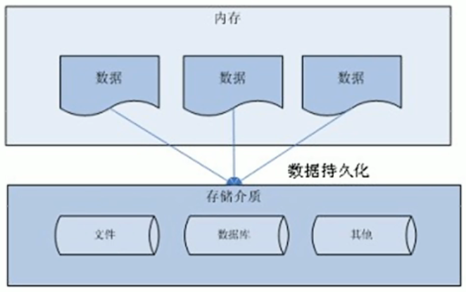
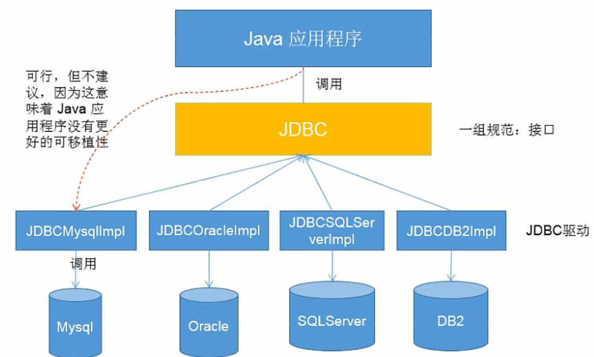
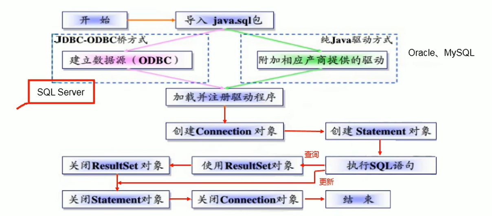
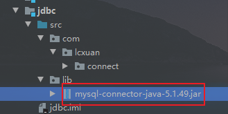
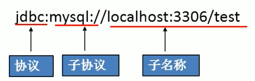
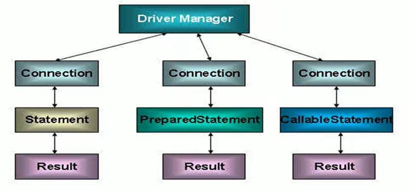
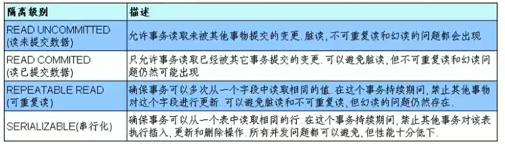

## JDBC

### 数据持久化

- 持久化：把数据并保存到可掉电式存储设备中以供之后使用

- 持久化的实现过程大多通过各种关系型数据库来完成

- 持久化的主要应用是将内存中的数据存储在关系型数据库中，也可以存储在磁盘文件、XML数据文件中



### JDBC介绍

- JDBC（Java Database Connectivity）是一个独立于特定数据库管理系统、通用的SQL数据库存取和操作的公共接口（API），定义了用来访问数据库的标准Java类库，使用这些类库可以以一种标准的方法、方便地访问数据库资源



JDBC接口（API）包含两个层次：

- **面向应用的API：** Java API，抽象接口，供应用程序开发人员使用（连接数据库，执行SQL语句，获得结果）

- **面向数据库的API：** Java Driver API，供开发商开发数据库驱动程序使用

### JDBC编写步骤



### 获取数据库连接

#### 要素一：Driver接口实现类

- Java.sql.Driver接口是所有JDBC驱动程序需要实现的借口。这个接口是提供给数据库厂商使用的，不同是数据库厂商提供不同的实现

- 在程序中不需要直接去访问实现了Driver接口的类，而是由驱动程序管理器类（java.sql.DriverManager）去调用这些Driver实现
  
  - Mysql的驱动：com.mysql.jdbc.Driver

- 将jar包导入java工程中，习惯上新建一个lib文件夹
  
  
  
  在jar包上右键 --> Add as Library... 加载Jar包即可

#### 要素二：URL

- JDBC URL用于标识一个被注册的驱动程序，驱动程序管理器通过这个URL选择正确的驱动程序，从而建立到数据库的连接

- JDBC URL的标准由三个部分组成，各部分用冒号分隔
  
  - 协议:子协议:子名称
    
    - 协议：JDBC URL中的协议总是jdbc
    
    - 子协议：子协议用于标识一个数据库驱动程序
    
    - 子名称，一种标识数据库的方法。用子名称的目的是为了定位数据库提供足够的信息，包含主机名（服务端IP地址），端口号，数据库名
    
    

#### 获取数据库连接方式一

```java
    public void test1() throws SQLException {
        // 获取Driver实现类对象
        Driver driver = new com.mysql.jdbc.Driver();

        String url = "jdbc:mysql://192.168.34.128:3306/jdbc_study";

        // 将用户名和密码封装在Properties中
        Properties info = new Properties();
        info.setProperty("user", "root");
        info.setProperty("password", "123456");

        // 获取数据库连接
        Connection connect = driver.connect(url, info);

        System.out.println(connect);
    }
```

#### 获取数据库连接方式二

- 对方式一的迭代，在如下程序中不出现第三方的api，使得程序具有更好的可移植性

```java
    @Test
    public void test2() throws Exception{
        // 1. 获取Driver实现类对象，通过反射实现
        Class<?> clazz = Class.forName("com.mysql.jdbc.Driver");
        Driver driver = (Driver) clazz.getDeclaredConstructor().newInstance();

        // 2. 提供连接的数据
        String url = "jdbc:mysql://192.168.34.128:3306/jdbc_study";

        // 3. 提供连接需要的用户名和密码
        Properties info = new Properties();
        info.setProperty("user", "root");
        info.setProperty("password", "123456");

        // 4. 获取连接
        Connection connect = driver.connect(url, info);
        System.out.println(connect);
    }
```

#### 获取数据库连接方式三

- 使用DriverManager提供Driver

```java
    @Test
    public void test3() throws Exception {
        // 1. 获取Driver实现类对象
        Class<?> aClass = Class.forName("com.mysql.jdbc.Driver");
        Driver driver = (Driver) aClass.getDeclaredConstructor().newInstance();

        // 2. 注册驱动
        DriverManager.registerDriver(driver);

        // 3. 获取连接
        String url = "jdbc:mysql://192.168.34.128:3306/jdbc_study";
        String user = "root";
        String password = "123456";
        Connection connection = DriverManager.getConnection(url, user, password);

        System.out.println(connection);
    }
```

#### 获取数据库连接方式四

- 可以只是加载驱动，不用显示的注册驱动

- 如果使用的是mysql驱动，则可以不同加载驱动

```java
   @Test
    public void test4() throws Exception {
        // 1. 加载Driver
        Class.forName("com.mysql.jdbc.Driver");

        // 2. 获取连接
        String url = "jdbc:mysql://192.168.34.128:3306/jdbc_study";
        String user = "root";
        String password = "123456";
        Connection connection = DriverManager.getConnection(url, user, password);

        System.out.println(connection);
    }
```

#### 获取数据库连接方式五

- 将数据库连接需要的4个基本信息声明到配置文件中，通过读取配置文件的方式，获取连接

- 创建配置文件jdbc.properties，并写入配置信息
  
  ```java
  driver=com.mysql.jdbc.Driver
  url=jdbc:mysql://192.168.34.128:3306/jdbc_study
  user=root
  password=123456
  ```

- 获取数据库连接
  
  ```java
      @Test
      public void test5() throws Exception {
          // 1. 读取配置文件中的4个基本信息
          InputStream inputStream = ConnectTest.class.getClassLoader().getResourceAsStream("jdbc.properties");
  
          Properties properties = new Properties();
          properties.load(inputStream);
  
          String driverClass = properties.getProperty("driver");
          String url = properties.getProperty("url");
          String user = properties.getProperty("user");
          String password = properties.getProperty("password");
  
          // 2. 加载驱动
          Class<?> aClass = Class.forName(driverClass);
  
          // 3. 获取连接
          Connection connection = DriverManager.getConnection(url, user, password);
  
          System.out.println(connection);
  
          if (inputStream != null){
              inputStream.close();
          }
      }
  ```

### 使用PreparedStatement实现CRUD操作

#### 操作和访问是数据库

- 数据库连接被用于向数据库服务器发送命令和SQL语句，并接受数据库服务器返回的结果，其实一个数据库连接就是一个Socket连接

- 在java.sql包中有3个接口分别定义了对数据库调用的不同方式
  
  - Statement：用于执行静态SQL语句并返回它所生成结果的对象
  
  - PreparedStatement：SQL语句被预编译并存储在此对象中，可以使用此对象多次高效地执行该语句
  
  - CallableStatement：用于执行SQL存储过程
  
  

#### 使用Statement操作数据表的弊端

- 通过调用Connection对象的createStatement()方法创建该对象。该对象用于执行静态的SQL语句，并返回执行结果

- Statement接口中定义下列方法用于执行SQL语句
  
  ```java
  int exceteUpdate(String sql)：执行更新操作(增加、删除、修改)
  ResultSet executeQuery(String sql)：执行查询
  ```

- Statement操作数据表存在弊端：
  
  - 问题一：存在拼串操作，繁琐
  
  - 问题二：存在SQL注入问题

- 解决方式：使用Statement接口的子接口PreparedStatement即可

#### PreparedStatement

- 通过调用调用connection对象的prepareStatement(sql)方法可以获取prepareStatement对象
  
  ```java
  // 获取prepareStatement对象
  String sql = "insert into user(user, passsword, email) values (?, ?, ?)"; // ?是占位符
  PreparedStatement preparedStatement = connection.prepareStatement(sql);
  ```

- PreparedStatement 对象所代表的 SQL 语句中的参数用问号(?)来表示，调用 PreparedStatement 对象的 setXxx() 方法来设置这些参数，setXxx() 方法有两个参数
  
  - 参数1：要设置的 SQL 语句中的参数的索引(从 1 开始)
  
  - 参数2：设置的 SQL 语句中的参数的值

##### JDBC工具类的封装

```java
public class JDBCUtil {

    /**
     * 获取数据库连接
     * @return Connection
     * @throws Exception
     */
    public static Connection getConnection() throws Exception {
        InputStream inputStream = ClassLoader.getSystemClassLoader().getResourceAsStream("jdbc.properties");
        Properties properties = new Properties();
        properties.load(inputStream);

        String driverClass = properties.getProperty("driver");
        String url = properties.getProperty("url");
        String user = properties.getProperty("user");
        String password = properties.getProperty("password");

        Class.forName(driverClass);

        Connection connection = DriverManager.getConnection(url, user, password);
        return connection;
    }

    /**
     * 资源关闭
     * @param conn 数据库连接
     * @param statement statement接口及子接口
     */
    public static void closeResource(Connection conn, Statement statement){
        closeResource(conn, statement, null);
    }

    public static void closeResource(Connection conn, Statement statement, ResultSet resultSet){
        if (resultSet != null){
            try {
                resultSet.close();
            } catch (SQLException throwables) {
                throwables.printStackTrace();
            }
        }
        if (statement != null){
            try {
                statement.close();
            } catch (SQLException throwables) {
                throwables.printStackTrace();
            }
        }
        if (conn != null){
            try {
                conn.close();
            } catch (SQLException throwables) {
                throwables.printStackTrace();
            }
        }
    }
}
```

##### 实现增加、删除、修改操作

- 增加操作

```java
    @Test
    public void testInsert(){
        Connection connection = null;
        PreparedStatement preparedStatement = null;
        try {
            connection = JDBCUtil.getConnection();

            // 2. 获取prepareStatement对象
            String sql = "insert into user(user, password, email) values (?, ?, ?)"; // ?是占位符
            preparedStatement = connection.prepareStatement(sql);
            // 3. 填充占位符
            preparedStatement.setString(1, "Lcxuan2");
            preparedStatement.setString(2, "1234567");
            preparedStatement.setString(3, "1986057632@qq.com");

            // 4. 执行sql
            preparedStatement.execute();
        } catch (Exception e) {
            e.printStackTrace();
        } finally {
            JDBCUtil.closeResource(connection, preparedStatement);
        }
    }
```

- 修改操作

```java
    @Test
    public void testUpdate(){
        Connection connection = null;
        PreparedStatement preparedStatement = null;
        try {
            // 1. 获取数据库连接
            connection = JDBCUtil.getConnection();

            // 2. 预编译sql语句，并返回prepareStatement的实例
            String sql = "update user set user = ? where id = ?";
            preparedStatement = connection.prepareStatement(sql);

            // 3. 填充占位符
            preparedStatement.setString(1, "Lcxuan3");
            preparedStatement.setInt(2, 6);

            // 4. 执行sql
            preparedStatement.execute();
        } catch (Exception e) {
            e.printStackTrace();
        } finally {
            // 5. 关闭资源
            JDBCUtil.closeResource(connection, preparedStatement);
        }
    }
```

- 删除操作

```java
    @Test
    public void testDelete(){
        Connection connection = null;
        PreparedStatement preparedStatement = null;
        try {
            connection = JDBCUtil.getConnection();

            String sql = "delete from user where id = ?";
            preparedStatement = connection.prepareStatement(sql);

            preparedStatement.setInt(1, 6);

            preparedStatement.execute();
        } catch (Exception e) {
            e.printStackTrace();
        } finally {
            JDBCUtil.closeResource(connection, preparedStatement);
        }
    }
```

##### 封装增加、删除、修改的通用操作

```java
    public int update(String sql, Object ... args){
        Connection connection = null;
        PreparedStatement preparedStatement = null;
        try {
            // 1.获取数据库连接
            connection = JDBCUtil.getConnection();

            // 2.预编译sql语句，返回PreparedStatement的对象
            preparedStatement = connection.prepareStatement(sql);

            // 3.填充占位符
            for (int i = 0; i < args.length; i++) {
                preparedStatement.setObject(i + 1, args[i]);
            }

            // 4.执行
            return preparedStatement.executeUpdate();
        } catch (Exception e) {
            e.printStackTrace();
        } finally {
            // 5.资源关闭
            JDBCUtil.closeResource(connection, preparedStatement);
        }
        return 0;
    }
```

##### 查询操作

ORM编程思想（Object relational mapping）

- 一个数据表对应一个Java类

- 表中一条记录对应Java类的一个对象

- 表中一个字段对应Java类的一个属性

```java
    @Test
    public void testQuery1(){
        Connection connection = null;
        PreparedStatement preparedStatement = null;
        ResultSet resultSet = null;
        try {
            connection = JDBCUtil.getConnection();

            String sql = "select * from user where id = ?";
            preparedStatement = connection.prepareStatement(sql);
            preparedStatement.setInt(1, 1);

            // 执行并返回结果集
            resultSet = preparedStatement.executeQuery();

            // 处理结果集
            // 判断结果集的下一条是否有数据，如果有数据返回则返回true，并指针下移
            // 如果返回false，指针不下移
            if (resultSet.next()){
                // 获取当前这条数据的各个字段
                int id = resultSet.getInt(1);
                String user = resultSet.getString(2);
                String password = resultSet.getString(3);
                String email = resultSet.getString(4);

                User userObject = new User(id, user, password, email);
                System.out.println(userObject);
            }
        } catch (Exception e) {
            e.printStackTrace();
        } finally {
            // 关闭资源
            JDBCUtil.closeResource(connection, preparedStatement, resultSet);
        }
    }
```

##### 封装查询操作

- 封装通用查询方法，返回一条记录

```java
    public <T> T query(Class<T> clazz, String sql, Object... args){
        Connection connection = null;
        PreparedStatement preparedStatement = null;
        ResultSet resultSet = null;
        try {
            connection = JDBCUtil.getConnection();
            preparedStatement = connection.prepareStatement(sql);
            for (int i = 0; i < args.length; i++) {
                preparedStatement.setObject(i + 1, args[i]);
            }

            resultSet = preparedStatement.executeQuery();
            ResultSetMetaData metaData = resultSet.getMetaData();
            int columnCount = metaData.getColumnCount();

            if (resultSet.next()){
                T t = clazz.getDeclaredConstructor().newInstance();

                for (int i = 0; i < columnCount; i++) {
                    Object columnValue = resultSet.getObject(i + 1);
                    String columnLabel = metaData.getColumnLabel(i + 1);

                    Field field = clazz.getDeclaredField(columnLabel);
                    field.setAccessible(true);
                    field.set(t, columnValue);
                }
                return t;
            }
        } catch (Exception e) {
            e.printStackTrace();
        } finally {
            JDBCUtil.closeResource(connection, preparedStatement, resultSet);
        }
        return null;
    }
```

- 封装通用查询方法，返回多条记录

```java
    public <T> List<T> queryAll(Class<T> clazz, String sql, Object... args){
        Connection connection = null;
        PreparedStatement preparedStatement = null;
        ResultSet resultSet = null;
        try {
            connection = JDBCUtil.getConnection();
            preparedStatement = connection.prepareStatement(sql);
            for (int i = 0; i < args.length; i++) {
                preparedStatement.setObject(i + 1, args[i]);
            }

            resultSet = preparedStatement.executeQuery();
            ResultSetMetaData metaData = resultSet.getMetaData();
            int columnCount = metaData.getColumnCount();

            ArrayList<T> list = new ArrayList<>();
            while (resultSet.next()){
                T t = clazz.getDeclaredConstructor().newInstance();
                for (int i = 0; i < columnCount; i++) {
                    Object columnValue = resultSet.getObject(i + 1);
                    String columnLabel = metaData.getColumnLabel(i + 1);

                    Field field = clazz.getDeclaredField(columnLabel);
                    field.setAccessible(true);
                    field.set(t, columnValue);
                }
                list.add(t);
            }

            return list;
        } catch (Exception e) {
            e.printStackTrace();
        } finally {
            JDBCUtil.closeResource(connection, preparedStatement, resultSet);
        }
        return null;
    }
```

### ResultSet和ResultSetMetaData

#### ResultSet

- 查询需要调用PreparedStatement的executeQuery()方法，查询结果是ResultSet对象

- ResultSet对象封装了执行数据库操作的结果集

- ResultSet对象维护了一个只想当前数据行的游标，在第一行之前，通过ResultSet对象的next()方法移动到下一行，调用next()方法检测下一行是否有效，若有效，则返回true，且指针下移

- 当指针指向下一行时，可以通过调用getXxx(int index)或者getXxx(String columnLabel)获取每一列的值
  
  ```java
  getInt(1);
  getString("name");
  ```

#### ResultSetMetaData

- 用于获取关于ResultSet对象中列的类型和属性信息的对象

- 通过ResultSet对象中的getMetaData()方法获取ResultSetMetaData对象
  
  - **getColumnName**(int column)：获取指定列的名称
  
  - **getColumnLabel**(int column)：获取指定列的别名
  
  - **getColumnCount**()：返回当前 ResultSet 对象中的列数。
  
  - getColumnTypeName(int column)：检索指定列的数据库特定的类型名称。
  
  - getColumnDisplaySize(int column)：指示指定列的最大标准宽度，以字符为单位。
  
  - **isNullable**(int column)：指示指定列中的值是否可以为 null。
  
  - isAutoIncrement(int column)：指示是否自动为指定列进行编号，这样这些列仍然是只读的。

### 操作Mysql中的BLOB类型字段

#### 插入数据到blob类型的字段

```java
    @Test
    public void testInsert(){
        Connection connection = null;
        PreparedStatement preparedStatement = null;
        FileInputStream inputStream = null;
        try {
            connection = JDBCUtil.getConnection();

            String sql = "insert into user(user, password, email, photo) values (?,?,?,?)";
            preparedStatement = connection.prepareStatement(sql);

            preparedStatement.setObject(1, "赵六");
            preparedStatement.setObject(2, "123456");
            preparedStatement.setObject(3, "213456@qq.com");

            // 将图片存入user表中的blob类型的字段中
            inputStream = new FileInputStream(new File("image.jpg"));
            preparedStatement.setBlob(4, inputStream);

            preparedStatement.execute();
        } catch (Exception e) {
            e.printStackTrace();
        } finally {
            JDBCUtil.closeResource(connection, preparedStatement);
            if (inputStream != null){
                try {
                    inputStream.close();
                } catch (IOException e) {
                    e.printStackTrace();
                }
            }
        }
    }
```

#### 查询Blob类型的字段

```java
    @Test
    public void testQuery(){
        Connection connection = null;
        PreparedStatement preparedStatement = null;
        ResultSet resultSet = null;
        InputStream binaryStream = null;
        FileOutputStream outputStream = null;
        try {
            connection = JDBCUtil.getConnection();
            String sql = "select photo from user where id = ?";
            preparedStatement = connection.prepareStatement(sql);
            preparedStatement.setInt(1, 9);

            resultSet = preparedStatement.executeQuery();
            if (resultSet.next()){
                // 获取存储在blob类型字段的数据
                Blob photo = resultSet.getBlob("photo");
                binaryStream = photo.getBinaryStream();
                outputStream = new FileOutputStream(new File("blob.jpg"));

                byte[] bytes = new byte[1024];
                int len;
                while ((len = binaryStream.read(bytes)) != -1){
                    outputStream.write(bytes, 0, len);
                }
            }
        } catch (Exception e) {
            e.printStackTrace();
        } finally {
            JDBCUtil.closeResource(connection, preparedStatement, resultSet);
            if (binaryStream != null){
                try {
                    binaryStream.close();
                } catch (IOException e) {
                    e.printStackTrace();
                }
            }
            if (outputStream != null){
                try {
                    outputStream.close();
                } catch (IOException e) {
                    e.printStackTrace();
                }
            }
        }
    }
```

### 批量数据操作

- mysql服务器默认是关闭批处理的，需要通过一个参数，让mysql开启批处理的支持
  
  ```java
  ?rewriteBatchedStatements=true // 写在配置文件的url
  ```

- 批量处理语句包括下面三个方法：
  
  - addBatch(String)：添加需要批量处理的SQL语句或者参数
  
  - executeBatch()：执行批量处理语句
  
  - clearBatch()：清空缓存的数据
  
  ```java
      @Test
      public void test1(){
          Connection connection = null;
          PreparedStatement preparedStatement = null;
          try {
              long start = System.currentTimeMillis();
  
              connection = JDBCUtil.getConnection();
  
              // 设置不允许自动提交数据
              connection.setAutoCommit(false);
  
              String sql = "insert into user(user) values(?)";
              preparedStatement = connection.prepareStatement(sql);
  
              for (int i = 1; i <= 1000000; i++) {
                  preparedStatement.setObject(1, "name_" + i);
                  // 添加需要批量处理的SQL语句或者参数
                  preparedStatement.addBatch();
  
                  if (i % 500 == 0){
                      // 执行批量处理语句
                      preparedStatement.executeBatch();
  
                      // 清空缓存的数据
                      preparedStatement.clearBatch();
                  }
              }
  
              // 提交数据
              connection.commit();
  
              long end = System.currentTimeMillis();
              System.out.println(end - start);
          } catch (Exception e) {
              e.printStackTrace();
          } finally {
              JDBCUtil.closeResource(connection, preparedStatement);
          }
      }
  ```

### Java与SQL对应数据类型转换表

| Java类型             | SQL类型                    |
| ------------------ | ------------------------ |
| boolean            | BIT                      |
| byte               | TINYINT                  |
| short              | SMALLINT                 |
| int                | INTEGER                  |
| long               | BIGINT                   |
| String             | CHAR、VARCHAR、LONGVARCHAR |
| byte、array         | BINARY、VAR BINARY        |
| java.sql.Date      | DATE                     |
| java.sql.Time      | TIME                     |
| java.sql.Timestamp | TIMESTAMP                |

### 数据库事务

- 事务：一组逻辑操作单元，使数据从一种状态变换到另一种状态

- 事务处理：保证所有事务都作为一个工作单元来执行，即使出现故障，都不能改变这种执行方式
  
  - 当一个事务中执行多个操作时，要么所有事务都被提交（commit），这些修改永久保存
  
  - 要么数据库管理系统放弃所做的所有修改，整个事务回滚（rollback）到最初的状态

- 数据一旦提交，就不可回滚

- 以下操作会导致数据的自动提交
  
  - DDL 操作一旦执行，都会自动提交，set autocommit = false 对DDL操作失效
  
  - DML默认情况下，一旦执行会自动提交，可以通过set autocommit = false的方式取消DML操作的自动提交
  
  - 默认关闭连接时，会自动提交数据

- 封装DML后的update()方法，考虑到了事务的操作：
  
  ```java
      public int update(Connection connection, String sql, Object ... args){
          PreparedStatement preparedStatement = null;
          try {
              // 2.预编译sql语句，返回PreparedStatement的对象
              preparedStatement = connection.prepareStatement(sql);
  
              // 3.填充占位符
              for (int i = 0; i < args.length; i++) {
                  preparedStatement.setObject(i + 1, args[i]);
              }
  
              // 4.执行
              return preparedStatement.executeUpdate();
          } catch (Exception e) {
              e.printStackTrace();
          } finally {
              // 5.资源关闭
              JDBCUtil.closeResource(null, preparedStatement);
          }
          return 0;
      }
  ```

- 封装DML后的update()方法，考虑到了事务的操作：
  
  ```java
      public <T> T query(Connection connection, Class<T> clazz, String sql, Object... args){
          PreparedStatement preparedStatement = null;
          ResultSet resultSet = null;
          try {
              preparedStatement = connection.prepareStatement(sql);
              for (int i = 0; i < args.length; i++) {
                  preparedStatement.setObject(i + 1, args[i]);
              }
  
              resultSet = preparedStatement.executeQuery();
              ResultSetMetaData metaData = resultSet.getMetaData();
              int columnCount = metaData.getColumnCount();
  
              if (resultSet.next()){
                  T t = clazz.getDeclaredConstructor().newInstance();
  
                  for (int i = 0; i < columnCount; i++) {
                      Object columnValue = resultSet.getObject(i + 1);
                      String columnLabel = metaData.getColumnLabel(i + 1);
  
                      Field field = clazz.getDeclaredField(columnLabel);
                      field.setAccessible(true);
                      field.set(t, columnValue);
                  }
                  return t;
              }
          } catch (Exception e) {
              e.printStackTrace();
          } finally {
              JDBCUtil.closeResource(null, preparedStatement, resultSet);
          }
          return null;
      }
  ```

- 使用事务的转账操作：
  
  ```java
      @Test
      public void test(){
          Connection connection = null;
          try {
              connection = JDBCUtil.getConnection();
              // 1. 取消数据的自动提交
              connection.setAutoCommit(false);
  
              String sql1 = "update user set balance = balance - 100 where id = ?";
              update(connection, sql1, 1);
  
              // 模拟网络异常
              System.out.println(10 / 0);
  
              String sql2 = "update user set balance = balance + 100 where id = ?";
              update(connection, sql2, 2);
  
              // 2. 数据提交
              connection.commit();
          } catch (Exception e) {
              e.printStackTrace();
              try {
                  // 3. 回滚数据
                  connection.rollback();
              } catch (SQLException throwables) {
                  throwables.printStackTrace();
              }
          } finally {
              JDBCUtil.closeResource(connection, null);
          }
      }
  ```

### 事务的ACID属性

- 原子性（Atomicity）
  
  原子性是指事务是一个不可分割的工作单位，事务中的操作要么都发生，要么都不发生

- 一致性（Consistency）
  
  事务必须使数据库从一个一致性状态变换到另外一个一致性状态

- 隔离性（Isolation）
  
  事务的隔离性是指一个事务的执行不能被其他事务干扰，即一个事务内部的操作及使用得数据对并发的其他事务是隔离的，并发执行的各个事务之间不能互相干扰

- 持久性（Durability）
  
  持久性是指一个事务一旦被提交，它对数据库数据的改变是永久性的，接下来的其他操作和数据库故障不应该对其有任何影响

#### 数据库的并发问题

- 对于同时运行的多个事务，当这些事务访问数据库中相同的数据时，如果没有采取必要的隔离机制，就会导致各种并发问题
  
  - **脏读** ：对于两个事务T1、T2，T1读取了已经被T2更新但是还没有被提交的字段，之后，若T2回滚，T1读取的内容就是临时且无效的
  
  - **不可重复读** ：对于两个事务T1、T2，T1读取了一个字段，然后T2更新了该字段，之后，T1再次读取同一个字段，值就不同了
  
  - **幻读** ：对于两个事务T1、T2，T1从一个表中读取了一个字段，然后T2在该表中插入一些新行，之后，如果T1再次读取同一个表，就会多出几行

#### 四种隔离级别



Java实现获取和设置隔离级别：

```java
connection = JDBCUtil.getConnection();

// 获取隔离级别
System.out.println("隔离级别：" + connection.getTransactionIsolation());

// 设置隔离级别
connection.setTransactionIsolation(Connection.TRANSACTION_READ_COMMITTED);
```

### 数据库DAO

- DAO：Data Access Object访问数据信息的类和接口，包括了对数据的CRUD（Create、Retrival、Update、Delete），而不包含任何业务相关的信息。有时也称作：BaseDAO

- 作用：为了实现功能的模块化，更有利于代码的维护和升级。

- BaseDAO：
  
  ```java
  // 封装了针对于数据表的通用操作
  public abstract class BaseDAO<T> {
  
      private Class<T> clazz = null;
  
      public BaseDAO() {
          // 获取当前BaseDAO子类中的泛型
          Type genericSuperclass = this.getClass().getGenericSuperclass();
          ParameterizedType parameterizedType = (ParameterizedType) genericSuperclass;
  
          // 获取子类泛型的所有参数
          Type[] arguments = parameterizedType.getActualTypeArguments();
          this.clazz = (Class<T>) arguments[0];
      }
  
      public int update(Connection connection, String sql, Object ... args){
          PreparedStatement preparedStatement = null;
          try {
              // 2.预编译sql语句，返回PreparedStatement的对象
              preparedStatement = connection.prepareStatement(sql);
  
              // 3.填充占位符
              for (int i = 0; i < args.length; i++) {
                  preparedStatement.setObject(i + 1, args[i]);
              }
  
              // 4.执行
              return preparedStatement.executeUpdate();
          } catch (Exception e) {
              e.printStackTrace();
          } finally {
  
              // 5.资源关闭
              JDBCUtil.closeResource(null, preparedStatement);
          }
          return 0;
      }
  
      public T query(Connection connection, String sql, Object... args){
          PreparedStatement preparedStatement = null;
          ResultSet resultSet = null;
          try {
              preparedStatement = connection.prepareStatement(sql);
              for (int i = 0; i < args.length; i++) {
                  preparedStatement.setObject(i + 1, args[i]);
              }
  
              resultSet = preparedStatement.executeQuery();
              ResultSetMetaData metaData = resultSet.getMetaData();
              int columnCount = metaData.getColumnCount();
  
              if (resultSet.next()){
                  T t = clazz.getDeclaredConstructor().newInstance();
  
                  for (int i = 0; i < columnCount; i++) {
                      Object columnValue = resultSet.getObject(i + 1);
                      String columnLabel = metaData.getColumnLabel(i + 1);
  
                      Field field = clazz.getDeclaredField(columnLabel);
                      field.setAccessible(true);
                      field.set(t, columnValue);
                  }
                  return t;
              }
          } catch (Exception e) {
              e.printStackTrace();
          } finally {
              JDBCUtil.closeResource(null, preparedStatement, resultSet);
          }
          return null;
      }
  
      public List<T> queryAll(Connection connection, String sql, Object... args){
          PreparedStatement preparedStatement = null;
          ResultSet resultSet = null;
          try {
              preparedStatement = connection.prepareStatement(sql);
              for (int i = 0; i < args.length; i++) {
                  preparedStatement.setObject(i + 1, args[i]);
              }
  
              resultSet = preparedStatement.executeQuery();
              ResultSetMetaData metaData = resultSet.getMetaData();
              int columnCount = metaData.getColumnCount();
  
              ArrayList<T> list = new ArrayList<>();
              while (resultSet.next()){
                  T t = clazz.getDeclaredConstructor().newInstance();
                  for (int i = 0; i < columnCount; i++) {
                      Object columnValue = resultSet.getObject(i + 1);
                      String columnLabel = metaData.getColumnLabel(i + 1);
  
                      Field field = clazz.getDeclaredField(columnLabel);
                      field.setAccessible(true);
                      field.set(t, columnValue);
                  }
                  list.add(t);
              }
  
              return list;
          } catch (Exception e) {
              e.printStackTrace();
          } finally {
              JDBCUtil.closeResource(null, preparedStatement, resultSet);
          }
          return null;
      }
  
      public <T> T getValue(Connection connection, String sql, Object... args){
          PreparedStatement preparedStatement = null;
          ResultSet resultSet = null;
          try {
              preparedStatement = connection.prepareStatement(sql);
              resultSet = preparedStatement.executeQuery();
              if (resultSet.next()){
                  return (T) resultSet.getObject(1);
              }
          } catch (SQLException throwables) {
              throwables.printStackTrace();
          } finally {
              JDBCUtil.closeResource(null, preparedStatement, resultSet);
          }
          return null;
      }
  }
  ```

- UserDAO
  
  ```java
  public interface UserDao {
      void insert(Connection connection, User user);
  
      void deleteById(Connection connection, int id);
  
      void update(Connection connection, User user);
  
      User getUserById(Connection connection, int id);
  
      List<User> getUserByList(Connection connection);
  
      Long getCount(Connection connection);
  }
  
  ```

- UserDAOImpl
  
  ```java
  public class UserDaoImpl extends BaseDAO<User> implements UserDao{
      @Override
      public void insert(Connection connection, User user) {
  
      }
  
      @Override
      public void deleteById(Connection connection, int id) {
  
      }
  
      @Override
      public void update(Connection connection, User user) {
  
      }
  
      @Override
      public User getUserById(Connection connection, int id) {
          return null;
      }
  
      @Override
      public List<User> getUserByList(Connection connection) {
          return null;
      }
  
      @Override
      public Long getCount(Connection connection) {
          return null;
      }
  }
  ```

### 数据库连接池

- 传统模式使用数据库连接时存在的问题：
  
  - 需要使用数据库连接时，向数据库要求一个，执行完后再断开连接，这样的方式会消耗大量资源和时间，**数据库连接资源并没有得到很好的重复利用**，若同时有几百人甚至几千人在线，频繁进行数据库连接操作会占用很多系统资源，甚至造成服务器崩溃
  
  - **对于每一次数据库连接，使用完后都得断开。** 否则，如果程序出现异常而未能关闭，将会导致数据库系统中的内存泄漏，最终将导致重启数据库
  
  - **这种开发不能控制被创建的连接对象数**，系统资源会被毫无顾及的分配出去，如连接过多，也可能导致内存泄漏，服务器崩溃

**解决方式：使用数据库连接池**

#### 数据库连接池思想

- 为数据库连接建立一个“缓冲池”，预先在缓冲池中放入一定数量的连接，当需要建立数据库连接时，只需从“缓冲池”中取出一个，使用完毕之后再放回去

- 数据库连接池负责分配、管理和释放数据库连接，**允许重复使用一个现有的数据库连接，而不是重新建立一个**

#### 开源的数据库连接池方式

- JDBC的数据库连接池使用 javax.sql.DataSource 来表示，DataSource只是一个接口
  
  - **DBCP** ：Apache提供的数据库连接池，Tomcat服务器自带DBCP数据库连接池，速度相对与C3P0较快，但自身存在BUG，Hibernate3已不再提供支持
  
  - **C3P0** ：一个开源组织提供的数据库连接池，速度相对较慢，稳定性还可以，Hibernate3官方推荐使用
  
  - **Proxool** ：sourceforge下的一个开源项目数据库连接池，有监控连接池状态的功能，稳定性相对于C3P0差一点
  
  - **BoneCP** ：一个开源组织提供的数据库连接池，速度快
  
  - **Druid** ：阿里提供的数据库连接池，集DBCP、C3P0、Proxool优点于一身的数据库连接池

- DataSource通常被称为 数据源 / 连接池，包含连接池和连接池管理两个部分

- **DataSource用来取代DriverManager来获取Connection，获取速度快，同时可以大幅度提供数据库访问速度**

### C3P0数据库连接池技术

#### 连接方式一

```java
    @Test
    public void testConnection1() throws Exception {
        ComboPooledDataSource dataSource = new ComboPooledDataSource();

        // 设置C3P0数据库连接池的4个基本信息
        dataSource.setDriverClass("com.mysql.jdbc.Driver");
        dataSource.setJdbcUrl("jdbc:mysql://192.168.34.128:3306/jdbc_study?useUnicode=true&characterEncoding=utf8");
        dataSource.setUser("root");
        dataSource.setPassword("123456");

        // 设置值初始化数据库连接池时的连接数
        dataSource.setInitialPoolSize(10);

        Connection connection = dataSource.getConnection();
        System.out.println(connection);
    }
```

#### 连接方式二

在src目录下创建c3p0-config.xml文件，编写如下代码：

```xml
<?xml version="1.0" encoding="UTF-8"?>
<c3p0-config>
    <named-config name="c3p0">
        <!-- 提供获取连接的四个基本信息 -->
        <property name="driverClass">com.mysql.jdbc.Driver</property>
        <property name="jdbcUrl">jdbc:mysql://192.168.34.128:3306/jdbc_study?useUnicode=true&characterEncoding=utf8</property>
        <property name="user">root</property>
        <property name="password">123456</property>

        <!-- 进行数据库连接池管理的基本信息 -->
        <!-- 当数据库连接池中的连接数不够时，向数据库服务器申请的连接数 -->
        <property name="acquireIncrement">5</property>
        <!-- 初始化连接时的连接数 -->
        <property name="initialPoolSize">10</property>
        <!-- 最少连接数 -->
        <property name="minPoolSize">10</property>
        <!-- 最大连接数 -->
        <property name="maxPoolSize">100</property>
        <!-- 最多维护的statement个数 -->
        <property name="maxStatements">0</property>
        <!-- 每个连接中最多可以使用的statement个数 -->
        <property name="maxStatementsPerConnection">5</property>
    </named-config>
</c3p0-config>
```

连接数据库：

```java
    @Test
    public void testConnection2() throws Exception {
        ComboPooledDataSource dataSource = new ComboPooledDataSource("c3p0");
        Connection connection = dataSource.getConnection();
        System.out.println(connection);
    }
```

#### 封装C3P0连接

```java
public class C3P0Util {
    private static ComboPooledDataSource dataSource = new ComboPooledDataSource("c3p0");

    public static Connection getCollection() throws SQLException {
        return dataSource.getConnection();
    }

    public static void closeConnection(Connection connection, Statement statement){
        closeConnection(connection, statement, null);
    }

    public static void closeConnection(Connection connection, Statement statement, ResultSet resultSet){
        if (connection != null){
            try {
                connection.close();
            } catch (SQLException throwables) {
                throwables.printStackTrace();
            }
        }
        if (statement != null){
            try {
                statement.close();
            } catch (SQLException throwables) {
                throwables.printStackTrace();
            }
        }
        if (resultSet != null){
            try {
                resultSet.close();
            } catch (SQLException throwables) {
                throwables.printStackTrace();
            }
        }
    }
}
```

### DBCP数据库连接池技术

#### 连接方式一

```java
    @Test
    public void testConnection1() throws SQLException {
        // 创建DBCP数据库连接池
        BasicDataSource dataSource = new BasicDataSource();

        // 设置基本信息
        dataSource.setDriverClassName("com.mysql.jdbc.Driver");
        dataSource.setUrl("jdbc:mysql://192.168.34.128:3306/jdbc_study?useUnicode=true&characterEncoding=utf8");
        dataSource.setUsername("root");
        dataSource.setPassword("123456");

        // 设置数据库连接池的相关属性
        dataSource.setInitialSize(10);
        dataSource.setMaxActive(10);

        // 获取连接
        Connection connection = dataSource.getConnection();
        System.out.println(connection);
    }
```

#### 连接方式二

创建dbcp.properties文件，编写如下代码

```java
driverClassName=com.mysql.jdbc.Driver
url=jdbc:mysql://192.168.34.128:3306/jdbc_study?useUnicode=true&characterEncoding=utf8
username=root
password=123456
```

获取连接：

```java
    @Test
    public void testConnection2() throws Exception {
        Properties properties = new Properties();
        properties.load(new FileInputStream("src\\dbcp.properties"));
        BasicDataSource dataSource = (BasicDataSource) BasicDataSourceFactory.createDataSource(properties);

        Connection connection = dataSource.getConnection();
        System.out.println(connection);
    }
```

#### 封装DBCP数据库连接池的连接

```java
public class DBCPUtil {

    private static BasicDataSource dataSource = null;

    static {
        try {
            Properties properties = new Properties();
            properties.load(new FileInputStream("src\\dbcp.properties"));
            dataSource = (BasicDataSource) BasicDataSourceFactory.createDataSource(properties);
        }catch (Exception e) {
            e.printStackTrace();
        }
    }

    public static Connection getConnection() throws SQLException {
        return dataSource.getConnection();
    }
}
```

### Druid数据库连接池

创建配置文件druid.properties，代码如下：

```java
driverClassName=com.mysql.jdbc.Driver
url=jdbc:mysql://192.168.34.128:3306/jdbc_study?useUnicode=true&characterEncoding=utf8
username=root
password=123456

initialSize=5
```

获取连接：

```java
    @Test
    public void testConnection1() throws Exception {
        Properties properties = new Properties();
        InputStream inputStream = ClassLoader.getSystemClassLoader().getResourceAsStream("druid.properties");
        properties.load(inputStream);

        DruidDataSource dataSource = (DruidDataSource) DruidDataSourceFactory.createDataSource(properties);

        DruidPooledConnection connection = dataSource.getConnection();
        System.out.println(connection);
    }
```

#### 封装Druid数据库连接池的连接

```java
public class DruidUtil {

    private static DruidDataSource dataSource = null;

    static {
        try {
            Properties properties = new Properties();
            InputStream inputStream = ClassLoader.getSystemClassLoader().getResourceAsStream("druid.properties");
            properties.load(inputStream);

            dataSource = (DruidDataSource) DruidDataSourceFactory.createDataSource(properties);
        } catch (Exception e) {
            e.printStackTrace();
        }
    }
    public static Connection getConnection() throws SQLException {
        return dataSource.getConnection();
    }
}
```

### Apache-DBUtils实现CURD操作

- common-dbutils是Apache组织提供的一个开源JDBC工具类库，是对JDBC的简单封装，学习成本极低，并且能极大简化JDBC编码的工作量，同时不会影响程序的性能

#### 使用QueryRunner类添加数据

```java
    @Test
    public void test1(){
        Connection connection = null;
        try {
            QueryRunner queryRunner = new QueryRunner();

            connection = DruidUtil.getConnection();

            String sql = "insert into user(user, password) values(?, ?)";

            int i = queryRunner.update(connection, sql, "李八", "258741");
            System.out.println("影响行：" + i);
        } catch (SQLException throwables) {
            throwables.printStackTrace();
        } finally {
            try {
                if (connection != null){
                    connection.close();
                }
            } catch (SQLException throwables) {
                throwables.printStackTrace();
            }
        }
    }
```

#### 使用QueryRunner类和ResultSetHandler类实现查询一条数据

- BeanHandler：ResultSetHandler接口的实现类，用于封装表中的一条记录

```java
    @Test
    public void test2(){
        Connection connection = null;
        try {
            QueryRunner queryRunner = new QueryRunner();

            connection = DruidUtil.getConnection();
            String sql = "select id, user, password, email from user where id = ?";
            BeanHandler<User> userBeanHandler = new BeanHandler<User>(User.class);
            User user = queryRunner.query(connection, sql, userBeanHandler, 1);
            System.out.println(user);
        } catch (SQLException throwables) {
            throwables.printStackTrace();
        } finally {
            if (connection != null){
                try {
                    connection.close();
                } catch (SQLException throwables) {
                    throwables.printStackTrace();
                }
            }
        }
    }
```

#### 使用QueryRunner类和ResultSetHandler类实现查询一条数据

- BeanListHandler：ResultSetHandler接口的实现类，用于封装表中的多条记录

```java
    @Test
    public void test3(){
        Connection connection = null;
        try {
            QueryRunner queryRunner = new QueryRunner();

            connection = DruidUtil.getConnection();
            String sql = "select id, `user`, password, email from user";
            BeanListHandler<User> handler = new BeanListHandler<>(User.class);
            List<User> list = queryRunner.query(connection, sql, handler);
            System.out.println(list);
        } catch (SQLException throwables) {
            throwables.printStackTrace();
        } finally {
            if (connection != null){
                try {
                    connection.close();
                } catch (SQLException throwables) {
                    throwables.printStackTrace();
                }
            }
        }
    }
```

#### 特殊查询

- ScalarHandler：用于查询特殊值

```java
    @Test
    public void test4(){
        Connection connection = null;
        try {
            QueryRunner queryRunner = new QueryRunner();

            connection = DruidUtil.getConnection();
            String sql = "select count(*) from user";

            ScalarHandler<Long> handler = new ScalarHandler<>();
            Long query = queryRunner.query(connection, sql, handler);
            System.out.println(query);
        } catch (SQLException throwables) {
            throwables.printStackTrace();
        } finally {
            if (connection != null){
                try {
                    connection.close();
                } catch (SQLException throwables) {
                    throwables.printStackTrace();
                }
            }
        }
    }
```

#### 自定义ResultSetHandler的实现类

```java
    @Test
    public void test5(){
        Connection connection = null;
        try {
            QueryRunner queryRunner = new QueryRunner();
            connection = DruidUtil.getConnection();

            String sql = "select id, `user`, password, email from user where id = ?";

            ResultSetHandler<User> handler = new ResultSetHandler<User>() {
                @Override
                public User handle(ResultSet resultSet) throws SQLException {
                    try {
                        if (resultSet.next()) {
                            int id = resultSet.getInt(1);
                            String username = resultSet.getString(2);
                            String password = resultSet.getString(3);
                            String email = resultSet.getString(4);
                            User user = new User(id, username, password, email);
                            return user;
                        }
                    } catch (SQLException throwables) {
                        throwables.printStackTrace();
                    } finally {
                        DbUtils.closeQuietly(resultSet);
                    }
                    return null;
                }
            };

            User user = queryRunner.query(connection, sql, handler, 2);
            System.out.println(user);

        } catch (SQLException throwables) {
            throwables.printStackTrace();
        } finally {
            DbUtils.closeQuietly(connection);
        }
    }
```
