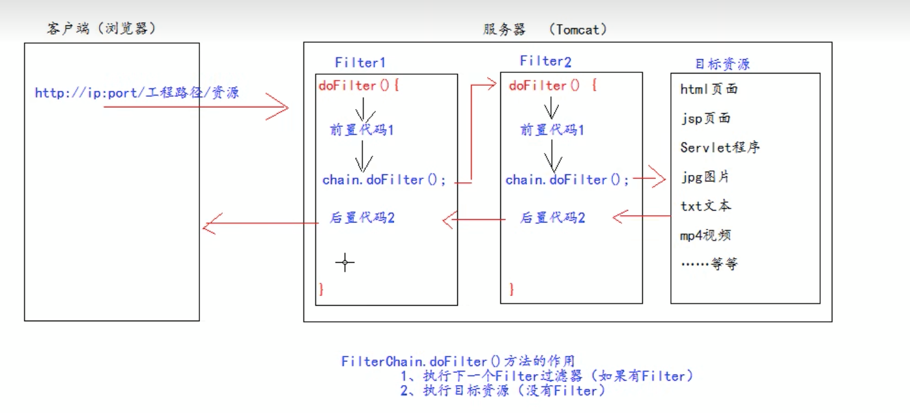

## Filter过滤器

Filter过滤器是JavaWeb三大组件之一

Filter过滤器是JavaEE的规范，也就是接口

Filter过滤器的作用是：拦截请求，过滤响应

- 拦截请求常用场景：权限检查、日记操作、事务管理等

### 基本使用

新建一个类 --> 继承 javax.servlet.Filter类，并重写方法

```java
public class AdminFilter implements Filter {
    /**
     * 专门用于拦截请求
     * @param servletRequest
     * @param servletResponse
     * @param filterChain
     * @throws IOException
     * @throws ServletException
     */
    @Override
    public void doFilter(ServletRequest servletRequest, ServletResponse servletResponse, FilterChain filterChain) throws IOException, ServletException {

    }

    @Override
    public void init(FilterConfig filterConfig) throws ServletException {

    }

    @Override
    public void destroy() {

    }
}
```

### 实现拦截请求

新建一个类 --> 继承 javax.servlet.Filter类，并重写方法，编写代码

**filterChain.doFilter(servletRequest, servletResponse)：使代码往下执行**

```java
public class AdminFilter implements Filter {
    @Override
    public void doFilter(ServletRequest servletRequest, ServletResponse servletResponse, FilterChain filterChain) throws IOException, ServletException {
        HttpServletRequest request = (HttpServletRequest) servletRequest;
        HttpSession session = request.getSession();
        Object user = session.getAttribute("user");
        if (user == null){
            System.out.println("用户未登录");
            return;
        }
        System.out.println("用户登录成功");
        // 程序继续往下执行
        filterChain.doFilter(servletRequest, servletResponse);
    }
}
```

在web.xml文件中编写Filter的配置：

```xml
<?xml version="1.0" encoding="UTF-8"?>
<web-app xmlns="http://xmlns.jcp.org/xml/ns/javaee"
         xmlns:xsi="http://www.w3.org/2001/XMLSchema-instance"
         xsi:schemaLocation="http://xmlns.jcp.org/xml/ns/javaee http://xmlns.jcp.org/xml/ns/javaee/web-app_4_0.xsd"
         version="4.0">

    <!-- 用于配置一个Filter过滤器 -->
    <filter>
        <!-- 起别名 -->
        <filter-name>AdminFilter</filter-name>
        <!-- 全类名 -->
        <filter-class>com.lcxuan.filter.AdminFilter</filter-class>
    </filter>
    <!-- 配置拦截路径 -->
    <filter-mapping>
        <!-- 哪个filter来拦截 -->
        <filter-name>AdminFilter</filter-name>
        <!--
            配置拦截路径
            /：表示拦截的请求地址为：http://ip:port/工程路径/
            /admin/*：表示拦截的请求路径为：http://ip:port/工程路径/admin/*
         -->
        <url-pattern>/admin/*</url-pattern>
    </filter-mapping>
</web-app>
```

### Filter的生命周期

包含几个方法：

- 构造器方法

- init初始化方法
  
  - 以上两步，在web工程启动的时候执行（Filter已经创建）

- doFilter过滤方法
  
  - 每次拦截到请求，就会执行

- destroy销毁方法
  
  - 停止web工程的时候，就会执行，会将Filter‘过滤器销毁

### FilterConfig类

FilterConfig类是Filter过滤器的配置文件类

每次创建Filter的时候，同时会创建一个FilterConfig类

FilterConfig类的作用：

- 获取Filter的名称，即filter-name的内容
- 获取在web.xml中配置的init-param初始化参数
- 获取ServerContext对象

web.xml文件中配置初始化参数：

```xml
<!-- 用于配置一个Filter过滤器 -->
<filter>
  <!-- 起别名 -->
  <filter-name>AdminFilter</filter-name>
  <!-- 全类名 -->
  <filter-class>com.lcxuan.filter.AdminFilter</filter-class>
  <!-- 初始化参数 -->
  <init-param>
    <param-name>username</param-name>
    <param-value>张三</param-value>
  </init-param>
</filter>
```

FilterConfig类的使用：

```java
@Override
public void init(FilterConfig filterConfig) throws ServletException {
  // 获取Filter的名称
  System.out.println("filter-name的内容是：" + filterConfig.getFilterName());
  // 获取在web.xml中配置的init-param初始化参数
  System.out.println("初始化参数username的值是：" + filterConfig.getInitParameter("username"));
  // 获取ServerContext对象
  System.out.println("获取ServerContext对象：" + filterConfig.getServletContext());
}
```

### FilterChain类

FilterChain就是过滤器链，即多个过滤器如何一起工作

FilterChain类，只有一个doFilter()方法，它的作用主要有两个：

- 执行下一个Filter过滤器（如果有Filter的情况下）
- 执行目标资源【即html文件、jsp文件等】（如果没有Filter的情况下）



创建Filter1和Filter2过滤器：

```java
public class Filter1 implements Filter {
    @Override
    public void init(FilterConfig filterConfig) throws ServletException {

    }

    @Override
    public void doFilter(ServletRequest servletRequest, ServletResponse servletResponse, FilterChain filterChain) throws IOException, ServletException {
        System.out.println("Filter1 前置代码");
        filterChain.doFilter(servletRequest, servletResponse);
        System.out.println("Filter1 后置代码");
    }

    @Override
    public void destroy() {

    }
}
```

```java
public class Filter2 implements Filter {
    @Override
    public void init(FilterConfig filterConfig) throws ServletException {

    }

    @Override
    public void doFilter(ServletRequest servletRequest, ServletResponse servletResponse, FilterChain filterChain) throws IOException, ServletException {
        System.out.println("Filter2 前置代码");
        filterChain.doFilter(servletRequest, servletResponse);
        System.out.println("Filter2 后置代码");
    }

    @Override
    public void destroy() {

    }
}
```

新建一个资源文件target.jsp文件：

```jsp
<%@ page contentType="text/html;charset=UTF-8" language="java" %>
<html>
<head>
    <title>Title</title>
</head>
<body>
    <%
        System.out.println("target.jsp 页面执行");
    %>
</body>
</html>
```

配置web.xml文件：

```xml
<filter>
  <filter-name>Filter1</filter-name>
  <filter-class>com.lcxuan.filter.Filter1</filter-class>
</filter>

<filter-mapping>
  <filter-name>Filter1</filter-name>
  <url-pattern>/target.jsp</url-pattern>
</filter-mapping>

<filter>
  <filter-name>Filter2</filter-name>
  <filter-class>com.lcxuan.filter.Filter2</filter-class>
</filter>

<filter-mapping>
  <filter-name>Filter2</filter-name>
  <url-pattern>/target.jsp</url-pattern>
</filter-mapping>
```

代码编写完后，在浏览器中输入http://ip:port/工程名/target.jsp，控制台输出：

```
Filter1 前置代码
Filter2 前置代码
target.jsp 页面执行
Filter2 后置代码
Filter1 后置代码
```

**注意：多个Filter过滤器执行时，会按照web.xml文件中的顺序决定**

多个Filter过滤器执行的特点：

- 所有Filter过滤器和目标资源都执行在同一个线程中
- 多个Filter过滤器共同执行时，都使用同一个Request对象

### Filter过滤器的拦截路径

#### 精确匹配

<url-pattern>/target.jsp</url-pattern>

以上的配置就是一个精确配置，表示请求地址为：http://ip:port/工程名/target.jsp

#### 目录匹配

<url-pattern>/admin/*</url-pattern>

以上的配置就是一个目录配置，表示请求地址为：http://ip:port/工程名/admin/*

#### 后缀名匹配

<url-pattern>*.html</url-pattern>

以上的配置就是一个后缀名配置，表示请求地址必须以.html后缀名结尾

**注意：Filter过滤器关心的是地址是否匹配，不关系请求的资源是否存在**
