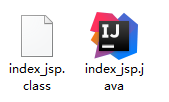
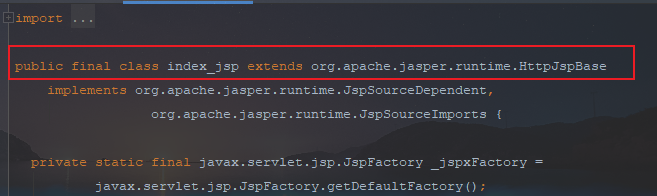
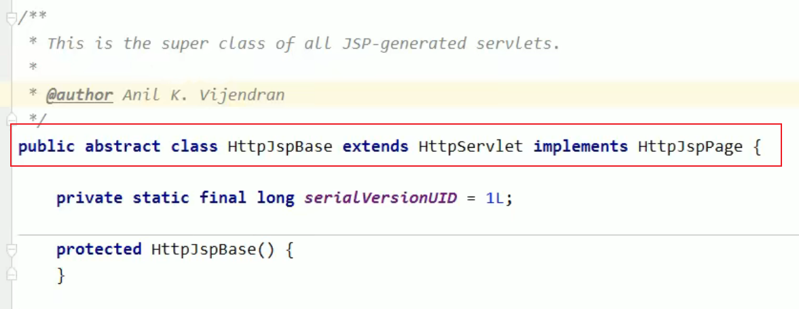
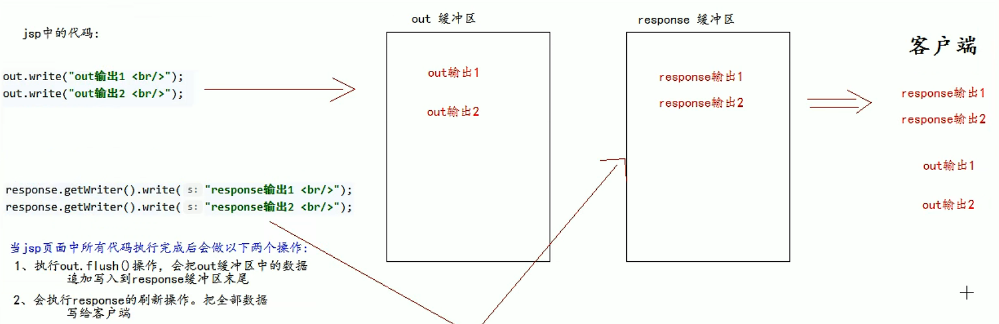

## JSP文件

- JSP，java server pages的服务器页面

- JSP的主要作用是代替Servlet程序回传html页面的数据

- 因为Servlet程序回传html页面数据是一件非常繁琐的事情，开发成本和维护成本极高

- jsp页面和html页面一样，都是存放在web目录下的，访问根访问html页面一样

### JSP本质

- 当第一次访问JSP页面的时候。Tomcat服务器会帮组我们把jsp页面翻译成为一个java源文件，并对它进行编译，成为.class字节码程序
  
  
  
  

- 从源代码中可以发现，HttpJspBase类，直接继承了HttpServlet类，所以，jsp翻译出来额java类，间接的继承了HttpServlet类，所以就是一个Servlet程序
  
  

### jsp头部的page指令

- 可以修改jsp页面中一些重要的属性，或者行为
  
  ```java
  <%@ page contentType="text/html;charset=UTF-8" language="java" %>
  ```

- language属性：表示jsp翻译后是什么语言的文件，暂时只支持java

- contentType属性：表示jsp返回得数据类型是什么，也是源码中的response.setContentType()参数值

- pageEncoding属性：表示当前jsp页面文件本身的字符集

- import属性：根java源代码一样，用于导包、导类

- 以下两个属性用于给out输出流使用
  
  - autoFlush属性：设置当out输出流缓冲区满后，是否自动刷新缓冲区。默认为true
  
  - buffer属性：设置out缓冲区的大小。默认是8KB

- **errorPage属性**：设置当jsp页面运行时出错，自动跳转去的错误页面路径

- isErrorPage属性：设置当前jsp页面是否是错误信息页面。默认是false，如果是true可以获取异常信息

- session属性：设置访问当前jsp页面，是否会创建HttpSession对象，默认是true

- extends属性：设置jsp翻译出来的java类默认继承谁

### 声明脚本

格式：

```java
<%! // 声明的java代码 %>
```

作用：可以给jsp翻译出来的java类定义属性和方法，甚至是静态代码块、内部类等

#### 声明属性

```java
<%!
    private Integer id;
    private String name;
    private static Map<String, Object> map;
%>
```

#### 声明类方法

```java
<%!
    public void aaa(){
        System.out.println(123);
    }
%>
```

#### 声明静态代码块

```java
<%!
    static {
        map = new HashMap<>();
        map.put("name", "张三");
    }
%>
```

#### 声明内部类

```java
<%!
    public static class A{
        private Integer id = 1;
    }
%>
```

### 表达式脚本

格式：

```java
<%= 表达式 %>
```

作用：在jsp页面上输出数据

表达式脚本的特点：

- 所有表达式脚本都会被翻译到_jspService方法中

- 表达式脚本都会被翻译称为out.print()输出到页面上

- 由于表达式脚本翻译的内容都在 _jspService()方法中，所以 _jspService()方法中的对象都可以直接使用

- 表达式脚本汇总的表达式不能以分号结束

#### 输出整型

```java
<%= 12 %>
```

#### 输出浮点型

```java
<%= 12.12 %>
```

#### 输出字符串

```java
<%= "这是一段字符串" %>
```

#### 输出对象

```java
<%= map %>
```

### 代码脚本

格式：

```java
<%
    java语句
%>
```

作用：可以在jsp页面中，编写需要的功能（java语句）

代码脚本：

- 代码脚本翻译后都在 _jspService方法中

- 代码脚本由于翻译到_jspService()方法中，所以在 _jspService()方法中的现有对象都可以直接使用

- 可以由多个代码脚本块组合完成一个完整的java语句

- 代码脚本还可以和表达式脚本一起组合使用，在jsp页面上输出数据

#### if语句

```java
<%
    int i = 12;
    if (i == 12){
        System.out.println("等于12");
    }else {
        System.out.println("不等于12");
    }
%>
```

#### for循环

```java
<%
    for (int j = 0; j < 10; j++) {
        System.out.println(i);
    }
%>
```

#### 翻译后java文件中的 _jspService方法内的代码都可以写

```java
<%
    String username = request.getParameter("username");
    System.out.println("请求参数：" + username);
%>
```

### JSP中三种注释

- 方式1：HTML注释
  
  html注释会被翻译到java源代码中。在 _jspService方法中，以out.writer输出到客户端
  
  ```java
  <!-- 这是一段 -->
  ```

- 方式2：java注释
  
  java注释会被翻译到java源代码中
  
  ```java
  <%
      // 单行注释
      /* 多行注释 */
  %>
  ```

- 方式3：JSP注释
  
  jsp注释可以注释掉JSP页面中所有的代码
  
  ```java
  <%-- 这是jsp注释 --%>
  ```

### Jsp中九大内置对象

- Jsp中内置对象，是指Tomcat服务器在翻译Jsp页面成为Servlet源代码后，内部提供的九大对象，称为内置对象
  
  - request：请求对象
  
  - response：响应对象
  
  - pageContext：jsp的上下文对象
  
  - session：会话对象
  
  - application：ServletContext对象
  
  - config：ServletConfig对象
  
  - out：jsp输出流对象
  
  - page：指向当前jsp的对象
  
  - exception：异常对象，需要开启isErrorPage="true"

- 四大域对象
  
  | 域对象         | 全类名                 | 描述                                |
  | ----------- | ------------------- | --------------------------------- |
  | pageContext | PageContextImpl类    | 当前jsp页面范围有效                       |
  | request     | HttpServletRequest类 | 一次请求内有效                           |
  | session     | HttpSession类        | 一个会话范围内有效<br/>打开浏览器访问服务器，直到服务器关闭  |
  | application | ServletContext类     | 整个web工程范围内都有效<br/>只要web工程不停止，数据都在 |

- 四大域对象可以像Map一样存取数据的对象。四个域对象功能一样，不同的是对数据的存取范围
  
  scope.jsp页面，代码如下：
  
  ```java
  <body>
      <h1>scope.jsp</h1>
      <%
          pageContext.setAttribute("key", "pageContext");
          request.setAttribute("key", "request");
          session.setAttribute("key", "session");
          application.setAttribute("key", "application");
      %>
      pageContext的值：<%= pageContext.getAttribute("key") %> <br>
      request的值：<%= request.getAttribute("key") %><br>
      session的值：<%= session.getAttribute("key") %><br>
      application的值：<%= application.getAttribute("key") %>
      <%
          request.getRequestDispatcher("/scope2.jsp").forward(request, response);
      %>
  </body>
  ```
  
  scope2.jsp页面，代码如下：
  
  ```java
  <body>
      <h1>scope2.jsp</h1>
      pageContext的值：<%= pageContext.getAttribute("key") %> <br>
      request的值：<%= request.getAttribute("key") %><br>
      session的值：<%= session.getAttribute("key") %><br>
      application的值：<%= application.getAttribute("key") %>
  </body>
  ```

- 四个域优先顺序，从小到大：
  
  pageContext --> request --> session --> application

- 输出：response对象和out对象
  
  - response对象：表示响应，经常用于设置返回给客户端的内容（输出）
  
  - out对象：给用户做输出使用
  
  - 代码示例：
    
    ```java
    <body>
        <%
            out.write("out输出1 <br>");
            out.write("out输出2 <br>");
            response.getWriter().write("response输出1 <br>");
            response.getWriter().write("response输出2 <br>");
        %>
    </body>
    ```
    
    
  
  - 由于jsp翻译之后，底层源代码都是使用out来进行输出，所以一般情况下，**在jsp页面中统一使用out来进行输出**，避免打乱页面输出的内容顺序
  
  - out对象的两个方法：
    
    - out.write()：输出字符串没有问题
    
    - out.print()：输出任意数据都没有问题，都是转换字符串后调用write方法输出【推荐使用】

### jsp的常用标签

#### jsp静态包含

- 语法：
  
  ```java
  <%@ include file="jsp页面的路径" %>
  ```

- 示例：
  
  ```java
  <%@ include file="/include/footer.jsp" %>
  ```

- 静态包含的特点：
  
  - 静态包含不会翻译被包含的jsp页面
  
  - 静态包含其实就是把包含的jsp页面的代码拷贝到包含的位置执行输出

#### jsp动态包含

- 语法：
  
  ```java
  <jsp:include page="jsp页面的"></jsp:include>
  ```

- 示例：
  
  ```java
  <jsp:include page="/include/footer.jsp"></jsp:include>
  ```

- 动态包含的特点：
  
  - 动态包含会把包含的jsp页面也翻译称为java代码
  
  - 

#### jsp标签-转发

- 功能就是请求转发

- 格式：
  
  ```java
  <jsp:forward page="转发的路径"></jsp:forward> 
  ```
