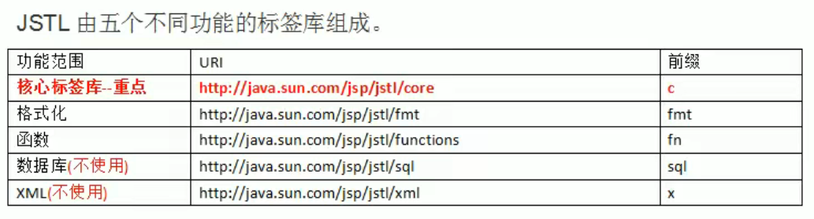
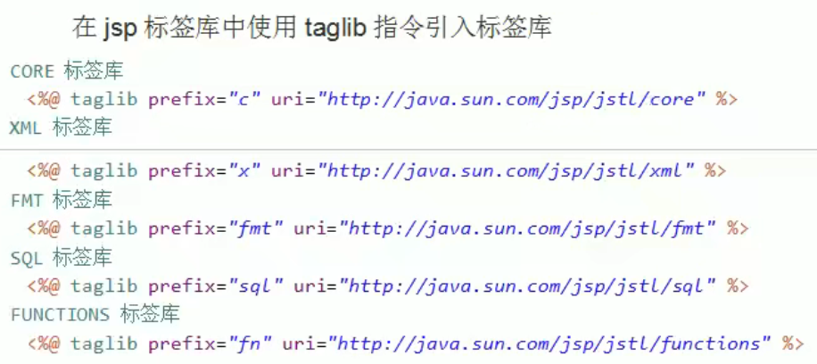
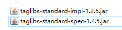
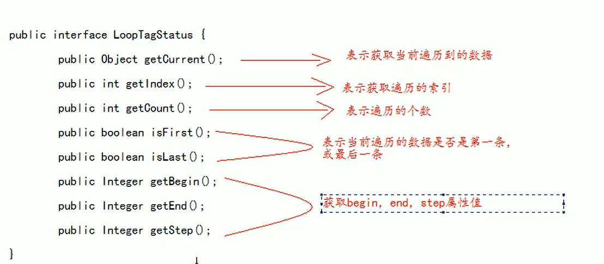

## JSTL标签库

JSTL标签库，全称：JSP Standard Tag Library，JSP标准标签库，是一个不断完善的开放源代码的JSP标签库

EL表达式主要是为了替换jsp中的表达式脚本

**JSTL标签库则是为了替换代码脚本**





### 使用步骤

- 1、先导入JSTL标签库的jar包
  
  

- 2、使用taglib指令引入标签库

### core核心库使用

#### <c:set />

- 作用：set标签可以往域中保存数据

- scope属性：设置保存到哪个域中
  
  - page表示PageContext域【默认值】
  
  - request表示Request域
  
  - session表示Session域
  
  - application表示ServletContext域

- var属性：设置key是多少

- value属性：设置值

```java
    <%--  <c:set/>  --%>
    保存之前：${requestScope.abc}<br>

    <c:set scope="request" var="abc" value="你好"/>

    保存之后：${requestScope.abc}<br>
```

#### <c:if />

- if标签用来做if判断

- test属性表示判断的条件，使用EL表达式输出
  
  ```java
      <c:if test="${12 == 12}">
          <h1>12等于12</h1>
      </c:if>
  ```

#### <c:choose><c:when><c:ottherwise>标签

- 多路判断，和switch...case非常接近

- <c:choose>标签表示开始选择判断

- <c:when>标签表示每一种判断情况
  
  - test属性表示当前这种判断情况的值

- <c:otherwise>标签表示剩下的情况
  
  ```java
      <c:set scope="request" var="height" value="180"/>
  
      <c:choose>
          <c:when test="${requestScope.height > 190}">
              <h2>小巨人</h2>
          </c:when>
          <c:when test="${requestScope.height > 180}">
              <h2>很高</h2>
          </c:when>
          <c:when test="${requestScope.height > 170}">
              <h2>还可以</h2>
          </c:when>
          <c:otherwise>
              <h2>剩下的是小于170</h2>
          </c:otherwise>
      </c:choose>
  ```

#### <c:forEach />

- 用于遍历输出使用

- begin属性：设置开始的索引

- end属性：设置结束的索引

- items属性：表示遍历的数据源

- var属性：表示循环的变量，或者表示遍历的数据

- step属性：表示遍历的步长值

- varStatus属性：表示当前遍历到的数据状态
  
  

- 示例1：遍历1到10
  
  ```java
      <c:forEach begin="1" end="10" var="i">
          ${i}
      </c:forEach>
  ```

- 示例2：遍历数组
  
  ```java
      <%
          request.setAttribute("arr", new String[]{"张三", "李四", "王五"});
      %>
      <c:forEach items="${requestScope.arr}" var="value">
          ${value}
      </c:forEach>
  ```

- 示例3：遍历Map集合
  
  ```java
      <%
          Map<String, Object> map = new HashMap<>();
          map.put("name", "张三");
          map.put("age", 18);
          map.put("sex", "男");
          request.setAttribute("map", map);
      %>
      <c:forEach items="${requestScope.map}" var="entry">
          key:${entry.key}, value:${entry.value}
      </c:forEach>
  ```

- 示例4：遍历List集合
  
  ```java
      <%
          List<Student> list = new ArrayList<>();
          for (int i = 1; i <= 10; i++) {
              list.add(new Student(i, "张三" + i, "123456" + i));
          }
          request.setAttribute("list", list);
      %>
      <c:forEach items="${requestScope.list}" var="student">
          编号：${student.id} ,用户名：${student.username} ,密码：${student.password}<br>
      </c:forEach>
  ```

- 示例5：所有属性组合使用
  
  ```java
      <%
          List<Student> list = new ArrayList<>();
          for (int i = 1; i <= 10; i++) {
              list.add(new Student(i, "张三" + i, "123456" + i));
          }
          request.setAttribute("list", list);
      %>
      <c:forEach begin="2" end="8" step="2" varStatus="status" items="${requestScope.list}" var="student">
          编号：${student.id} ,用户名：${student.username} ,密码：${student.password}, status:${status.index}<br>
      </c:forEach>
  ```
