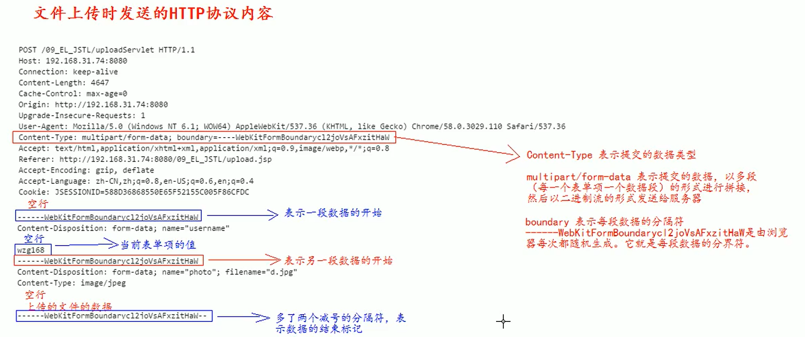
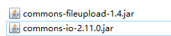

## JavaWeb

- JavaWeb是指所有通过Java语言编写可以通过浏览器访问的程序

- 基于请求和响应来开发的

- JavaWen三大组件：
  
  - Servlet程序
  
  - Filter过滤器
  
  - Listener监听器

### 请求和响应

- 请求：指客户端给服务器发送数据（Request）

- 响应：指服务器给客户端传回数据（Response）


### Web资源的分类

- 分为静态资源和动态资源
  
  - 静态资源：html、css、js、txt、mp4、jpg等
  
  - 动态资源：jsp页面、servlet程序、php程序等

### 创建动态Web工程


### Web工程目录介绍


- src目录：存放自己编写的java源代码

- web目录：专门用来存放web工程的资源文件，例如：
  
  - html页面
  
  - css文件
  
  - js文件
  
  - 等等

- WEB-INF目录：一个受服务器保护的目录，浏览器无法直接访问到此目录的内容

- web.xml：整个动态web工程的配置部署描述文件，可以在这里配置很多web工程的组建，例如：
  
  - Servlet程序
  
  - Filter过滤器
  
  - Listener监听器
  
  - Session超时
  
  - 等等

### IDEA 2020 启动部署Web应用


实现热部署：


### Servet使用

#### Servlet介绍

- Servlet 是JavaEE规范之一，规范就是接口

- Servlet是JavaWeb三大组件之一，三大组件分别是：
  
  - Servlet程序
  
  - Filter过滤器
  
  - Listener监听器

- Servlet是运行在服务器上的一个Java小程序，可以接收客户端发送过来得请求，并响应数据给客户端

#### 实现Servlet程序

- 编写一个类实现Servlet接口，并重写所有方法

- service()方法，用于处理请求，并响应数据
  
  ```java
  public class HelloServlet implements Servlet {
      @Override
      public void init(ServletConfig servletConfig) throws ServletException {
  
      }
  
      @Override
      public ServletConfig getServletConfig() {
          return null;
      }
  
      /**
       * 用于处理请求，并响应数据
       * @param servletRequest
       * @param servletResponse
       * @throws ServletException
       * @throws IOException
       */
      @Override
      public void service(ServletRequest servletRequest, ServletResponse servletResponse) throws ServletException, IOException {
          System.out.println("hello servlet");
      }
  
      @Override
      public String getServletInfo() {
          return null;
      }
  
      @Override
      public void destroy() {
  
      }
  }
  ```

- 在web.xml中配置servlet程序的访问地址
  
  ```xml
  <?xml version="1.0" encoding="UTF-8"?>
  <web-app xmlns="http://xmlns.jcp.org/xml/ns/javaee"
           xmlns:xsi="http://www.w3.org/2001/XMLSchema-instance"
           xsi:schemaLocation="http://xmlns.jcp.org/xml/ns/javaee http://xmlns.jcp.org/xml/ns/javaee/web-app_4_0.xsd"
           version="4.0">
  
      <!-- servlet标签：给Tomcat配置Servlet程序 -->
      <servlet>
          <!-- servlet-name标签：给Servlet程序起一个别名（一般是雷鸣） -->
          <servlet-name>HelloServlet</servlet-name>
          <!-- servlet-class标签：Servlet程序的全类名 -->
          <servlet-class>com.lcxuan.HelloServlet</servlet-class>
      </servlet>
  
      <!-- servlet-mapping标签：给servlet程序配置访问地址 -->
      <servlet-mapping>
          <!-- servlet-name标签：告诉服务器，当前配置的地址给哪个Servlet程序使用 -->
          <servlet-name>HelloServlet</servlet-name>
          <!-- url-pattern标签：配置访问地址 -->
          <!-- 当前Servlet工程访问路径：http:ip:port/工程路径/hello -->
          <url-pattern>/hello</url-pattern>
      </servlet-mapping>
  
  </web-app>
  ```

#### Servlet的生命周期

1、执行Servlet构造器方法

2、执行init初始化方法

3、执行service方法

4、执行的destroy销毁方法

步骤一和步骤二：在第一次访问的时候创建Servlet程序的时候调用

步骤三：每次访问都会调用

步骤四：Web工程停止的时候调用

#### 请求分发处理

```java
public class HelloServlet implements Servlet {

    public HelloServlet() {
        System.out.println("步骤一：执行构造器");
    }

    @Override
    public void init(ServletConfig servletConfig) throws ServletException {
        System.out.println("步骤二：init()");
    }

    @Override
    public ServletConfig getServletConfig() {
        return null;
    }

    @Override
    public void service(ServletRequest servletRequest, ServletResponse servletResponse) throws ServletException, IOException {
        System.out.println("步骤三：service()");

        // 将servletRequest请求转换为HttpServletRequest
        HttpServletRequest httpServletRequest = (HttpServletRequest) servletRequest;
        // 获取请求方式
        String method = httpServletRequest.getMethod();

        if ("GET".equals(method)){
            doGet();
        }else if ("POST".equals(method)){
            doPOST();
        }
    }

    // GET 请求的操作
    public void doGet(){

    }

    // POST 请求的操作
    public void doPOST(){

    }

    @Override
    public String getServletInfo() {
        return null;
    }

    @Override
    public void destroy() {
        System.out.println("步骤四：destroy()");
    }
}
```

#### 继承HttpServlet实现Servlet程序

- 一般实际项目开发中，都是使用继承HttpServlet的方式实现Servlet程序

- 实现步骤：
  
  - 1、编写一个类继承HttpServlet类
  
  - 2、根据业务需要重写doGet或者doPost方法
    
    ```java
    public class HelloServlet2 extends HttpServlet {
    
        /**
         * get请求时调用
         * @param req
         * @param resp
         * @throws ServletException
         * @throws IOException
         */
        @Override
        protected void doGet(HttpServletRequest req, HttpServletResponse resp) throws ServletException, IOException {
            System.out.println("GET 请求 doGet()");
        }
    
        /**
         * post请求时调用
         * @param req
         * @param resp
         * @throws ServletException
         * @throws IOException
         */
        @Override
        protected void doPost(HttpServletRequest req, HttpServletResponse resp) throws ServletException, IOException {
            System.out.println("POST 请求 doPost()");
        }
    }
    
    ```
  
  - 3、在web.xml中配置Servlet程序的访问地址
    
    ```xml
    <?xml version="1.0" encoding="UTF-8"?>
    <web-app xmlns="http://xmlns.jcp.org/xml/ns/javaee"
             xmlns:xsi="http://www.w3.org/2001/XMLSchema-instance"
             xsi:schemaLocation="http://xmlns.jcp.org/xml/ns/javaee http://xmlns.jcp.org/xml/ns/javaee/web-app_4_0.xsd"
             version="4.0">
    
        <servlet>
            <servlet-name>HelloServlet2</servlet-name>
            <servlet-class>com.lcxuan.HelloServlet2</servlet-class>
        </servlet>
    
        <servlet-mapping>
            <servlet-name>HelloServlet2</servlet-name>
            <url-pattern>/hello2</url-pattern>
        </servlet-mapping>
    
    </web-app>
    ```

#### 使用IDEA创建Servlet程序


#### Servlet继承体系


### ServletConfig类

- ServletConfig类就是Servlet程序的配置信息类

- Servle程序和ServletConfig对象都是由Tomcat服务器负责创建的

- Servlet程序默认第一次访问的时候创建，ServletConfig对象是每个Servlet程序创建时，就创建一个对应的ServletConfig对象

- 可以通过 `getServletConfig()` 获取ServletConfig对象

#### ServletConfig类三大作用

- 可以获取Servlet程序的别名（即Servlet-name的值）
  
  ```java
      @Override
      public void init(ServletConfig servletConfig) throws ServletException {
          // 获取Servlet程序的别名Servlet-name的值
          System.out.println("别名：" + servletConfig.getServletName());
      }
  ```

- 获取初始化参数 init-param，需要在web.xml中设置init-param参数
  
  ```xml
  <servlet>
      <servlet-name>HelloServlet</servlet-name>
      <servlet-class>com.lcxuan.HelloServlet</servlet-class>
      <!-- init-param：初始化参数，可以配置多个-->
      <init-param>
          <!-- param-name：参数名 -->
          <param-name>username</param-name>
          <!-- param-value：参数值 -->
          <param-value>root</param-value>
      </init-param>
      <init-param>
          <!-- param-name：参数名 -->
          <param-name>password</param-name>
          <!-- param-value：参数值 -->
          <param-value>123456</param-value>
      </init-param>
  </servlet>
  ```
  
  ```java
      @Override
      public void init(ServletConfig servletConfig) throws ServletException {
          // 获取初始化参数init-param
          System.out.println("初始化参数username的值：" + servletConfig.getInitParameter("username"));
          System.out.println("初始化参数password的值：" + servletConfig.getInitParameter("password"));
      }
  ```

- 获取ServletContext对象
  
  ```java
      @Override
      public void init(ServletConfig servletConfig) throws ServletException {
          // 获取ServletContext对象
          System.out.println(servletConfig.getServletContext());
      }
  ```

### ServletContext类

- ServletContext是一个接口，表示Servlet上下文对象

- 一个Web工程，只有一个ServletContext对象实例

- ServletContext对象是一个域对象
  
  - 域对象就是可以像Map一样存储数据的对象
  
  - 这里的域指的是存储数据的操作范围，即整个Web工程
  
  - 存储数据：setAttribute()
  
  - 获取数据：getAttribute()
  
  - 删除数据：removeAttribute()

- ServletContext是在Web工程部署启动时创建，在Web工程体质时销毁

- 可以通过两种方式获取：
  
  - 方式一：通过getServletConfig()方法
    
    ```java
    getServletConfig().getServletContext();
    ```
  
  - 方式二：直接获取
    
    ```java
    getServletContext();
    ```

#### ServletContext类的四个作用

- 获取web.xml中配置的上下文参数context-param
  
  ```xml
      <!-- context-param：上下文参数（属于整个Web工程）可以配置多个 -->
      <context-param>
          <!-- param-name：参数名-->
          <param-name>username</param-name>
          <!-- param-value：参数值 -->
          <param-value>root</param-value>
      </context-param>
      <context-param>
          <param-name>password</param-name>
          <param-value>123456</param-value>
      </context-param>
  ```
  
  ```java
      protected void doGet(HttpServletRequest request, HttpServletResponse response) throws ServletException, IOException {
          ServletContext context = getServletConfig().getServletContext();
          // 获取初始化的参数
          System.out.println(context.getInitParameter("username"));
          System.out.println(context.getInitParameter("password"));
      }
  ```

- 获取当前的工程路径，格式：/工程路径
  
  ```java
      protected void doGet(HttpServletRequest request, HttpServletResponse response) throws ServletException, IOException {
          ServletContext context = getServletConfig().getServletContext();
          // 获取当前工程的路径
          System.out.println("当前工程路径：" + context.getContextPath());
      }
  ```

- 获取工程部署后在服务器磁盘上的绝对路径
  
  ```java
      protected void doGet(HttpServletRequest request, HttpServletResponse response) throws ServletException, IOException {
          ServletContext context = getServletConfig().getServletContext();
          // 获取工程部署路径
          System.out.println("工程部署：" + context.getRealPath("/"));
      }
  ```

- 像Map一样存取数据
  
  ```java
      protected void doGet(HttpServletRequest request, HttpServletResponse response) throws ServletException, IOException {
          ServletContext servletContext = getServletContext();
          servletContext.setAttribute("key", "value");
          System.out.println("key中的值：" + servletContext.getAttribute("key"));
      }
  ```

### HTTP协议

- 协议是指，双方或者多方，相互约定好，都需要遵守的规则

- HTTP协议是指，客户端和服务器之间通信时，发送的数据，需要遵守的规则

#### 常用请求头

- Accept：表示客户端可以接收的数据类型

- Accept-Languege：表示客户端可以接收的语言类型

- User-Agent：表示客户端浏览器的信息

- Host：表示请求时的服务器IP和端口号

#### 常见响应码

- 200：表示请求成功

- 302：表示请求重定向

- 404：表示服务器收到请求，但是需要的数据不存在（请求地址错误）

- 500：表示服务器收到请求，但是服务器内部错误

#### MIME类型

- MIME 是HTTP协议中的数据类型


### HttpServletRequest类

- 每次请求，Tomcat服务器会将请求的HTTP协议解析到封装好的Request对象中，然后传递到service方法中（doGet / doPost方法）中，可以通过HttpServletRequest对象获取所有请求信息

#### 常用方法

| 方法名                             | 描述                    |
| ------------------------------- | --------------------- |
| getRequestURI()                 | 获取请求的资源路径             |
| getRequestURL()                 | 获取请求的统一资源定位符（绝对路径）    |
| getRemoteHost()                 | 获取客户端的IP地址            |
| getHeader(header)               | 获取请求头                 |
| getParameter(param)             | 获取请求的参数               |
| getParameterValues(param)       | 获取请求的参数（多个值的时候使用）     |
| getMethod()                     | 获取请求的方式（GET / POST等等） |
| setAttribute(key, value)        | 设置域数据                 |
| getAttribute(key)               | 获取域数据                 |
| getRequestDispatcher()          | 获取请求转发对象              |
| setCharacterEncoding(character) | 设置字符集                 |

```java
public class RequestAPIServlet extends HttpServlet {
    protected void doGet(HttpServletRequest request, HttpServletResponse response) throws ServletException, IOException {
        // getRequestURI()方法：获取请求的资源路径
        System.out.println(request.getRequestURI());

        // getRequestURL()方法：获取请求的统一资源定位符（绝对路径）
        System.out.println(request.getRequestURL());

        // getRemoteHost()方法：获取客户端的IP地址
        System.out.println(request.getRemoteHost());

        // getHeader()方法：获取请求头
        System.out.println(request.getHeader("User-Agent"));

        // getMethod()方法：获取请求的方式（GET / POST等等）
        System.out.println(request.getMethod());

        // setCharacterEncoding(character)方法：设置字符集
        request.setCharacterEncoding("UTF-8");

        // getParameter()方法：获取请求的参数
        String username = request.getParameter("username");
        String password = request.getParameter("password");
        System.out.println("用户名：" + username + ",密码：" + password);

        // getParameterValues()方法：获取请求的参数（多个值的时候使用）
        String[] hobbies = request.getParameterValues("hobby");
        System.out.println(Arrays.toString(hobbies));
    }
}
```

#### 请求转发

- 请求转发，是指服务器收到请求后，从一个资源跳转到另一个资源的操作

- 特点
  
  - 浏览器地址栏没有变化
  
  - 一次请求
  
  - 共享Request域中的数据
  
  - 可以转发到WEB-INF目录下

- 实现Servlet1将数据转发到Servlet2中
  
  ```java
  public class Servlet1 extends HttpServlet {
      protected void doGet(HttpServletRequest request, HttpServletResponse response) throws ServletException, IOException {
          String username = request.getParameter("username");
          System.out.println("servlet1 参数：" + username);
  
          // 设置数据，并传递到Servlet2中
          request.setAttribute("servlet1", "flag");
  
          // 请求转发
          RequestDispatcher dispatcher = request.getRequestDispatcher("/servlet2");
          // 转发到WEB-INF目录下
          //RequestDispatcher dispatcher = request.getRequestDispatcher("/WEB-INF/from.html");
  
          // 转发
          dispatcher.forward(request, response);
      }
  }
  ```
  
  ```java
  public class Servlet2 extends HttpServlet {
      protected void doGet(HttpServletRequest request, HttpServletResponse response) throws ServletException, IOException {
          String username = request.getParameter("username");
          System.out.println("servlet2 参数：" + username);
  
          // 查看servlet1中存储的数据
          Object servlet1 = request.getAttribute("servlet1");
          System.out.println(servlet1);
  
          // 其他逻辑
          System.out.println("其他逻辑......");
      }
  }
  ```

### HttpServletResponse类

- 每次请求，Tomcat服务器都会创建一个Response对象传递给Servlet程序去使用，HttpServletResponse表示所有响应的信息

- 如果需要设置返回给客户端的信息，都可以通过HttpServletResponse对象来进行设置

#### 两个输出流

| 输出流 | 方法                 | 描述             |
| --- | ------------------ | -------------- |
| 字节流 | getOutputStream(); | 常用于下载（传递二进制数据） |
| 字符流 | getWriter();       | 常用于回传字符串【常用】   |

- 两个流之间同时只能使用一个

- 使用了字节流，就不能再使用字符流，反之亦然，否则会报错

#### 向客户端回传数据

##### 回传字符串数据

```java
    protected void doGet(HttpServletRequest request, HttpServletResponse response) throws ServletException, IOException {
        // 默认字符集：ISO-8859-1
        System.out.println(response.getCharacterEncoding());

        PrintWriter writer = response.getWriter();
        writer.write("这是一段回传的字符串数据");
    }
```

##### 解决中文乱码问题

- 方式一：设置服务器和浏览器的字符集
  
  ```java
  // 设置服务器字符集编码
  response.setCharacterEncoding("UTF-8");
  
  // 通过响应头，设置浏览器设置字符集
  response.setHeader("Content-Type", "text/html;charset=UTF-8");
  ```

- 方式二：直接设置Content-Type
  
  ```java
  response.setContentType("text/html; charset=UTF-8");
  ```

### 请求重定向

- 请求重定向，是指客户端给服务器发送请求，然后服务器返回一个新的地址进行访问

- 特点
  
  - 地址栏发生变化
  
  - 两次请求
  
  - 不共享Request中的数据
  
  - 不能访问WEB-INF下的资源
  
  - 可以访问工程外的资源


#### 方式一

Response1代码，代码如下：

```java
public class Response1 extends HttpServlet {
    protected void doGet(HttpServletRequest request, HttpServletResponse response) throws ServletException, IOException {
        System.out.println("response1");
        // 设置响应码302，表示重定向
        response.setStatus(302);
        // 设置响应头，说明新的地址在哪
        response.setHeader("Location", "http://localhost:8080/web_1/response2");
    }
}
```

Response2，代码如下：

```java
public class Response2 extends HttpServlet {
    protected void doGet(HttpServletRequest request, HttpServletResponse response) throws ServletException, IOException {
        response.getWriter().write("Response2 result");
    }
}
```

#### 方式二【推荐】

```java
response.sendRedirect("http://localhost:8080/web_1/response2");
```

### Listener监听器

- Listener监听器是JavaWeb中的三大组件之一

- Listener是JavaEE的规范【即接口】

- 监听器的作用：监听某种事物的变化，如果通过回调函数，反馈给用户（程序）去做响应的处理

#### ServletContextListener监听器

- 可以监听ServletContext对象的创建和销毁

- ServletContext对象在web工程启动时创建，在web工程停止时销毁

- 监听到创建和销毁后都会分别调用ServletContextListener监听器的方法反馈
  
  

- contextInitialized()方法在ServletContext对象创建后马上调用，进行初始化

- contextDestroyed()方法在ServletContext对象在销毁后调用

- 实现ServletContextListener监听器步骤
  
  - 编写类，实现ServletContextListener接口，并实现两个回调方法
    
    ```java
    public class MyServletContextListenerIml implements ServletContextListener {
        @Override
        public void contextInitialized(ServletContextEvent sce) {
            System.out.println("ServletContext被初始化");
        }
    
        @Override
        public void contextDestroyed(ServletContextEvent sce) {
            System.out.println("ServletContext被销毁");
        }
    }
    ```
  
  - 在web.xml文件中配置监听器
    
    ```xml
    <!-- 配置监听器 -->
    <listener>
        <listener-class>com.lcxuan.listener.MyServletContextListenerIml</listener-class>
    </listener>
    ```

### 文件上传和下载

#### 文件上传

- 需要有一个form标签，需要post请求，enctype属性必须为multipart/form-data值

- form标签中使用<input type=file>添加上传的文件

- 编写服务器代码接收，处理上传的数据

- encType=multipart/form-data 表示提交的数据，以多段（每一个表单项一个数据段）的形式进行拼接，然后以二进制流的形式发送给服务器
  
  

前端代码示例：

```html
<%@ page contentType="text/html;charset=UTF-8" language="java" %>
<html>
<head>
    <title>Title</title>
</head>
<body>
    <form action="http://localhost:8080/web4/upload" method="post" enctype="multipart/form-data">
        用户名：<input type="text" name="username"><br>
        头像：<input type="file" name="header"><br>
        <input type="submit" value="上传头像">
    </form>
</body>
</html>
```

服务器代码

- 需要导入两个jar包
  
  

- 以上两个jar包中，常用的类：

- ServletFileUpload类，用于解析上传的数据
  
  - boolean **isMultipartContent(HttpServletRequest request)**：判断当前上传的数据格式是否是多段的格式
  
  - List<FileItem> **parseRequest(HttpServletRequest request)**：解析上传的数据

- FileItem类，表示每一个表单项
  
  - boolean **isFormField()**：判断当前这个表单项，是否是普通的表单项，还是上传文件的表单性，true是普通表单性，false是上传的表单项
  
  - String **getFieldName()**：获取表单项的name属性值
  
  - String **getString()**：获取当前表单项的值
  
  - String **getName()**：获取上传的文件名
  
  - void **write(file)**：将上传的文件写入到 参数file 指定的磁盘位置
  
  ```java
  public class UploadServlet extends HttpServlet {
      protected void doPost(HttpServletRequest request, HttpServletResponse response){
          // 判断上传的数据是否是多段数据
          if (ServletFileUpload.isMultipartContent(request)){
              // 创建FileItemFactory的工厂实现类
              FileItemFactory fileItemFactory = new DiskFileItemFactory();
              // 创建用于解析上传数据的工具类
              ServletFileUpload servletFileUpload = new ServletFileUpload(fileItemFactory);
              try {
                  // 解析上传的数据，获取每一个表单项FileItem
                  List<FileItem> fileItems = servletFileUpload.parseRequest(request);
                  for (FileItem fileItem : fileItems) {
                      if (fileItem.isFormField()){
                          // 普通表单项
                          System.out.println("表单项的name属性值：" + fileItem.getFieldName());
                          System.out.println("表单项的value属性值：" + fileItem.getString("UTF-8"));
                      }else {
                          // 上传的文件
                          System.out.println("表单项的name属性值：" + fileItem.getFieldName());
                          System.out.println("上传的文件名" + fileItem.getName());
  
                          fileItem.write(new File("E:\\" + fileItem.getName()));
                      }
                  }
              } catch (Exception e) {
                  e.printStackTrace();
              }
          }
      }
  }
  ```

#### 文件下载

导入包：


```java
public class DownloadServlet extends HttpServlet {
    protected void doGet(HttpServletRequest request, HttpServletResponse response) throws ServletException, IOException {
        // 1.获取下载的文件名
        String downloadFilename = "m01.jpg";

        // 2.读取要下载的文件内容
        // 获取文件的输入流
        InputStream inputStream = getServletContext().getResourceAsStream("/file/" + downloadFilename);
        // 获取文件的输出流
        ServletOutputStream outputStream = response.getOutputStream();

        // 3.在回传前，通过响应头告诉客户端返回的数据类型
        // 获取要下载的文件类型
        String mimeType = getServletContext().getMimeType("/file/" + downloadFilename);
        System.out.println("文件类型：" + mimeType);
        //设置返回的数据类型
        response.setContentType(mimeType);

        // 4.设置客户端收到的数据是用于下载使用
        // Content-Disposition响应头，表示收到的数据怎么处理
        // attachment表示附件，表示下载使用
        // filename表示执行下载的文件名
        response.setHeader("Content-Disposition", "attachment;filename=" + URLEncoder.encode(downloadFilename, "UTF-8"));

        // 5.把加载的文件内容回传给客户端
        // 读取输入流的所有数据，将数据输出给输入流
        IOUtils.copy(inputStream, outputStream);
    }
}

```
