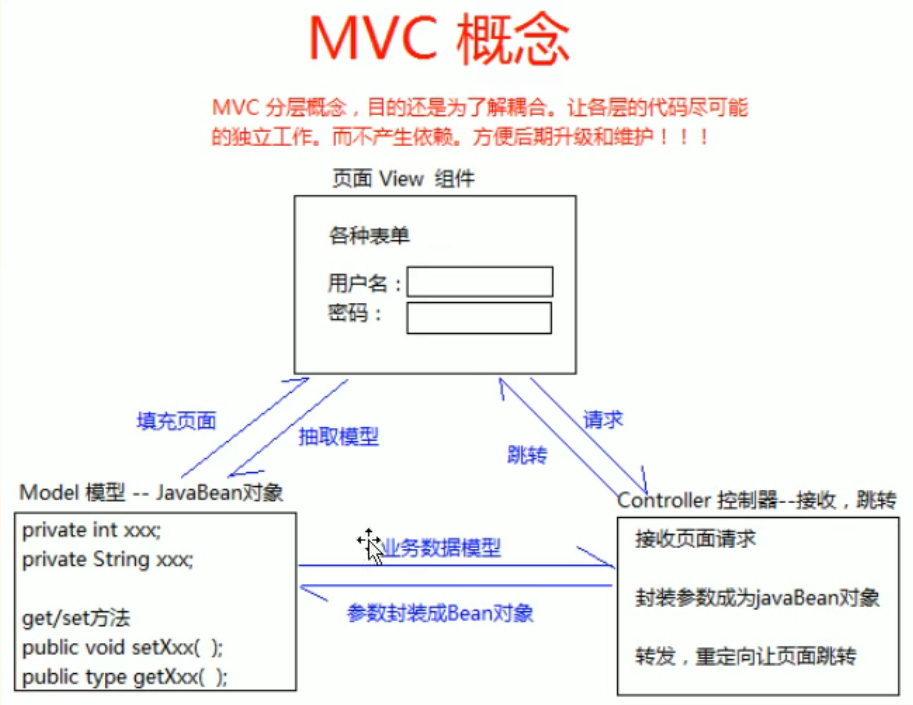

## MVC

MVC，全称（Model View Controller）

- Model：模型

- View：视图

- Controller：控制器

用于指导web层的代码如何有效的分离，单独工作

MVC是一种思想，将代码拆分成组件，单独开发，组合使用（**目的是为了解耦合**）

### Model模型

将业务逻辑相关的数据封装成具体的JavaBean类，不掺杂任何与数据处理相关的代码

相关目录：

- JavaBean

- domian

- entity

### View视图

只负责数据和界面的显示，不接受任何与显示数据无关的代码

相关目录：

- JSP

- HTML

### Controller控制器

只负责接收请求，调用业务层的代码处理请求，然后派发给页面，是一个“调度者”的角色

MVC

MVC，全称（Model View Controller）

- Model：模型

- View：视图

- Controller：控制器

用于指导web层的代码如何有效的分离，单独工作

### Model模型

将业务逻辑相关的数据封装成具体的JavaBean类，不掺杂任何与数据处理相关的代码

相关目录：

- JavaBean

- domian

- entity

- pojo

### View视图

只负责数据和界面的显示，不接受任何与显示数据无关的代码

相关目录：

- JSP

- HTML

### Controller控制器

只负责接收请求，调用业务层的代码处理请求，然后派发给页面，是一个“调度者”的角色

相关目录：Servlet
