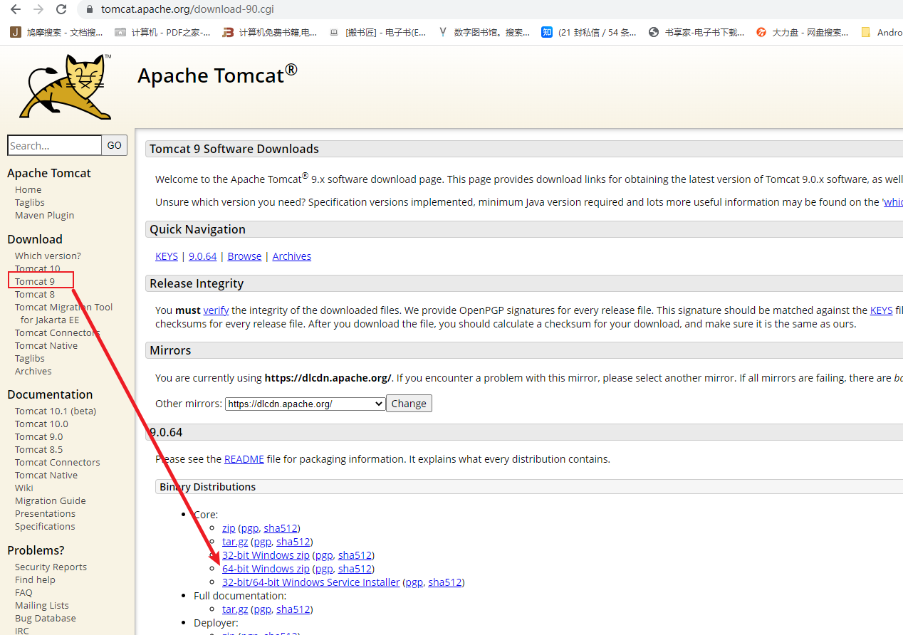
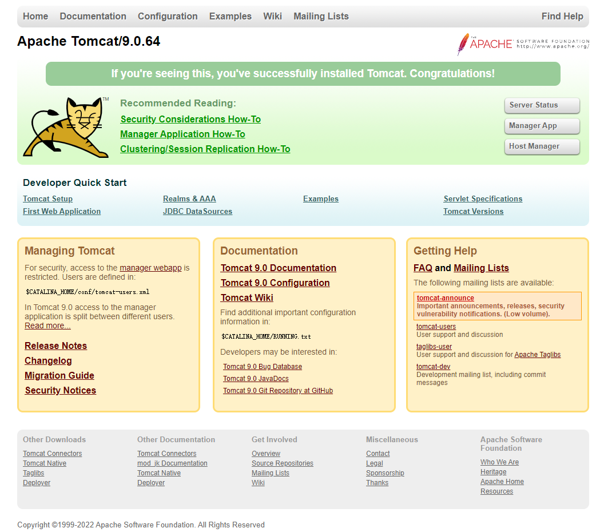
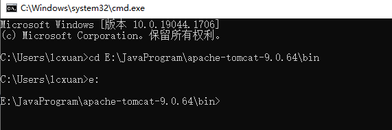

## Tomcat

### Tomcat服务器介绍

Tomcat：Apache组织提供的一种WEB服务器，提供jsp和servlet的支持，轻量级的JavaWeb容器（服务器），也是当前应用最广的JavaWeb服务器【免费】

> Tomcat官网：[https://tomcat.apache.org/](https://tomcat.apache.org/)

### Tomcat服务器安装

找到官方，找到Download下载，下载完后，解压即可



### Tomcat目录介绍


- bin目录：专门用来存放Tomcat服务器的可执行程序

- conf目录：专门用来存放Tomcat服务器的配置文件

- lib目录：专门用来存放Tomcat服务器的jar包

- logs目录：专门用来存放Tomcat服务器运行时输出的日记信息

- temp目录：专门用来Tomcat运行时产生的临时数据

- webapps目录：专门用来存放部署的web工程

- work目录：Tomcat工作时的目录，用来存放Tomcat运行时jsp翻译为servlet的源码，和Session钝化的目录

### Tomcat服务器的启动

#### 方式一：双击startup.bat文件

Tomcat目录 --> bin目录 --> 双击startup.bat文件即可启动

测试，打开浏览器，输入以下其中一个浏览器地址：

- [http://localhost:8080](http://localhost:8080)

- [http://127.0.0.1:8080](http://127.0.0.1:8080)

出现以下界面则Tomcat服务器启动成功



#### 方式二：使用命令行方式

1、win + r 打开命令行

2、cd到Tomcat的bin目录下



3、输入启动命令：catalina run


### Tomcat服务器关闭

#### 方式一：点击Tomcat服务器窗口的关闭按钮


#### 方式二：把Tomcat服务器窗口Ctrl + C

#### 方式三：找到Tomcat服务器的bin目录下的shutdown.bat文件


### 修改Tomcat端口号

Tomcat默认端口号：8080

Tomcat目录 --> conf目录 --> server.xml文件，修改以下端口号即可，修改完后需要重启Tomcat服务器


### 部署Web工程到Tomcat服务器上

#### 方式一：拷贝工程到webapps目录

只需要把Web工程的目录拷贝到Tomcat目录 --> webapps目录下即可

#### 方式二：

Tomcat目录 --> conf目录 --> Catalina目录 --> localhost目录下新建一个xml文件（名字可以自定），内容如下：

```xml
<!--
Context表示一个工程上下文
path表示工程的访问，这里的名字需要和文件名
docBase表示工程的目录
 -->
<Context path="/web03" docBase="e:\myweb" />
```


### 默认访问的工程和资源

默认访问的是ROOT工程

### IDEA整合Tomcat服务器

打开IDEA --> File --> Settings --> Build, Execution, Deployment -->Application Servers添加Tomcat服务器


