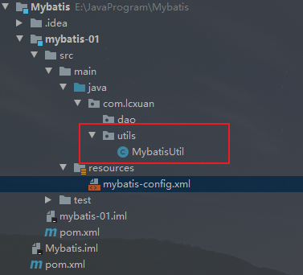
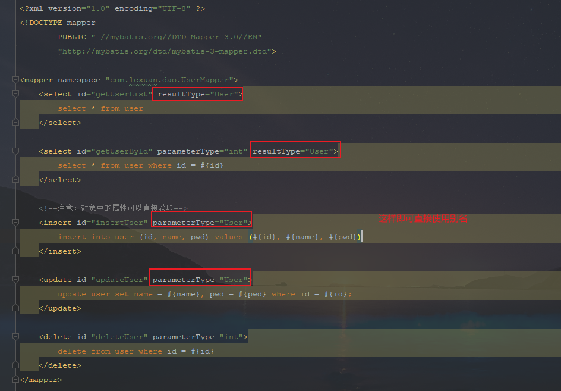
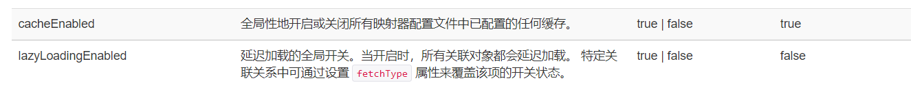
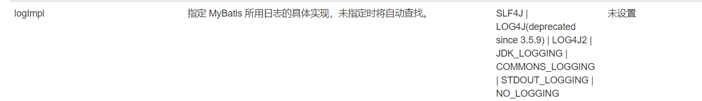
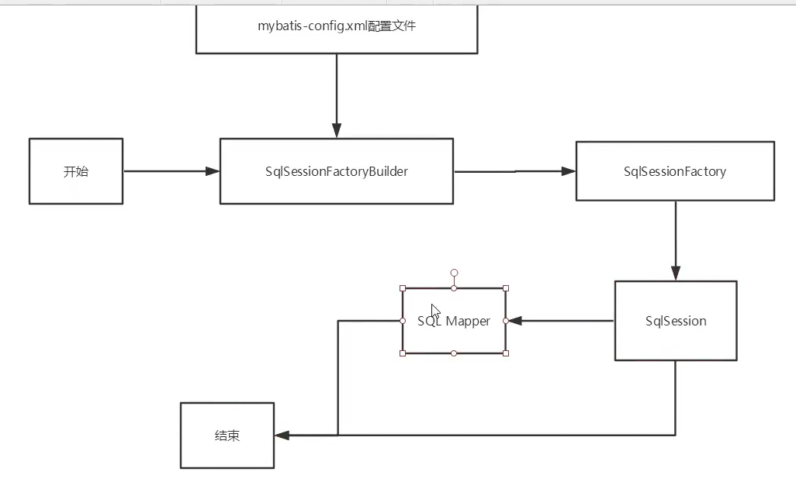
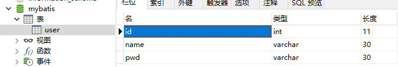
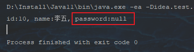
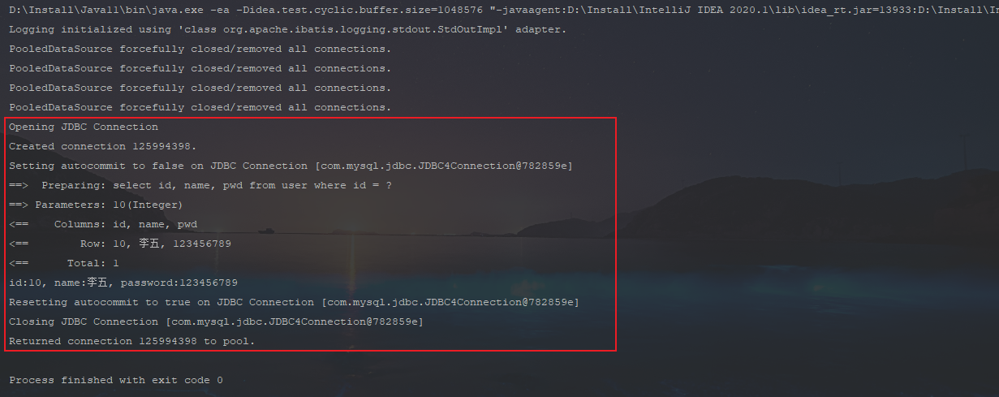
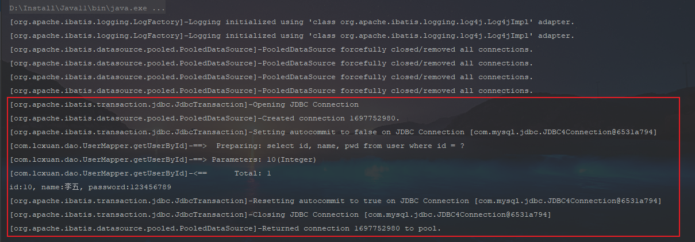

## MyBatis

### 简介

GitHub地址：[Releases · mybatis/mybatis-3 (github.com)](https://github.com/mybatis/mybatis-3/releases)

Maven仓库：[Maven Repository: org.mybatis » mybatis (mvnrepository.com)](https://mvnrepository.com/artifact/org.mybatis/mybatis)

中文文档：[mybatis – MyBatis 3 | 入门](https://mybatis.org/mybatis-3/zh/getting-started.html)

**为什么需要Mybatis**

- 为了将数据存入到数据库中
- 方便
- 传统JDBC代码太复杂


### 问题解决

错误：Error:java: 不再支持源选项 5。请使用 6 或更高版本。

解决方法：在pom.xml文件中加上，代码如下：

```xml
<properties>
    <project.build.sourceEncoding>UTF-8</project.build.sourceEncoding>
    <maven.compiler.encoding>UTF-8</maven.compiler.encoding>
    <java.version>11</java.version>
    <maven.compiler.source>11</maven.compiler.source>
    <maven.compiler.target>11</maven.compiler.target>
</properties>
```


### 使用MyBatis

#### 搭建环境

添加Maven

```xml
<dependencies>

    <!--    mysql驱动-->
    <dependency>
        <groupId>mysql</groupId>
        <artifactId>mysql-connector-java</artifactId>
        <version>8.0.28</version>
    </dependency>

    <!--    mybatis-->
    <dependency>
        <groupId>org.mybatis</groupId>
        <artifactId>mybatis</artifactId>
        <version>3.5.9</version>
    </dependency>

    <!--    junit-->
    <dependency>
        <groupId>junit</groupId>
        <artifactId>junit</artifactId>
        <version>4.13.2</version>
    </dependency>
</dependencies>
```

在resource目录下 -> 新建一个mybatis-config.xml文件，用于mybatis的配置：

```xml
<?xml version="1.0" encoding="UTF-8" ?>
<!DOCTYPE configuration
        PUBLIC "-//mybatis.org//DTD Config 3.0//EN"
        "http://mybatis.org/dtd/mybatis-3-config.dtd">
<!--核心配置文件-->
<configuration>
    <environments default="mysql">
        <environment id="mysql">
            <transactionManager type="JDBC"/>
            <dataSource type="POOLED">
                <property name="driver" value="com.mysql.jdbc.Driver"/>
                <property name="url" value="jdbc:mysql://localhost:3306/mybatis?useSSL=true&amp;useUnicode=true&amp;characterEncoding=UTF-8"/>
                <property name="username" value="root"/>
                <property name="password" value="123456"/>
            </dataSource>
        </environment>
    </environments>
    <!--<mappers>-->
    <!--    <mapper resource="org/mybatis/example/BlogMapper.xml"/>-->
    <!--</mappers>-->
</configuration>
```


#### 新建工具类

这个工具类，用于获取SqlSession对象



```java
public class MybatisUtil {

    private static SqlSessionFactory sessionFactory;

    //获取SqlSessionFactory对象
    static {
        try {
            String resource = "mybatis-config.xml";
            InputStream resourceAsStream = Resources.getResourceAsStream(resource);
            sessionFactory = new SqlSessionFactoryBuilder().build(resourceAsStream);
        } catch (IOException e) {
            e.printStackTrace();
        }
    }

    //获取sqlSession对象，SqlSession对象包含了面向数据库执行SQL命令所需的所有方法
    public static SqlSession getSqlSession(){
        return sessionFactory.openSession();
    }
}
```


#### 编写代码

主要创建实体类、DAO接口、接口实现xml

##### 实体类

新建一个pojo包，接着创建User类，并设置Get和Set方法，代码如下：

```java
public class User {
    private int id;
    private String name;
    private String pwd;

    public User() {
    }

    public User(int id, String name, String pwd) {
        this.id = id;
        this.name = name;
        this.pwd = pwd;
    }

    public int getId() {
        return id;
    }

    public void setId(int id) {
        this.id = id;
    }

    public String getName() {
        return name;
    }

    public void setName(String name) {
        this.name = name;
    }

    public String getPwd() {
        return pwd;
    }

    public void setPwd(String pwd) {
        this.pwd = pwd;
    }
}
```

##### DAO接口

用于编写操作数据表的方法

在dao包中，新建一个UserMapper接口文件，代码如下：

```java
public interface UserMapper {
    List<User> getUserList();
}
```

##### 接口实现xml

用于实现DAO接口中的方法，

在dao包中，新建一个UserMapper.xml文件，代码如下：

```xml
<?xml version="1.0" encoding="UTF-8" ?>
<!DOCTYPE mapper
        PUBLIC "-//mybatis.org//DTD Mapper 3.0//EN"
        "http://mybatis.org/dtd/mybatis-3-mapper.dtd">
<!--namespace绑定一个对应的DAO/Mapper接口-->
<mapper namespace="com.lcxuan.dao.UserMapper">
    <!--id：对应着接口方法的名字-->
    <select id="getUserList" resultType="com.lcxuan.pojo.User">
        select * from user
    </select>
</mapper>
```


##### 测试

**注意：org.apache.ibatis.binding.BindingException: Type interface com.lcxuan.dao.UserMapper is not known to the MapperRegistry.**

上面的报错是因为我们没有注册UserMapper

这时我们需要在配置文件下面注册UserMapper，代码如下：

```xml
<mappers>
    <mapper resource="com/lcxuan/dao/UserMapper.xml"/>
</mappers>
```


### 增删改查

namespace中的包名要和 Dao/Mapper 接口的包名一致

#### select

查询语句

- id：对应namespace中的方法名
- resultType：Sql语句执行的返回值
- parameterType：参数类型

例如：

接口中有一个通过id查询用户的方法，代码如下：

```java
public interface UserMapper {
    User getUserById(int id);
}
```

Mapper中可以通过传参的方式查询，代码如下：

```xml
<?xml version="1.0" encoding="UTF-8" ?>
<!DOCTYPE mapper
        PUBLIC "-//mybatis.org//DTD Mapper 3.0//EN"
        "http://mybatis.org/dtd/mybatis-3-mapper.dtd">
<mapper namespace="com.lcxuan.dao.UserMapper">

    <select id="getUserById" parameterType="int" resultType="com.lcxuan.pojo.User">
        select * from user where id = #{id}
    </select>
    
</mapper>
```


#### insert

插入语句

例如：需要将名字为张三、密码为123456789的数据插入到数据库中

这时在接口中定义方法，代码如下：

```java
public interface UserMapper {
    int insertUser(User user);
}
```

Mapper中设置插入语句，代码如下：

```xml
<?xml version="1.0" encoding="UTF-8" ?>
<!DOCTYPE mapper
        PUBLIC "-//mybatis.org//DTD Mapper 3.0//EN"
        "http://mybatis.org/dtd/mybatis-3-mapper.dtd">
<mapper namespace="com.lcxuan.dao.UserMapper">
    
    <!--注意：对象中的属性可以直接获取-->
    <insert id="insertUser" parameterType="com.lcxuan.pojo.User">
        insert into user (id, name, pwd) values (#{id}, #{name}, #{pwd})
    </insert>
    
</mapper>
```


#### update

更新语句

例如：将id为1的名字修改为李四，密码为123456789

这时在接口中定义方法，代码如下：

```java
public interface UserMapper {
    int updateUser(User user);
}
```

Mapper中设置更新语句，代码如下：

```xml
<?xml version="1.0" encoding="UTF-8" ?>
<!DOCTYPE mapper
        PUBLIC "-//mybatis.org//DTD Mapper 3.0//EN"
        "http://mybatis.org/dtd/mybatis-3-mapper.dtd">
<mapper namespace="com.lcxuan.dao.UserMapper">
    
    <update id="updateUser" parameterType="com.lcxuan.pojo.User">
        update user set name = #{name}, pwd = #{pwd} where id = #{id};
    </update>
    
</mapper>
```


#### delete

删除语句

例如：删除id为1的数据

这时在接口中定义方法，代码如下：

```java
public interface UserMapper {
    int deleteUser(int id);
}
```

Mapper中设置删除语句，代码如下：

```java
<?xml version="1.0" encoding="UTF-8" ?>
<!DOCTYPE mapper
        PUBLIC "-//mybatis.org//DTD Mapper 3.0//EN"
        "http://mybatis.org/dtd/mybatis-3-mapper.dtd">
<mapper namespace="com.lcxuan.dao.UserMapper">
    <delete id="deleteUser" parameterType="int">
        delete from user where id = #{id}
    </delete>
</mapper>
```


#### 使用map方式

使用map的方式将参数传入，代码如下：

```java
public interface UserMapper {
    int addUser(Map<String, Object> map);
}
```

Mapper中使用，代码如下：

```xml
<?xml version="1.0" encoding="UTF-8" ?>
<!DOCTYPE mapper
        PUBLIC "-//mybatis.org//DTD Mapper 3.0//EN"
        "http://mybatis.org/dtd/mybatis-3-mapper.dtd">
<mapper namespace="com.lcxuan.dao.UserMapper">
    <insert id="addUser" parameterType="map">
        insert into user (id, name, pwd) values (#{userId}, #{userName}, #{password})
    </insert>
</mapper>
```

这是在insert语句中的参数可以是任意的值，只需要在传入时一样即可，代码如下：

```java
SqlSession sqlSession = MybatisUtil.getSqlSession();

UserMapper mapper = sqlSession.getMapper(UserMapper.class);

HashMap<String, Object> map = new HashMap<>();
map.put("userId", 10);
map.put("userName", "Lcxuan");
map.put("password", "123456789");

int i = mapper.addUser(map);
System.out.println("影响行数" + i);

sqlSession.close();
```


#### 模糊查询

接口中添加方法，代码如下：

```java
public interface UserMapper {
    List<User> getUserByLike(String value);
}
```

Mapper中设置SQL，代码如下：

```java
<?xml version="1.0" encoding="UTF-8" ?>
<!DOCTYPE mapper
        PUBLIC "-//mybatis.org//DTD Mapper 3.0//EN"
        "http://mybatis.org/dtd/mybatis-3-mapper.dtd">
<mapper namespace="com.lcxuan.dao.UserMapper">
    <select id="getUserByLike" resultType="com.lcxuan.pojo.User">
        select * from user where name like #{value}
    </select>
</mapper>
```


### 配置解析

#### 1、核心配置文件

- mybatis-config.xml文件
- 所有配置
  - configuration（配置）
    - [properties（属性）](https://mybatis.org/mybatis-3/zh/configuration.html#properties)【掌握】
    - [settings（设置）](https://mybatis.org/mybatis-3/zh/configuration.html#settings)【掌握】
    - [typeAliases（类型别名）](https://mybatis.org/mybatis-3/zh/configuration.html#typeAliases)【掌握】
    - [typeHandlers（类型处理器）](https://mybatis.org/mybatis-3/zh/configuration.html#typeHandlers)
    - [objectFactory（对象工厂）](https://mybatis.org/mybatis-3/zh/configuration.html#objectFactory)
    - [plugins（插件）](https://mybatis.org/mybatis-3/zh/configuration.html#plugins)
    - environments（环境配置）【掌握】
      - environment（环境变量）
        - transactionManager（事务管理器）
        - dataSource（数据源）
    - [databaseIdProvider（数据库厂商标识）](https://mybatis.org/mybatis-3/zh/configuration.html#databaseIdProvider)
    - [mappers（映射器）](https://mybatis.org/mybatis-3/zh/configuration.html#mappers)【掌握】


#### 2、环境配置（environments）

Mybatis可以配置多种环境

**注意：尽管可以配置多个环境，但每个 SqlSessionFactory 实例只能选择一种环境**

Mybatis默认的事务管理器：JDBC

Mybatis默认连接池：POOLED


#### 3、properties（属性）

可以通过properties属性来实现引用配置文件

也可以在外部进行配置，并可以进行动态替换。你既可以在典型的 Java 属性文件中配置这些属性，也可以在 properties 元素的子元素中设置。

例如：编写一个配置文件db.properties，代码如下：

```properties
driver=com.mysql.jdbc.Driver
url=jdbc:mysql://localhost:3306/mybatis?useSSL=true&useUnicode=true&characterEncoding=utf-8
username=root
password=123456
```

在核心配置文件中引用

```java
<?xml version="1.0" encoding="UTF-8" ?>
<!DOCTYPE configuration
        PUBLIC "-//mybatis.org//DTD Config 3.0//EN"
        "http://mybatis.org/dtd/mybatis-3-config.dtd">
<!--核心配置文件-->
<configuration>
    <!-- 引入外部配置文件 -->
    <properties resource="db.properties">
        <property name="username" value="root"/>
        <property name="password" value="123456"/>
    </properties>

    <environments default="mysql">
        <environment id="mysql">
            <transactionManager type="JDBC"/>
            <dataSource type="POOLED">
                <property name="driver" value="${driver}"/>
                <property name="url" value="${url}"/>
                <property name="username" value="${username}"/>
                <property name="password" value="${password}"/>
            </dataSource>
        </environment>
    </environments>
    <mappers>
        <mapper resource="com/lcxuan/dao/UserMapper.xml"/>
    </mappers>
</configuration>
```

- 可以直接引入外部文件
- 可以在其中增加一些属性配置
- 如果两个文件中有相同字段，优先使用外部配置文件


#### 4、typeAliases（类型别名）

类型别名可为 Java 类型设置一个缩写名字

作用：在降低冗余的全限定类名书写

```xml
<?xml version="1.0" encoding="UTF-8" ?>
<!DOCTYPE configuration
        PUBLIC "-//mybatis.org//DTD Config 3.0//EN"
        "http://mybatis.org/dtd/mybatis-3-config.dtd">
<!--核心配置文件-->
<configuration>
    <properties resource="db.properties">
        <property name="username" value="root"/>
        <property name="password" value="123456"/>
    </properties>

    <!--设置别名：给实体类起别名-->
    <typeAliases>
        <typeAlias type="com.lcxuan.pojo.User" alias="User"/>
    </typeAliases>

    <environments default="mysql">
        <environment id="mysql">
            <transactionManager type="JDBC"/>
            <dataSource type="POOLED">
                <property name="driver" value="${driver}"/>
                <property name="url" value="${url}"/>
                <property name="username" value="${username}"/>
                <property name="password" value="${password}"/>
            </dataSource>
        </environment>
    </environments>
    <mappers>
        <mapper resource="com/lcxuan/dao/UserMapper.xml"/>
    </mappers>
</configuration>
```



也可以指定一个包名，MyBatis 会在包名下面搜索需要的 Java Bean

搜索的实体类包，默认别名为这个类的类名，首字母小写

```xml
<?xml version="1.0" encoding="UTF-8" ?>
<!DOCTYPE configuration
        PUBLIC "-//mybatis.org//DTD Config 3.0//EN"
        "http://mybatis.org/dtd/mybatis-3-config.dtd">
<!--核心配置文件-->
<configuration>
    <properties resource="db.properties">
        <property name="username" value="root"/>
        <property name="password" value="123456"/>
    </properties>

    <!--设置别名：给实体类起别名-->
    <typeAliases>
        <package name="com.lcxuan.pojo"/>
    </typeAliases>


    <environments default="mysql">
        <environment id="mysql">
            <transactionManager type="JDBC"/>
            <dataSource type="POOLED">
                <property name="driver" value="${driver}"/>
                <property name="url" value="${url}"/>
                <property name="username" value="${username}"/>
                <property name="password" value="${password}"/>
            </dataSource>
        </environment>
    </environments>
    <mappers>
        <mapper resource="com/lcxuan/dao/UserMapper.xml"/>
    </mappers>
</configuration>
```

如果在实体类比较少的时候，建议使用第一种方式

如果在实体类十分多的时候，建议使用第二种方式

区别：

- 第一个可以自定义别名，第二种则不行（可以使用@Alias()注解解决）

```java
@Alias("user")
public class User{}
```


#### 5、settings（设置）

这是 MyBatis 中极为重要的调整设置，它们会改变 MyBatis 的运行时行为






#### 6、mappers（映射器）

 方式一：【推荐使用】

```xml
<mappers>
  <mapper resource="com/lcxuan/mapper/UserMapper.xml"/>
</mappers>
```

方式二：使用class文件绑定注册

```xml
<mappers>
  <mapper class="com.lcxuan.mapper.UserMapper"/>
</mappers>
```

注意：

- 接口和Mapper配置文件必须同名
- 接口和Mapper配置文件必须在一个包下

方式三：使用扫描包进行注入绑定

```xml
<mappers>
  <package name="com.lcxuan.mapper"/>
</mappers>
```

注意点和方式二一样


#### 7、生命周期和作用域

生命周期和作用域是至关重要的，因为错误的使用会导致非常严重的并发问题



##### SqlSessionFactoryBuilder

- 一旦创建SqlSessionFactory就不需要它
- 局部变量

##### SqlSessionFactory

- 可以想象成数据库连接池
- 一旦被创建就应该在应用运行期间一直存在，没有任何理由丢弃它或者重新创建另外一个实例
- 最简单的就是使用**单例模式**或者**静态单例模式**

##### SqlSession

- 连接到连接池的一个请求
- 需要开启和关闭
- 用完之后需要赶紧关闭，否则资源会被占用


### 解决属性名和字段名不一致的问题

当前User表中的字段：



修改实体类中的数据：

```java
public class User {
    private int id;
    private String name;
    private String password;

    public User() {
    }

    public User(int id, String name, String password) {
        this.id = id;
        this.name = name;
        this.password = password;
    }

    public int getId() {
        return id;
    }

    public void setId(int id) {
        this.id = id;
    }

    public String getName() {
        return name;
    }

    public void setName(String name) {
        this.name = name;
    }

    public String getPassword() {
        return password;
    }

    public void setPassword(String password) {
        this.password = password;
    }
}
```

这是查询数据会出现password为空的问题



解决方式：

- 起别名

```xml
<select id="getUserById" resultType="User">
    select id, name, pwd as password from user where id = #{id}
</select>
```

- 使用resultMap

#### resultMap

结果集映射

```xml
<?xml version="1.0" encoding="UTF-8" ?>
<!DOCTYPE mapper
        PUBLIC "-//mybatis.org//DTD Mapper 3.0//EN"
        "http://mybatis.org/dtd/mybatis-3-mapper.dtd">

<mapper namespace="com.lcxuan.dao.UserMapper">

    <!--结果集映射 id对应着下面的resultMap type最终映射的类型-->
    <resultMap id="UserMap" type="User">
        <!--column:数据库中的字段 property：实体类中的属性-->
        <result column="pwd" property="password"/>
    </resultMap>

    <select id="getUserById" resultMap="UserMap">
        select id, name, pwd from user where id = #{id}
    </select>
</mapper>
```


### 日志

#### 1、日志工厂

如果一个数据库操作，出现了异常，而我们需要排错，那么日志就是最好的助手


- SLF4J
- LOG4J(deprecated since 3.5.9)【掌握】
- LOG4J2
- JDK_LOGGING
- COMMONS_LOGGING
- STDOUT_LOGGING【掌握】
- NO_LOGGING

在Mybatis中具体使用哪个日志实现，需要在设置中设定

##### STDOUT_LOGGING

在mybatis核心配置中，配置日志：

```xml
<settings>
    <setting name="logImpl" value="STDOUT_LOGGING"/>
</settings>
```




#### Log4j

Log4j是Apache的一个开源项目，通过使用Log4j，可以控制日志信息输送的目的地是控制台、文件、GUI组件

也可以控制每一条日志的输出格式

通过定义每一条日志信息的级别，能够更加细致地控制日志的生成过程

通过一个配置文件来灵活地进行配置，而不需要修改应用的代码

##### 1、导入log4j的maven包

```xml
<dependency>
    <groupId>log4j</groupId>
    <artifactId>log4j</artifactId>
    <version>1.2.17</version>
</dependency>
```

##### 2、设置log4j.properties配置文件

```properties
#将等级为DEBUG的日志信息输出到console和file这两个目的地，console和file的定义在下面的代码
log4j.rootLogger=DEBUG,console,file

#控制台输出的相关设置
log4j.appender.console = org.apache.log4j.ConsoleAppender
log4j.appender.console.Target = System.out
log4j.appender.console.Threshold=DEBUG
log4j.appender.console.layout = org.apache.log4j.PatternLayout
log4j.appender.console.layout.ConversionPattern=[%c]-%m%n

#文件输出的相关设置
log4j.appender.file = org.apache.log4j.RollingFileAppender
log4j.appender.file.File=./log/logFile.log
log4j.appender.file.MaxFileSize=10mb
log4j.appender.file.Threshold=DEBUG
log4j.appender.file.layout=org.apache.log4j.PatternLayout
log4j.appender.file.layout.ConversionPattern=[%p][%d{yy-MM-dd}][%c]%m%n

#日志输出级别
log4j.logger.org.mybatis=DEBUG
log4j.logger.java.sql=DEBUG
log4j.logger.java.sql.Statement=DEBUG
log4j.logger.java.sql.ResultSet=DEBUG
log4j.logger.java.sql.PreparedStatement=DEBUG
```

##### 3、配置log4j的日志

```xml
<settings>
    <setting name="logImpl" value="LOG4J"/>
</settings>
```

##### 4、log4j的使用



1. 在要使用Log4j的类中，导入包 import org.apache.log4j.Logger

2. 日志对象，参数为当前类的class

```java
static Logger logger = Logger.getLogger(UserDaoTest.class);
```

3. 日志级别

```java
logger.info("info:testLog4j...");
logger.debug("debug:testLog4j...");
logger.error("error:testLog4j...");
```


### 分页

#### 使用Limit进行分页

1、接口实现方法，代码如下：

```java
public interface UserMapper {
    List<User> getUserByLimit(Map<String, Object> map);
}
```

2、Mapper.xml，代码如下：

```xml
<?xml version="1.0" encoding="UTF-8" ?>
<!DOCTYPE mapper
        PUBLIC "-//mybatis.org//DTD Mapper 3.0//EN"
        "http://mybatis.org/dtd/mybatis-3-mapper.dtd">

<mapper namespace="com.lcxuan.dao.UserMapper">
    <select id="getUserByLimit" parameterType="map" resultType="user">
        select * from user limit #{startIndex}, #{pageSize}
    </select>
</mapper>
```


#### 使用RowBounds分页

不使用SQL进行分页

1、接口实现方法，代码如下：

```java
public interface UserMapper {
    List<User> getUserByRowBounds();
}
```

2、Mapper.xml文件，代码如下：

```java
<?xml version="1.0" encoding="UTF-8" ?>
<!DOCTYPE mapper
        PUBLIC "-//mybatis.org//DTD Mapper 3.0//EN"
        "http://mybatis.org/dtd/mybatis-3-mapper.dtd">

<mapper namespace="com.lcxuan.dao.UserMapper">
    <select id="getUserByRowBounds" resultType="user">
        select * from user
    </select>
</mapper>
```

3、测试，代码如下：

```java
SqlSession sqlSession = MybatisUtil.getSqlSession();

//RowBounds实现
RowBounds rowBounds = new RowBounds(0, 2);

//通过代码层面实现分页
List<User> userList = sqlSession.selectList("com.lcxuan.dao.UserMapper.getUserByRowBounds", null, rowBounds);

for (User user : userList) {
    System.out.println(user);
}

sqlSession.close();
```


### 使用注解开发

接口上实现注解，代码如下：

```java
public interface UserMapper {
    @Select("select * from user")
    List<User> getUsers();
}
```

核心配置文件中绑定接口，代码如下：

```xml
<mappers>
    <mapper class="com.lcxuan.dao.UserMapper"/>
</mappers>
```


本质：反射机制实现

底层：动态代理
