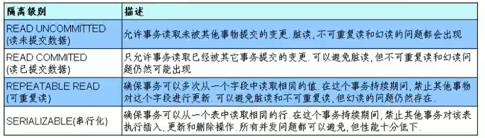

## 隔离级别



- 查看隔离级别
  
  ```shell
  select @@tx_isolation;
  ```

- 设置当前mysql连接的隔离级别：
  
  ```shell
  set transaction isolation level read committed;
  ```

- 设置数据库系统的全局隔离级别：
  
  ```shell
  set global transaction isolation level read committed;
  ```


