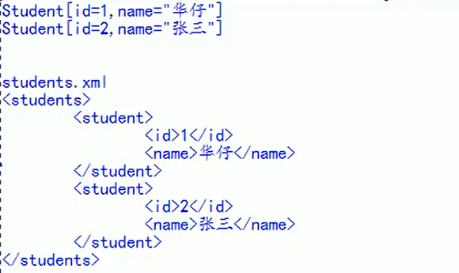

## XML

- xml是可扩展的标记性语言

- 主要作用：
  
  - 用来保存数据，而且这些事数据具有自我描述性
  
  - 可以作为项目或者模块的配置文件
  
  - 还可以作为网络传输数据的格式（JSON为主）



```xml
<?xml version="1.0" encoding="UTF-8" ?>
<!--
    <?xml version="1.0" encoding="UTF-8" ?>
    以上内容就是xml文件的声明
    version="1.0" 表示xml的版本
    encoding="UTF-8" 表示xml文件本身的编码
-->
<books> <!-- books 表示多个图书的信息 -->
    <book sn="SN1001">  <!-- book 表示一个图书的信息 sn="SN1001" 表示图书的序列号 -->
        <name>时间简史</name>  <!-- name标签 表示书名 -->
        <author>霍金</author> <!-- author标签 表示作者 -->
        <price>75</price> <!-- price标签 表示价格 -->
    </book>
    <book sn="SN1002">  <!-- book 表示一个图书的信息 sn="SN1001" 表示图书的序列号 -->
        <name>Java入门</name>  <!-- name标签 表示书名 -->
        <author>张三</author> <!-- author标签 表示作者 -->
        <price>70</price> <!-- price标签 表示价格 -->
    </book>
</books>
```

### XML语法规则

- 所有XML元素必须有关闭标签

- XML元素对大小写敏感（即区分大小写）

- XML 必须正确的嵌套

- XML文档必须有根元素

- XML中的特殊字符需要使用其他方法
  
  ```xml
  >特殊字符 使用 >
  <特殊字符 使用 <
  ```

- 文本区域（CDATA区）可以告诉xml解析器，文本不需要被解析
  
  ```xml
  <![CDATA[输入的字符,不会被解析成xml]]>
  ```

### XML标签

- XML标签指的是开始标签到结束标签的部分

- 标签可以包含其他元素、文本或者两者的混合物，元素也可以有属性

- XML中的标签也分为 单标签 和 双标签
  
  - 单标签
    
    ```xml
    <标签名 属性="值" 属性="值" ... />
    ```
  
  - 双标签
    
    ```xml
    <标签名 属性="值" 属性="值" ...>文本数据或者标签</标签名>
    ```

- XML中一个标签可以有多个属性，**每个属性的值必须使用 引号 引起来**

### XML元素命名规则

- 名称可以包含字母、数字以及其他的字符

- 名称不能以数字或者标点符号开始

- 名称不能包含空格

### 使用dom4j解析技术

- 解析以下books.xml文件，代码如下：
  
  ```xml
  <?xml version="1.0" encoding="UTF-8" ?>
  <!--
      <?xml version="1.0" encoding="UTF-8" ?>
      以上内容就是xml文件的声明
      version="1.0" 表示xml的版本
      encoding="UTF-8" 表示xml文件本身的编码
  -->
  <books> <!-- books 表示多个图书的信息 -->
      <book sn="SN1001">  <!-- book 表示一个图书的信息 sn="SN1001" 表示图书的序列号 -->
          <name>时间简史</name>  <!-- name标签 表示书名 -->
          <author>霍金</author> <!-- author标签 表示作者 -->
          <price>75</price> <!-- price标签 表示价格 -->
      </book>
      <book sn="SN1002">  <!-- book 表示一个图书的信息 sn="SN1001" 表示图书的序列号 -->
          <name>Java入门</name>  <!-- name标签 表示书名 -->
          <author>张三</author> <!-- author标签 表示作者 -->
          <price>70</price> <!-- price标签 表示价格 -->
      </book>
  </books>
  ```

- 需要导入dom4j的jar包

- 解析代码
  
  ```java
  
  ```
