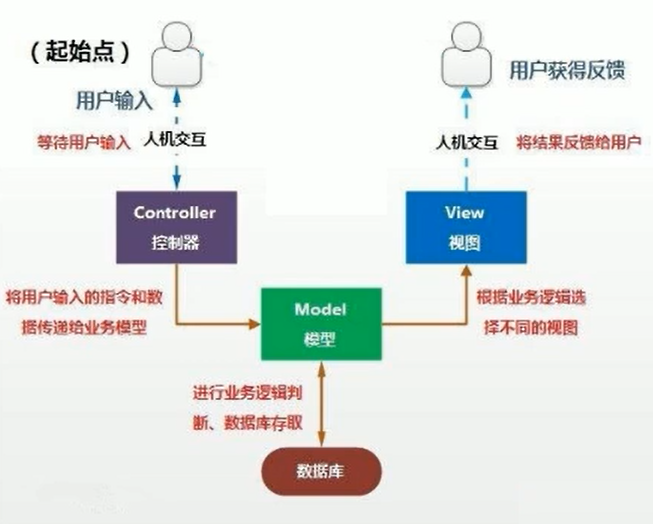

## MVC设计模式

MVC是常用的设计模式之一，将整个程序分为三个层次：

- 视图模型层

- 控制器层

- 数据模型层

将程序输入输出、数据处理，以及数据的展示分离开来的设计模式使程序结构变得灵活而且清晰，同时也描述了程序各个对象间的通信方式，降低程序的耦合性

### 模型层（model）

主要用于处理数据

- 数据对象封装：model.bean/domain

- 数据库操作类：model.dao

- 数据库：model.db

### 控制层（controller）

主要处理业务逻辑

- 应用界面相关：controller.activity

- 存放fragment：controller.fragment

- 显示列表的适配器：controller.adaper

- 服务相关：controller.service

- 抽取的基类：controller.base

### 视图层（view）

主要显示数据

- 相关工具类：view.utils

- 自定义View：view.ui

