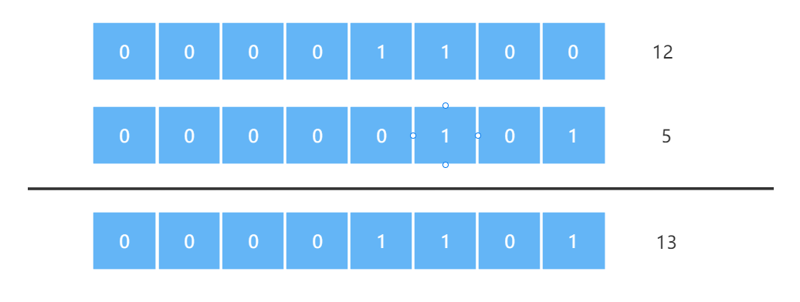
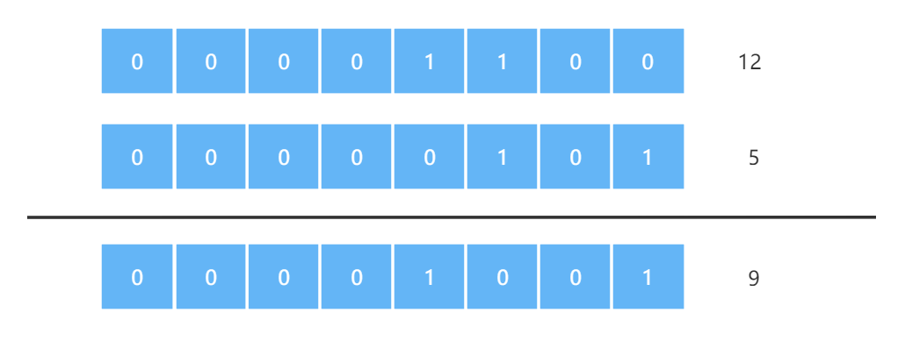
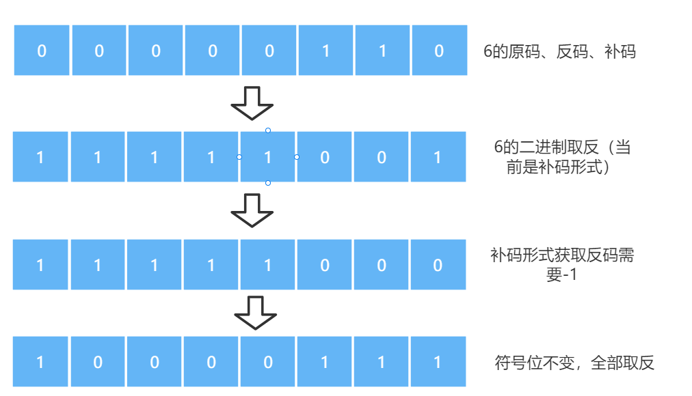
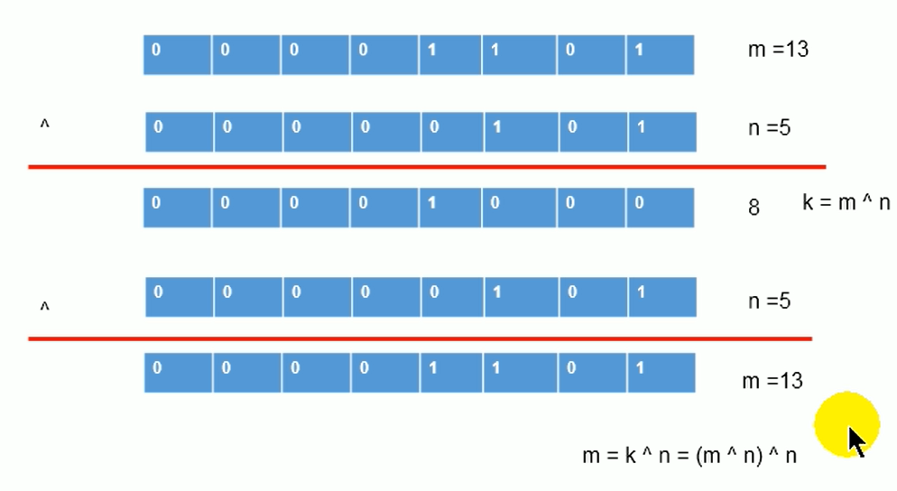

## 位运算符

直接对整数的二进制进行的运算

### 一、运算符<<

左移，在**一定范围内**相当每次往左移动一位乘于一个2，超出范围可能会出现结果不同

例如：21 << 4，21往左移动4位，相当于===> 21 * 2 * 2 * 2 * 2 = 336

```java
int i = 21;

// 得出结果：336
System.out.println("<< 左移运算：" + (i << 4));
```

### 二、运算符>>

右移，在**一定范围内**相当每次往右移动一位除于一个2，超出范围可能会出现结果不同

例如：21 >> 1，21往右移动1位，相当于===> 21 / 2 = 10

```java
int i = 21;

// 得出结果：10
System.out.println(">> 右移运算：" + (i >> 1));
```

### 三、运算符>>>

无符号右移，被移位的二进制最高位无论是0还是1，空缺出来的位置都使用0补，其余和运算符 >>一样

### 四、运算符&

与运算，二进制进行&运算，只有1&1时结果为1，否则为0


```java
int m = 12;
int n = 5;
// 得出结果：4
System.out.println("m & n：" + (m & n));
```

### 五、运算符|

或运算，二进制进行|运算，只有0|0时结果为0，否则为1



```java
int m = 12;
int n = 5;
// 得出结果：13
System.out.println("m | n：" + (m | n));
```

### 六、运算符^

异或运算，相同的二进制位进行^运算，结果为0，不同的二进制位进行^运算，结果为1

例如：

1^1 = 0 、0^0 = 0

1^0 = 1 、0^1 = 1



```java
int m = 12;
int n = 5;
// 得出结果：9
System.out.println("m ^ n：" + (m ^ n));
```

### 七、运算符~

取反运算，将该数的所有二进制位全部取反

公式：~x = - (x + 1)



例如：~6 = -7

```java
int i = 6;
System.out.println("~运算符：" + (~i));
```

### 练习

#### 一、交换两个变量的值

使用异或方式：



```java
// 练习：交换两个变量的值
int num1 = 10;
int num2 = 20;
System.out.println("num1:" + num1 + ", num2:" + num2);

// 使用异或方式
num1 = num1 ^ num2;
num2 = num1 ^ num2;
num1 = num1 ^ num2;

System.out.println("num1:" + num1 + ", num2:" + num2);
```

### 面试题

#### 一、最高效的计算2 * 8

解决方法 ：2 << 3 或者 8 << 1
