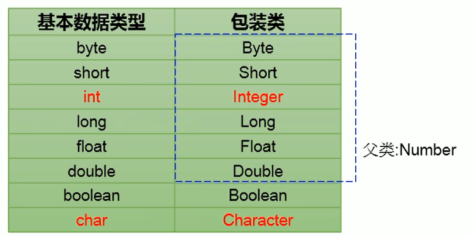

## 包装类

包装类（封装类）是针对八种基本数据类型定义相应的引用类型



### 基本数据类型转换为包装类

- Java9之前的转换方式：调用包装类的构造器
  
  ```java
  Integer integer1 = new Integer(10);
  ```

- Java9之后的使用方式：调用包装类.valueOf()方法
  
  ```java
  Integer integer = Integer.valueOf(10);
  ```

### 包装类转换为基本数据类型

需要调用包装类的 xxxValue()方法

```java
Integer integer = new Integer(123);
int i = integer.intValue();
```

### 自动装箱和自动拆箱

JDK 5.0 的新特性

#### 自动装箱

主要用于替代基本数据类型转换为包装类的过程，只需要简单的赋值即可

```java
int number = 10;
Integer integer = number;
```

#### 自动拆箱

主要用于替代包装类转换为基本数据类型的过程，只需要简单的赋值即可

```java
Integer integer = Integer.valueOf(10);
int number = integer;
```

### 基本数据类型、包装类和String类型的相互转换

转换为String类型：

- 方式1：连接运算
  
  ```java
  String str1 = 1 + "";
  ```

- 方式2：使用String.valueOf()方法
  
  ```java
  float f1 = 12.3f;
  String str2 = String.valueOf(f1);
  ```

转换为基本数据类型、包装类：

- 调用包装类的parseXXX()方法
  
  ```java
  
  ```
