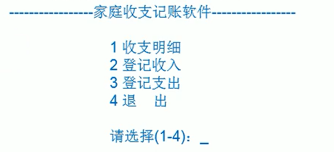
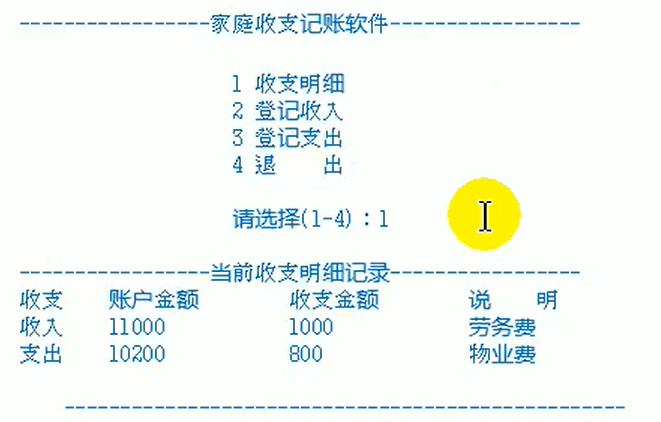
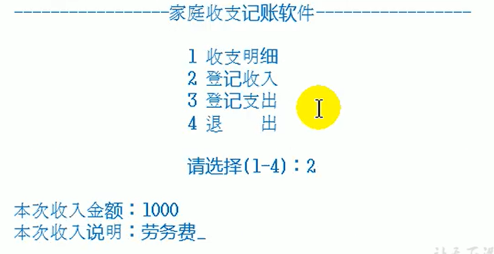
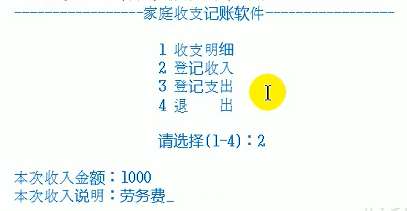
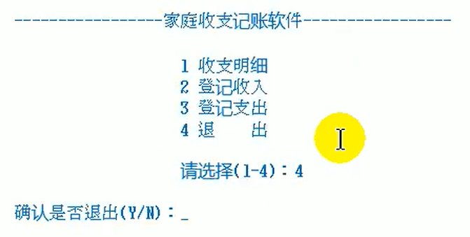

## 需求说明

- 模拟实现基于文本界面的《家庭记账软件》

- 该软件能够记录家庭的收入、支出、并能够打印收支明细表

- 项目采用分级菜单方式。

### 说明

- 假设家庭起始的生活基本金为10000元

- 每次登记收入（菜单2）后，收入的金额应该累加到基本金中，并记录本次收入明细，以便后续的查询

- 每次登录支出（菜单3）后，支出的金额应该从基本金中扣除，并记录本次支出明细，以便后续的查询

- 查询收支明细（菜单1）时，将显示所有的收入、支出的明细列表

### 主菜单

### 收支明细

- 收支明细的界面及操作过程如下：

### 登记收入

- 登记收入的界面及操作过程如下：

### 登记支出

- 登记支出的界面及操作过程如下：

### 退出

- 退出的界面及操作过程如下：

