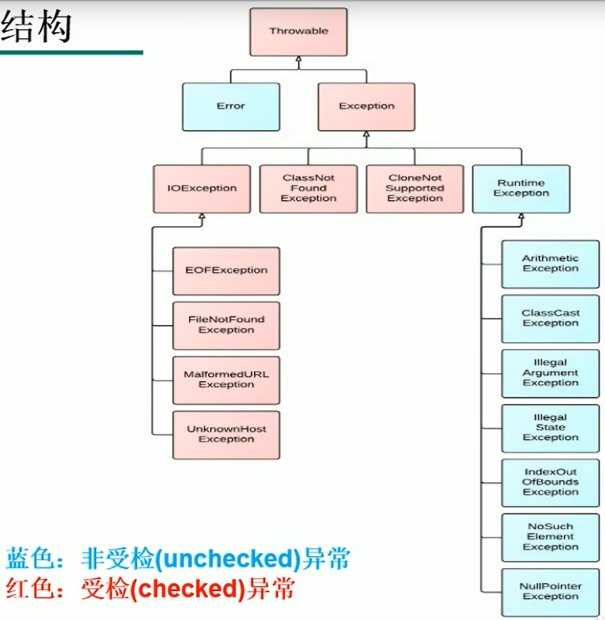

## 异常

在系统运行过程中可能会遇到一些问题，而有些问题不是靠代码能够避免的。例如：客户输入数据的格式，读取文件是否存在，网络是否始终保持通常等。

**异常：在Java语言中，将程序执行中发生的不正常情况称为“异常”（开发过程中的语法错误和逻辑错误不是异常）**

### 异常分类

Java程序在执行过程中所发生的异常事件分为两种：

- Error

- Exception

#### Error

Java虚拟机无法解决的严重问题，一般不用编写针对性的代码进行处理

例如：JVM系统内部错误、资源耗尽等严重情况。

```java
public class ErrorTest {
    public static void main(String[] args) {
        // 栈溢出：java.lang.StackOverflowError
        //main(args);

        // 堆溢出：java.lang.OutOfMemoryError
        Integer[] arr = new Integer[1024 * 1024 * 1024];
    }
}
```

#### Exception

其他因编程错误或者偶然的外在因素导致的一般性问题，可以编写针对性的代码进行处理，例如：

- 空指针访问

- 读取不存在的文件

- 网络连接中断

- 数据下标越界

Exception还分为两种异常：

- 编译时异常（checked）

- 运行时异常（unchecked）



### 解决方法

对于上述的错误，一般有两种解决方法：

- 遇到错误就终止程序的运行

- 在编写程序时，考虑到错误的检测、错误消息的提示，以及错误的处理

### 异常处理方式

将异常处理的程序代码集中在一起，与正常的程序代码分开，使得程序简洁、优雅、并易于维护

Java提供的是异常处理的抓抛模型

- 过程一：“抛”：程序在正常执行的过程中，一旦出现异常，就会在异常代码处生成一个对应异常类的对象，并将此对象抛出，一旦抛出对象后，后面的代码就不再执行，异常对象的产生：
  
  - 系统自动生成的异常对象
  
  - 手动生成的异常对象，并抛出（throw关键字）

- 过程二："抓"：可以理解为异常处理的方式：
  
  - try-catch-finally
  
  - throws

#### 方式一：try-catch-finally

```java
try{
    // 可能出现异常的代码
}catch(异常类型1 变量名){
    // 处理异常的方式1
}catch(异常类型2 变量名){
    // 处理异常的方式2
}
....
finally{
    // 一定会执行的
}
```

- finally{}是可选的

- 使用try将可能出现的异常包装起来，在执行过程中，一旦出现异常，就会生成一个对应异常类的对象，根据此对象的类型，去catch中进行匹配

- 一旦try中的异常匹配到某个catch时，就会进入catch中进行异常处理，一旦处理完成，就会跳出try-catch结构（在没有写finally的情况下）。继续执行后面的代码

- catch中的异常类型如果没有子父类关系，则谁在上面谁在下面没有关系，但是一旦满足子父类关系，则要求子类一定声明在父类的上面。否则会报错

- try结构中声明的变量，在try外面不能再被调用

- 常用异常处理的方法：
  
  - getMessage()方法
  
  - printStackTrace()方法

```java
public class ExceptionTest {
    public static void main(String[] args) {
        String str = "123";
        str = "abc";

        int num = 0;    //这种方式可以在try结构外被调用
        try {
            //int num = Integer.parseInt(str);  // 当前这种方式无法在try结构外被调用
            num = Integer.parseInt(str);

            System.out.println("数值转换后的代码......");
        }catch (NumberFormatException e){
            System.out.println(e.getMessage()); // getMessage()方法
            e.printStackTrace();    // printStackTrace()方法
        }
        System.out.println("获取到的num：" + num);
    }
}
```

##### finally的使用

- finally是可选的

- finally中声明的是一定会被执行的代码。即使catch中又出现异常，try中有return语句，catch中有return语句等情况

- 像数据库连接、输入输出流、网络编程Socket等资源，JVM是不能回收的，需要手动进行资源释放

- try-catch-finally结构是可以相互嵌套的

```java
public class FinallyTest {
    public static void main(String[] args) {
        try {
            int a = 10;
            int b = 0;
            System.out.println(a / b);
        }catch (ArithmeticException e){
            int[] arr = new int[1024 * 1024 * 1024];
        }catch (Exception e){
            e.printStackTrace();
        }finally {
            System.out.println("一定执行的代码");
        }
    }
}
```

使用try-catch-finally处理编译时异常，使得程序在编译时就不再报错，但是在运行时仍然可能报错，相当于使用try-catch-finally将一个编译时可能出现的异常，延迟到运行时出现

#### 方式二：throws + 异常类型

- throws + 异常类型，是写在方法的声明处，指明此方法执行时，可能抛出的异常类型，当方法执行时，出现异常，仍会在异常代码处生成一个异常类的对象，此对象满足throws后异常类型时，就会抛出，异常代码后续的代码不再执行

```java
public class ExceptionTest2 {

    public static void main(String[] args) {
        try {
            method1();
        } catch (ArithmeticException e) {
            e.printStackTrace();
        }
    }

    public static void method1() throws ArithmeticException{
        int a = 10;
        int b = 0;
        int num = a / b;
    }
}
```

### 方法重写的规则之一

子类重写的方法抛出的异常类型不能大于父类被重写的方法抛出的异常类型

### try-catch-finally和throws的选择

- 如果父类中被重写的方法没有throws方式处理异常，则子类重写的方法也不能使用throws，意味着如果子类重写的方法中有异常，则必须使用try-catch-finally方式

- 执行的方法A中，先后又调用了另外的几个方法，这几个方法是递进关系执行的，建议这几个方法使用throws方式，而方法A考虑使用try-catch-finally方式

### 手动抛出异常

使用throw关键字

```java
public class StudentTest {
    public static void main(String[] args) {
        try {
            Student student = new Student();
            student.register(0);
            System.out.println(student);
        } catch (Exception e) {
            e.printStackTrace();
        }
    }
}

class Student{
    private int id;

    public void register(int id) throws Exception{
        if (id > 0){
            this.id = id;
        }else {
            // 手动抛出异常对象
            throw new RuntimeException("您输入的数据非法！！！");
        }
    }

    @Override
    public String toString() {
        return "Student{" +
                "id=" + id +
                '}';
    }
}
```

### 自定义异常

步骤一：继承于现有的异常结构：

- RuntimeException

- Exception

步骤二：提供全局常量：serialVersionUID

步骤三：提供重载的构造器

```java
public class MyException extends RuntimeException{
    static final long serialVersionUID = -7034897190745166939L;

    public MyException() {
    }

    public MyException(String message) {
        super(message);
    }

}
```