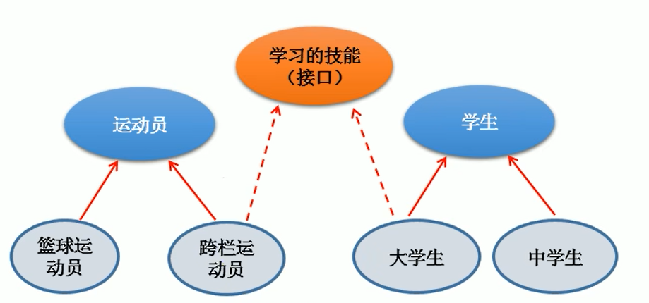

## 接口（interface）

有时候必须从几个类中派生出一个子类，继承它们所有的属性和方法，但是，Java中不支持多重继承，所以有了接口，可以实现多重继承

接口就是一种规范，定义的是一组规则。



### 接口使用

- 接口使用interface关键字类定义

- Java中，接口和类是并列的结构

- 接口中不能定义构造器，所以接口不能实例化

- 定义接口成员
  
  - Java7及以前：只能定义全局常量和抽象方法
    
    - 全局常量：`public static final`【可以省略不写】
    
    - 抽象方法：`public abstract`【可以省略不写】
  
  - Java8以后：除了定义全局常量和抽象方法外，还可以定义静态方法、默认方法
    
    - 静态方法：`public static`【可以省略public】，只能使用接口来调用
    
    - 默认方法：`public default`【可以省略public】，可以在实现类中进行重写

- Java开发中，接口通过让类去实现（implements关键字）的方式来使用
  
  - 如果实现类实现了接口中所有的方法，则实现类可以实例化
  
  - 如果实现类没有实现接口中的所有方法，则实现类为一个抽象类

- 接口可以实现多个接口 ---> 用于弥补Java单继承的局限性

- 接口和接口之间可以继承，并且可以多继承

- 如果子类继承的父类和实现的接口中声明同名同参数的方法，那么子类在没有重写此方法的情况下，默认调用的是父类中的同名同参数的方法

- 如果实现类实现了多个接口，而这个多个接口中定义了同名同参数的默认方法，那么在实现类没有重写此方法的情况下，会报错

```java
interface AttackAble{
    void attack();
}

interface Flyable{
    // 定义全局常量
    public static final int MAX_SPEED = 7900;   // 方式一：全写
    int MIN_SPEED = 1;  // 方式二：省略public static final

    // 定义抽象方法
    public abstract void fly(); // 方式一：全写
    void stop();    // 方式二：省略public abstract
}

// 实现接口
class Plane implements Flyable{

    @Override
    public void fly() {

    }

    @Override
    public void stop() {

    }
}

abstract class Kite implements Flyable{
    @Override
    public void fly() {

    }
}

// 实现多个接口
class Bullet implements Flyable, AttackAble{

    @Override
    public void attack() {

    }

    @Override
    public void fly() {

    }

    @Override
    public void stop() {

    }
}

// 接口和接口之前的继承，并且可以多继承
interface AA{}
interface BB{}
interface CC extends AA, BB{}

```