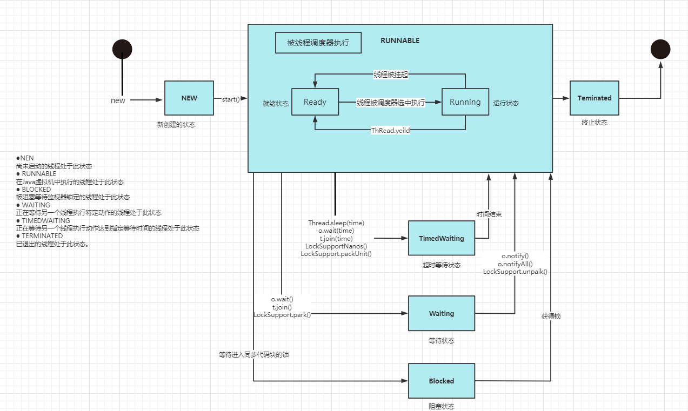

## 进程

进程是指运行中的程序，例如：使用的QQ，就启动了一个进程，操作系统就会为该进程分配内存空间

进程是程序的一次执行过程，或是正在运行的一个程序。是董涛过程：有它自身的产生、存在和消亡过程

## 线程

线程由进程创建，是进程的一个实体

一个进程可以拥有多个线程

单线程：同一个时刻，只允许执行一个线程

多线程：同一个时刻，可以执行多个线程，比如：一个QQ进程，可以同时打开多个聊天窗口，一个迅雷进程，可以同时下载多个文件

### 并发

同一个时刻，多个任务交替执行，造成一个“貌似同时”的错觉，简单的说，单核CPU实现的多任务就是并发

### 并行

同一个时刻，多个任务同时执行。多核CPU可以实现并行

### 创建线程的四种方式

- 继承Thread类，重写run方法

- 实现Runnnable接口，重写run方法

- 实现Callable接口，实现call()方法

- 使用线程池

### 线程终止

#### 基本说明

- 当线程完成任务后，会自动退出
- 还可以通过使用变量来控制run方法退出的方式停止线程，即通知方式

### 线程常用方法

- setName：设置线程名称

- getName：返回线程的名称

- start：线程开始执行

- run：调用线程对象run方法

- setPriority：更改线程的优先级

- getPriority：获取线程的优先级

- sleep：在指定的毫秒数内让当前正在执行的线程休眠（暂停执行）

- interrupt：中断线程

- yieId：线程的礼让。让出cpu，让其他线程执行，但礼让时间不确定，所以不一定成功

- join：线程的插队。插队的线程一旦插队成功，则肯定先执行完插入的线程所有的任务

### 用户线程和守护线程

- 用户线程：也叫工作线程，当线程的任务执行完或通知方式结束
- 守护线程：一般是为工作线程服务的，当所有的用户线程结束，守护线程自动结束
- 常见守护线程：垃圾回收机制

设置守护线程：

```java
对象.setDaemon(true);
```

### 线程的状态



### 解决线程安全问题的方式

- 在多线程编程，一些敏感数据不允许被多个线程同时访问，此时就使用同步访问技术，保证数据在任何同一时刻，最多有一个线程访问，以保证数据的完整性
- 也可以理解：线程同步，即当有一个线程在对内存进行操作时，其他线程都不可以对这个内存地址进行操作，知道该线程完成操作，其他线程才能对该内容地址进行操作

#### Synchronized方法使用

- 方式一：同步代码块

```java
synchronized (同步监视器){    //得到对象的锁，才能操作同步代码
    //需要被同步代码;
}
//1. 操作共享数据的代码，即为需要被同步的代码
//2. 同步监视器，俗称：锁。任何一个类的对象，都可以充当锁。也可以使用this、或者当前的对象【类.class】作为锁
//    要求：多个线程必须共用同一把锁
//3. 共享数据，多个线程共同操作的变量
```

- 方式二：同步方法，synchronized放在方法声明

```java
//Runnable方式
public synchronized void method(){    //同步监视器：this
    //需要被同步的代码
}

//Thread方式
public static synchronized void method(){    //同步监视器：对象【类.class】
    //需要同步的代码
}
```

同步的缺点：操作同步代码时，只能有一个线程参与，其他线程都在等待，相当于一个单线程的过程，相对来说效率会较低

#### Lock锁【JDK 5.0新增】

从JDK 5.0开始，Java提供了更强大的线程同步机制——通过显式定义同步锁对象来实现同步。同步锁使用Lock对象充当。

java.util.concurrent.locks.Lock接口是控制多个线程对共享资源进行访问的工具。锁提供了对共享资源的独占访问，每次只能有一个线程对Lock对象加锁，线程开始访问共享资源之前应该获取Lock对象

ReentrantLock类实现了Lock，它拥有与Synchronized相同的并发性内存语义，在实现线程安全的控制中，比较常用的是ReentrantLock，可以显式加锁、释放锁

```java
//获取ReentrantLock对象
ReentrantLock reentrantLock = new ReentrantLock();
//上锁
reentrantLock.lock();
//解锁
reentrantLock.unlock();
```

示例：

```java
class Window implements Runnable{

    private int ticket = 100;
    //1. 实例化ReentrantLock
    //true：公平的执行线程
    //false：默认。会并发执行线程
    private ReentrantLock reentrantLock = new ReentrantLock();

    @Override
    public void run() {
        while (true){

            try {
                //2. 调用lock()
                reentrantLock.lock();

                try {
                    Thread.sleep(100);
                } catch (InterruptedException e) {
                    e.printStackTrace();
                }

                if (ticket > 0){
                    System.out.println(Thread.currentThread().getName() + "卖出一张票，票号为：" + ticket);
                    ticket--;
                }else {
                    break;
                }

            }finally {
                //3.调用解锁方法：unlock()
                reentrantLock.unlock();
            }
        }
    }
}
```

#### Synchronized和Lock区别：

- 相同：二者都可以解决线程安全问题
- 不同：
  - Synchronized机制在执行完相应的同步代码以后，自动的释放同步监视器
  - Lock需要手动的启动同步（lock()），同时结束同步也需要手动的实现（unlock()）

优先使用顺序：Lock --> 同步代码块 --> 同步方法

### 互斥锁

- Java语言中，引入了对象互斥锁的概念，来保证共享数据操作的完整性
- 每个对象都对应于一个可称为"互斥锁"的标记，这个标记用来保证在任一时刻，只能有一个线程访问该对象
- 关键字synchronized来与对象的互斥锁练习，当某个对象用synchronized修饰时，表示该对象在任一时刻只能由一个线程访问
- 同步的局限性：导致程序的执行效率要降低
- 同步方法（非静态）的锁可以是this，也可以是其他对象（要求是同一个对象）
- 同步方法（静态）的锁为的当前类本身

#### 注意事项和细节

1、不同方法如果没有使用static修饰：默认锁对象为this

2、如果方法使用static修饰，默认锁随想：当前类.class

3、实现的落地步骤：

- 需要先分析上锁的代码
- 选择同步代码块或同步方法
- 要求多个线程的锁对象为同一个即可

### 线程的死锁

不同的线程分别占用对方需要的同步资源不放弃，都在等待对方放弃自己需要的同步资源，就会形成死锁

出现死锁后，不会出现异常和提示，只是所有的线程会处于阻塞的状态

**注意：在项目中，一定要避免死锁**

### 释放锁

1、当前线程的同步方法、同步代码块执行结束

2、当前线程在同步代码块、同步方法中遇到break、return

3、当前线程在同步代码块、同步方法中出现了未处理的Error或Exception，导致异常结束

4、当前线程在同步代码块、同步方法中执行了线程对象的wait()方法，当前线程暂停，并释放锁

### 线程的通信

三个方法：

- wait()：当调用此方法，当前线程会进入阻塞状态，并且会释放同步监视器
- notify()：当调用此方法，唤醒阻塞的一个线程，当有多个线程被阻塞时，优先唤醒优先级高得，当优先级相同时，随机唤醒
- notifyAll()：当调用此方法，唤醒阻塞的所有线程

#### 以上三个方法注意事项：

1. 只能在同步代码块和同步方法中执行

2. 都定义在java.lang.Object中

3. 调用者只能是同步监视器，例如：

```java
synchronized (obj){
    obj.wait()
}
```

wait()和sleep()的区别：

- 位置不同：sleep()在Thread类中声明，wait()在Object类中声明
- 调用要求不同：sleep()可以在任意地方中调用，wait()只能在同步代码块和同步方法中调用
- 是否释放同步监视器：如果两个方法都在同步代码块中使用，那么sleep()只会阻塞当前线程，不会释放同步监视器，而wait()会阻塞当前线程，并且释放同步监视器

### JDK5.0 新增线程的创建方式

#### 新增方式一：实现Callable接口

与Runnable相比，Callable功能更强大些

- 相比run()方法，可以有返回值
- 方法可以抛出异常
- 支持泛型的返回值
- 需要借助FutureTask类，比如获取返回结果

##### Future接口

- 可以对具体Runnable、Callable接口任务的执行结果进行取消、查询是否完成、获取结果等
- FutrueTask时Future接口的唯一实现类
- FutrueTask同时实现了Runnable、Futrue接口。既可以作为Runnable被线程执行、又可以作为Future得到Callable的返回值

##### 实现步骤

1. 创建一个实现Callable接口的实现类，并实现call()方法，将此线程需要执行的操作声明在call()方法中
2. 创建Callable接口实现类的对象
3. 将此Callable接口实现类的对象作为参数FutureTask构造器中，创建FutureTask对象
4. 将FutureTask对象作为参数传递到Thread类的构造器中，创建Thread对象，并start()开启线程
5. 如果需要获取线程的返回值，可以使用FutureTask.get()方法获取返回值

代码示例：

```java
//1. 创建一个实现Callable接口的实现类，并实现call()方法，将此线程需要执行的操作声明在call()方法中
class NumThread implements Callable<Integer>{

    @Override
    public Integer call() throws Exception {

        int sum = 0;

        for (int i = 0; i < 100; i++) {
            if (i % 2 == 0){
                sum += i;
            }
        }

        return sum;
    }
}

public class ThreadNew {
    public static void main(String[] args) {
        //2. 创建Callable接口实现类的对象
        NumThread numThread = new NumThread();

        //3. 将此Callable接口实现类的对象作为参数FutureTask构造器中，创建FutureTask对象
        FutureTask<Integer> futureTask = new FutureTask<Integer>(numThread);

        //4. 启动callable线程
        new Thread(futureTask).start();

        try {
            //5. 获取线程返回值
            Integer integer = futureTask.get();

            System.out.println("最终的值为：" + integer);
        } catch (InterruptedException e) {
            e.printStackTrace();
        } catch (ExecutionException e) {
            e.printStackTrace();
        }
    }
}

```

##### 理解Callable接口创建多线程的方式比Runnable接口创建多线程更加强大？

1. call()可以有返回值
2. call()可以抛出异常，被外面的操作捕获到，获取异常的信息
3. Callable是支持泛型的

#### 新增方式二：使用线程池

**背景：**经常创建和销毁、使用量特别大的资源，比如：并发情况下的线程，对特别影响很大

**思路：**提前创建好多个线程，放入线程池中，使用时直接获取，使用完放回池中，可以避免频繁创建销毁、实现重复利用。

**好处：**

- 提高响应速度（减少了创建新线程的时间）
- 降低资源消耗（重复利用线程池中线程，不需要每次都创建）
- 便于线程管理
  - corePoolSize：核心池的大小
  - maximumPoolSize：最大线程数
  - keepAliveTime：线程没有任务时最多保持多长时间后会终止

JDK 5.0开始提供了线程池相关的API：ExecutorService和Executors

**ExecutorService：**真正的线程池接口。常见的子类：ThreadPoolExecutor

- void execute(Runnable command)：执行任务/命令，没有返回值【一般用来执行Runnable】
- <T>Future<T>submit(Callable<T> task)：执行任务，有返回值【一般用来执行Callable】
- void shutdown()：关闭线程池

**Executors：**工具类，线程池的工厂类，用于创建并返回不同类型的线程池

- Executors.newCacheThreadPool()：创建一个可根据需要创建新线程的线程池
- Executors.newFixedThreadPool(n)：创建一个可重用固定线程的线程池
- Executors.newSingleThreadExector()：创建一个只有一个线程的线程池
- Executors.newScheduledThreadPool(n)：创建一个线程池，可安排

代码示例：

```java
public class ThreadPool {
    public static void main(String[] args) {

        //1. 提供指定线程数量的线程池
        ExecutorService service = Executors.newFixedThreadPool(10);

        //2. 执行线程的操作，需要提供实现的Runnable接口或者Callable接口实现类的对象
        service.execute(new Thread1());
        service.execute(new Thread2());

        //3. 关闭连接池
        service.shutdown();

    }
}

class Thread1 implements Runnable{

    @Override
    public void run() {
        int sum = 0;
        for (int i = 0; i < 1000; i++) {
            sum += i;
        }
        System.out.println("1000的总和为："+sum);
    }
}

class Thread2 implements Runnable{

    @Override
    public void run() {
        int sum = 0;
        for (int i = 0; i < 2000; i++) {
            sum += i;
        }
        System.out.println("2000的总和为："+sum);
    }
}
```

##### 设置线程的属性 ----> 即线程的管理

```java
//将当前对象的类型转换为ThreadPoolExecutor
ThreadPoolExecutor service = (ThreadPoolExecutor) Executors.newFixedThreadPool(10);

//设置线程的属性
service.setCorePoolSize(10);
```

## 面试题

创建线程的方式有多少种？

**四种，即继承Thread、实现Runnable接口、实现Callable接口和实现线程池**
