## Spring

### 1、简介

Spring是一个轻量级控制反转（IOC）和面向切面（AOP）的容器框架

主要用于解决业务层和其他各层之间的耦合，实现高内聚，低耦合

官方地址：[Spring Framework](https://spring.io/projects/spring-framework#overview)

Maven地址：https://mvnrepository.com/artifact/org.springframework/spring-webmvc

当前最新版本：5.3.19

```xml
<!-- https://mvnrepository.com/artifact/org.springframework/spring-webmvc -->
<dependency>
    <groupId>org.springframework</groupId>
    <artifactId>spring-webmvc</artifactId>
    <version>5.3.19</version>
</dependency>
<!-- https://mvnrepository.com/artifact/org.springframework/spring-webmvc -->
<dependency>
    <groupId>org.springframework</groupId>
    <artifactId>spring-jdbc</artifactId>
    <version>5.3.19</version>
</dependency>
```


### 2、优点

- 一个开源免费的框架
- 一个轻量级的、非入侵式（即引入Spring后不会影响代码的任何情况）的框架
- 控制反转（IOP）、面向切面编程（AOP）
- 支持事务的处理，对框架整合的支持


### 3、组成

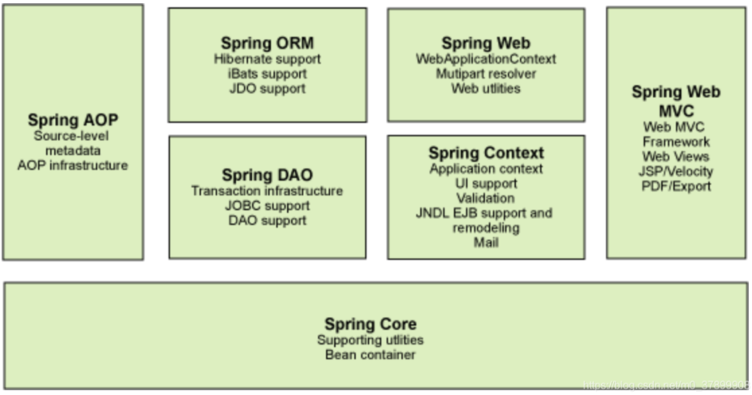


### 4、拓展

- Spring Boot
  - 一个快速开发的脚手架
  - 基于Spring Boot可以快速的开发单个微服务
  - 约定大于配置
- Spring Cloud
  - Spring Cloud是基于Spring Boot实现的


### 5、IOC

在以前的业务中，用户的需求可能会影响我们的代码，我们需要根据用户的需求去修改原代码，但是如果程序的代码量十分的大，修改一次的成本代价是十分的大

而IOC就是解决这个问题，大大降低了耦合性

控制反转IOC（Inversion of Control）是一种设计思想，DI（依赖注入）是实现IOC的一种方法

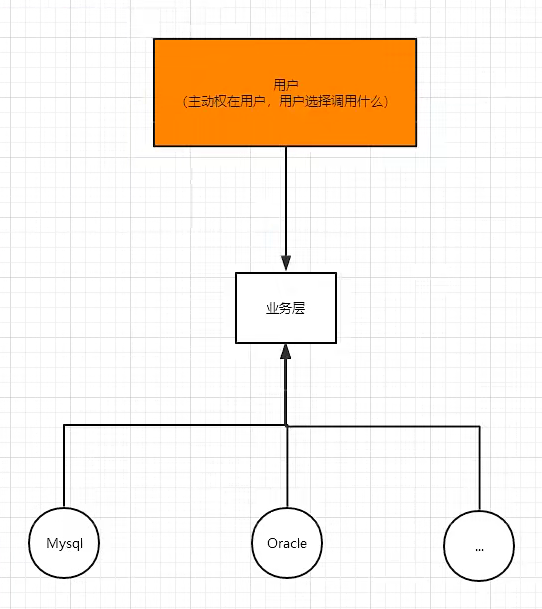

IOC是Spring框架的核心内容，使用多种方式完美实现了IOC，可以使用XML配置，也可以使用注解，在新版本的Spring也可以零配置实现IOC

```xml
<?xml version="1.0" encoding="UTF-8"?>
<beans xmlns="http://www.springframework.org/schema/beans"
       xmlns:xsi="http://www.w3.org/2001/XMLSchema-instance"
       xsi:schemaLocation="http://www.springframework.org/schema/beans
        https://www.springframework.org/schema/beans/spring-beans.xsd">

    <!--    使用spring来创建对象，在spring这些都成为Bean-->
    <!--    这里相当于实例化一个对象
            id：变量名
            class：实例化的对象
            property：相当于给对象中的属性设置值
    -->
    <bean id="hello" class="com.lcxuan.pojo.Hello">
        <!--name：实体类setXXX()方法， value：设置的内容-->
        <property name="str" value="内容"/>
    </bean>

    <bean id="mysqlImpl" class="com.lcxuan.dao.UserDaoMysqlImpl"/>
    <bean id="sqlServerImpl" class="com.lcxuan.dao.UserDaoSqlServerImpl"/>

    <bean id="userServiceImpl" class="com.lcxuan.service.UserServiceImpl">
        <!--ref：引用Spring容器中创建好的对象-->
        <property name="userDao" ref="mysqlImpl"/>
    </bean>
</beans>
```


#### 5.1、IOC创建对象方式

##### 使用无参构造创建对象【默认】

实体类，代码如下：

```java
public class User {
    private String name;

    public User() {
        System.out.println("User的无参构造");
    }

    public String getName() {
        return name;
    }

    public void setName(String name) {
        this.name = name;
    }

    public void show(){
        System.out.println("当前name：" + name);
    }
}
```

beans.xml文件，代码如下：

```xml
<?xml version="1.0" encoding="UTF-8"?>
<beans xmlns="http://www.springframework.org/schema/beans"
       xmlns:xsi="http://www.w3.org/2001/XMLSchema-instance"
       xsi:schemaLocation="http://www.springframework.org/schema/beans
        https://www.springframework.org/schema/beans/spring-beans.xsd">

    <bean id="user" class="com.lcxuan.pojo.User">
        <property name="name" value="Lcxuan"/>
    </bean>
</beans>
```

测试，使用ClassPathXmlApplicationContext，代码如下：

```java
public class MyTest {
    public static void main(String[] args) {
        ApplicationContext context = new ClassPathXmlApplicationContext("beans.xml");
        User user = (User) context.getBean("user");
        user.show();
    }
}
```


##### 使用有参构造创建对象

###### 第一种方式：下标赋值

实体类，代码如下：

```java
public class User {
    private String name;

    public User(String name) {
        System.out.println("有参构造：" + name);
    }

    public String getName() {
        return name;
    }

    public void setName(String name) {
        this.name = name;
    }

    public void show(){
        System.out.println("当前name：" + name);
    }
}
```

beans.xml，代码如下：

```xml
<?xml version="1.0" encoding="UTF-8"?>
<beans xmlns="http://www.springframework.org/schema/beans"
       xmlns:xsi="http://www.w3.org/2001/XMLSchema-instance"
       xsi:schemaLocation="http://www.springframework.org/schema/beans
        https://www.springframework.org/schema/beans/spring-beans.xsd">

    <bean id="user" class="com.lcxuan.pojo.User">
        <!--index：从0开始往后，为第n个参数-->
        <!--value：第n个参数的值-->
        <constructor-arg index="0" value="Lcxuan"/>
    </bean>
</beans>
```

测试，代码如下：

```java
public class MyTest {
    public static void main(String[] args) {
        ApplicationContext context = new ClassPathXmlApplicationContext("beans.xml");
        User user = (User) context.getBean("user");
        user.show();
    }
}
```


###### 第二种方式：通过类型创建【不推荐】

```xml
<?xml version="1.0" encoding="UTF-8"?>
<beans xmlns="http://www.springframework.org/schema/beans"
       xmlns:xsi="http://www.w3.org/2001/XMLSchema-instance"
       xsi:schemaLocation="http://www.springframework.org/schema/beans
        https://www.springframework.org/schema/beans/spring-beans.xsd">

    <bean id="user" class="com.lcxuan.pojo.User">
        <constructor-arg type="java.lang.String" value="Lcxuan"/>
    </bean>
</beans>
```


###### 第三种方式：直接通过参数名创建【推荐】

```xml
<?xml version="1.0" encoding="UTF-8"?>
<beans xmlns="http://www.springframework.org/schema/beans"
       xmlns:xsi="http://www.w3.org/2001/XMLSchema-instance"
       xsi:schemaLocation="http://www.springframework.org/schema/beans
        https://www.springframework.org/schema/beans/spring-beans.xsd">

    <bean id="user" class="com.lcxuan.pojo.User">
        <constructor-arg name="name" value="Lcxuan"/>
    </bean>
</beans>
```


#### 5.2、Spring的配置

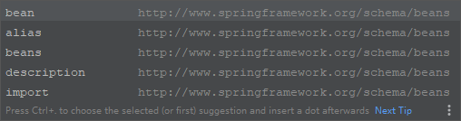

##### 5.2.1、alias别名

beans.xml，代码如下：

```xml
<?xml version="1.0" encoding="UTF-8"?>
<beans xmlns="http://www.springframework.org/schema/beans"
       xmlns:xsi="http://www.w3.org/2001/XMLSchema-instance"
       xsi:schemaLocation="http://www.springframework.org/schema/beans
        https://www.springframework.org/schema/beans/spring-beans.xsd">

    <bean id="user" class="com.lcxuan.pojo.User">
        <constructor-arg name="name" value="Lcxuan"/>
    </bean>

    <!--给User添加别名aaa-->
    <alias name="user" alias="aaa"/>
</beans>
```

测试，代码如下：

```java
public class MyTest {
    public static void main(String[] args) {
        ApplicationContext context = new ClassPathXmlApplicationContext("beans.xml");
        //使用别名aaa
        User user = (User) context.getBean("aaa");
        user.show();
    }
}
```


##### 5.2.2、bean配置

```xml
<?xml version="1.0" encoding="UTF-8"?>
<beans xmlns="http://www.springframework.org/schema/beans"
       xmlns:xsi="http://www.w3.org/2001/XMLSchema-instance"
       xsi:schemaLocation="http://www.springframework.org/schema/beans
        https://www.springframework.org/schema/beans/spring-beans.xsd">

    <!--
        id：变量名
        class：实例化的对象
        name：别名，可以同时取多个别名，使用逗号隔开
    -->
    <bean id="user" class="com.lcxuan.pojo.User" name="user2,newUser">
        <property name="name" value="Lcxuan"/>
        <constructor-arg name="name" value="Lcxuan"/>
    </bean>
</beans>
```


##### 5.2.3、import

可以将多个配置文件，导入合并成一个

例如：当前存在多个配置文件，如下图：

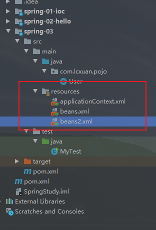

这个时候只需要在applicationContext.xml文件中使用import引入即可，代码如下：

```xml
<?xml version="1.0" encoding="UTF-8"?>
<beans xmlns="http://www.springframework.org/schema/beans"
       xmlns:xsi="http://www.w3.org/2001/XMLSchema-instance"
       xsi:schemaLocation="http://www.springframework.org/schema/beans
        https://www.springframework.org/schema/beans/spring-beans.xsd">

    <import resource="beans.xml"/>
    <import resource="beans2.xml"/>

</beans>
```

最后只使用applicationContext.xml文件，即可使用其他的配置文件


#### 5.3、依赖注入

##### 5.3.1、方式一：通过构造器注入

这种方式在上面已经使用


##### 5.3.2、方式二：Set方式注入

- 依赖：bean对象的创建依赖于容器
- 注入：bean对象中的所有属性，由容器来注入

【环境搭建】

1. 复杂类型

```java
public class MyTest {
    public static void main(String[] args) {
        ApplicationContext context = new ClassPathXmlApplicationContext("beans.xml");
        Student student = (Student) context.getBean("student");
        System.out.println(student.toString());

        /*
        * 输出：
        * Student{
        *   name='Lcxuan', 
        *   address=Address{address='广东中山'}, 
        *   books=[Java, Android, Php], 
        *   hobbies=[听歌, 敲代码], 
        *   card={idCard=123456789009876543, bankCard=1234567234563456123}, 
        *   games=[吃鸡, 不知道], 
        *   info={password=123456, username=Lcxuan}, 
        *   wife='null'
        * }
        */
    }
}
```

2. 真实类型

```java
public class Student {
    private String name;
    private Address address;
    private String[] books;
    private List<String> hobbies;
    private Map<String, String> card;
    private Set<String> games;
    private Properties info;
    private String wife;
	
    //省略get、set方法、toString()
}
```

3. beans.xml

```xml
<?xml version="1.0" encoding="UTF-8"?>
<beans xmlns="http://www.springframework.org/schema/beans"
       xmlns:xsi="http://www.w3.org/2001/XMLSchema-instance"
       xsi:schemaLocation="http://www.springframework.org/schema/beans
        https://www.springframework.org/schema/beans/spring-beans.xsd">

    <bean id="address" class="com.lcxuan.pojo.Address">
        <property name="address" value="广东中山"/>
     </bean>

    <bean id="student" class="com.lcxuan.pojo.Student">
        <!--普通值注入-->
        <property name="name" value="Lcxuan"/>

        <!--Bean注入-->
        <property name="address" ref="address"/>

        <!--数组注入-->
        <property name="books">
            <array>
                <value>Java</value>
                <value>Android</value>
                <value>Php</value>
            </array>
        </property>

        <!--List注入-->
        <property name="hobbies">
            <list>
                <value>听歌</value>
                <value>敲代码</value>
            </list>
        </property>

        <!--Map注入-->
        <property name="card">
            <map>
                <entry key="idCard" value="123456789009876543"/>
                <entry key="bankCard" value="1234567234563456123"/>
            </map>
        </property>

        <!--Set注入-->
        <property name="games">
            <set>
                <value>吃鸡</value>
                <value>不知道</value>
            </set>
        </property>

        <!--Null-->
        <property name="wife">
            <null/>
        </property>

        <!--Properties-->
        <property name="info">
            <props>
                <prop key="username">Lcxuan</prop>
                <prop key="password">123456</prop>
            </props>
        </property>
    </bean>

</beans>
```

4. 测试

```java
public class MyTest {
    public static void main(String[] args) {
        ApplicationContext context = new ClassPathXmlApplicationContext("beans.xml");
        Student student = (Student) context.getBean("student");
        System.out.println(student.toString());
    }
}
```


##### 5.3.3、方式三：扩展方式注入

可以使用p命名空间和c命名空间进行注入

userBean.xml，代码如下：

```xml
<?xml version="1.0" encoding="UTF-8"?>
<beans xmlns="http://www.springframework.org/schema/beans"
       xmlns:xsi="http://www.w3.org/2001/XMLSchema-instance"
       xsi:schemaLocation="http://www.springframework.org/schema/beans
       https://www.springframework.org/schema/beans/spring-beans.xsd"
       xmlns:p="http://www.springframework.org/schema/p"
       xmlns:c="http://www.springframework.org/schema/c">

    <!--p命名空间注入，可以直接注入属性的值：property-->
    <bean id="user" class="com.lcxuan.pojo.User" p:name="Lcxuan" p:age="18"/>

    <!--c命名空间注入，通过构造器注入-->
    <bean id="user2" class="com.lcxuan.pojo.User" c:name="构造器名字" c:age="18"/>
</beans>
```

测试，代码如下：

```java
public class MyUserTest {

    @Test
    public void test(){
        ApplicationContext context = new ClassPathXmlApplicationContext("userBean.xml");
        User user = context.getBean("user", User.class);
        System.out.println(user);
    }

    @Test
    public void test2(){
        ApplicationContext context = new ClassPathXmlApplicationContext("userBean.xml");
        User user = context.getBean("user2", User.class);
        System.out.println(user);
    }
}
```


**注意：p命名空间和c命名空间不能直接使用，需要导入xml约束**

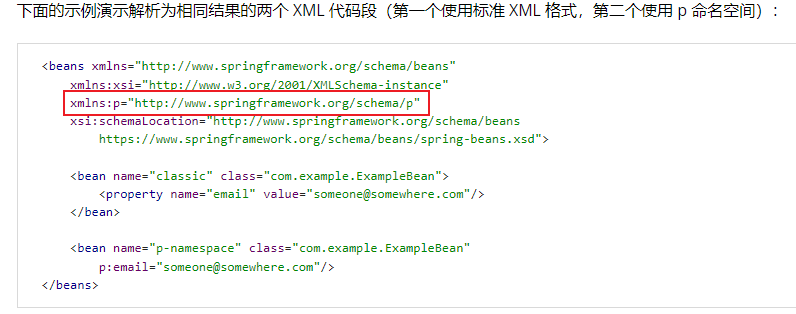

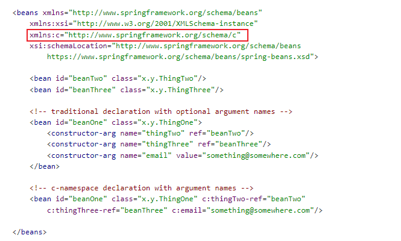


#### 5.4、bean作用域

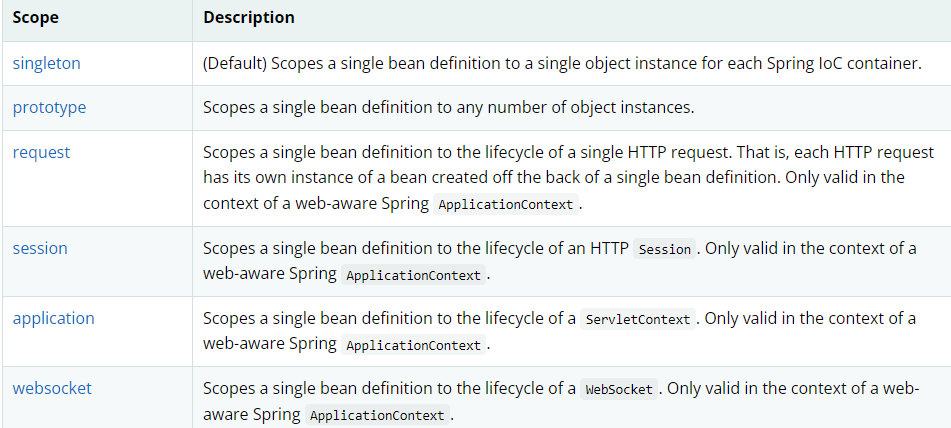

##### 5.4.1、singleton（单例模式）【默认】

创建的所有实例都只有一个

可以在xml中使用scope设置作用域，代码如下：

```xml
<?xml version="1.0" encoding="UTF-8"?>
<beans xmlns="http://www.springframework.org/schema/beans"
       xmlns:xsi="http://www.w3.org/2001/XMLSchema-instance"
       xsi:schemaLocation="http://www.springframework.org/schema/beans
       https://www.springframework.org/schema/beans/spring-beans.xsd"
       xmlns:p="http://www.springframework.org/schema/p"
       xmlns:c="http://www.springframework.org/schema/c">
    
    <bean id="user" class="com.lcxuan.pojo.User" p:name="Lcxuan" p:age="18" scope="singleton"/>
</beans>
```

测试，代码如下：

```java
public class MyUserTest {
    @Test
    public void test(){
        ApplicationContext context = new ClassPathXmlApplicationContext("userBean.xml");
        User user = context.getBean("user", User.class);
        User user2 = context.getBean("user", User.class);
        System.out.println(user == user2);	//输出：true
    }
}
```


##### 5.4.2、prototype（原型模式）

创建的所有实例都为单独的一个对象

在xml中使用scope设置作用域，代码如下：

```xml
<?xml version="1.0" encoding="UTF-8"?>
<beans xmlns="http://www.springframework.org/schema/beans"
       xmlns:xsi="http://www.w3.org/2001/XMLSchema-instance"
       xsi:schemaLocation="http://www.springframework.org/schema/beans
       https://www.springframework.org/schema/beans/spring-beans.xsd"
       xmlns:p="http://www.springframework.org/schema/p"
       xmlns:c="http://www.springframework.org/schema/c">

    <bean id="user" class="com.lcxuan.pojo.User" p:name="Lcxuan" p:age="18" scope="prototype"/>
</beans>
```

测试，代码如下：

```java
public class MyUserTest {
    @Test
    public void test(){
        ApplicationContext context = new ClassPathXmlApplicationContext("userBean.xml");
        User user = context.getBean("user", User.class);
        User user2 = context.getBean("user", User.class);
        System.out.println(user == user2);	//输出：false
    }
}
```


##### 5.4.3、其余的request、session、application

这些只能在web开发中使用


#### 5.5、Bean的自动装配

自动装配是Spring满足bean依赖的一种方式

Spring会在上下文中自动寻找，并自动给bean装配属性


在Spring中有三种装配的方式

1. 在xml中显示的配置
2. 在Java中显示配置
3. 隐式的自动装配【重要】


##### 5.5.1、使用byName方式：

```xml
<?xml version="1.0" encoding="UTF-8"?>
<beans xmlns="http://www.springframework.org/schema/beans"
       xmlns:xsi="http://www.w3.org/2001/XMLSchema-instance"
       xsi:schemaLocation="http://www.springframework.org/schema/beans
        https://www.springframework.org/schema/beans/spring-beans.xsd">

    <bean id="cat" class="com.lcxuan.pojo.Cat"/>
    <bean id="dog" class="com.lcxuan.pojo.Dog"/>

    <!--
    byName：会自动在容器上下文中查找，和自己对象set方法后面的值对应的beanid
    -->
    <bean id="people" class="com.lcxuan.pojo.People" autowire="byName">
        <property name="name" value="张三"/>
     </bean>
</beans>
```

##### 5.5.2、使用byType方式：

```xml
<?xml version="1.0" encoding="UTF-8"?>
<beans xmlns="http://www.springframework.org/schema/beans"
       xmlns:xsi="http://www.w3.org/2001/XMLSchema-instance"
       xsi:schemaLocation="http://www.springframework.org/schema/beans
        https://www.springframework.org/schema/beans/spring-beans.xsd">

    <bean id="cat" class="com.lcxuan.pojo.Cat"/>
    <bean id="dog111" class="com.lcxuan.pojo.Dog"/>

    <!--
    byType：会自动在容器上下文中查找，和自己对象属性类型相同的bean
    -->
    <bean id="people" class="com.lcxuan.pojo.People" autowire="byType">
        <property name="name" value="张三"/>
     </bean>
</beans>
```

总结：

- byName：需要保证所有bean的id唯一，并且这个bean需要和自动注入的属性和set方法的值一致
- byType：需要保证所有bean的class唯一，并且这个bean需要和自动注入的属性的类型一致


##### 5.5.3、使用注解实现自动装配

使用注解须知：

1. 导入约束：context约束
2. 配置注解的支持：<context:annotation-config/>

```xml
<?xml version="1.0" encoding="UTF-8"?>
<beans xmlns="http://www.springframework.org/schema/beans"
    xmlns:xsi="http://www.w3.org/2001/XMLSchema-instance"
    xmlns:context="http://www.springframework.org/schema/context"
    xsi:schemaLocation="http://www.springframework.org/schema/beans
        https://www.springframework.org/schema/beans/spring-beans.xsd
        http://www.springframework.org/schema/context
        https://www.springframework.org/schema/context/spring-context.xsd">

    <context:annotation-config/>

</beans>
```


**@Autowired**

直接在属性上使用即可，也可以在set方式上使用

使用@Autowired可以不用编写Set方法，前提是这个自动装配的属性在IOC（Spring）容器中存在，且符合名字【默认通过byType方式，如果有多个类型相同则使用ByName】

如果显示定义了Autowired的required属性为false，说明这个对象可以为null，否则不允许为空

```java
public class People {

    @Autowired(required = false)
    private Cat cat;
    @Autowired
    private Dog dog;
    private String name;
}
```


**@Qualifiter**

指定一个唯一的bean对象注入

```java
public class People {

    @Autowired
    private Cat cat;
    
    @Autowired
    @Qualifier(value = "dog111")
    private Dog dog;
    private String name;
}
```


#### 5.6、使用注解开发

在Spring4之后，如果要使用注解进行开发，必须保证AOP的包导入了

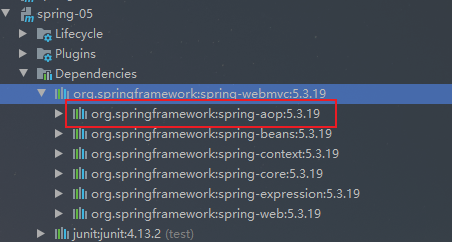

##### 5.6.1、bean

@Component：放在类上，说明这个类被Spring管理了

```java
//这里的@Component注解等价于<bean id="user" class="com.lcxuan.pojo.User"/>
@Component
public class User {
    public String name = "Lcxuan";
}
```


##### 5.6.2、属性值注入

使用@Value

```java
@Component
public class User {

    //相当于<property name="name" value="Lcxuan"/>
    @Value("Lcxuan")
    public String name;

    //@Value("Lcxuan")
    //public void setName(String name) {
    //    this.name = name;
    //}
}
```


##### 5.6.3、衍生的注解

@Component有几个衍生注解，例如：我们在web开发中，会按照mvc三层架构来进行分层

- dao【@Repository】
- service【@Service】
- controller【@Controller】

以上四个注解的功能都是一样的，都是代表将某个类注册到Spring中，装配


##### 5.6.4、自动装配

- @Autowired
- @Qualifiter


##### 5.6.5、作用域

- @Scope

```java
@Component
@Scope("singleton")
public class User {
    
}
```


#### 5.7、使用Java方式配置Spring

现在要完成不适用Spring的xml配置了，全权交给Java来使用

JavaConfig是Spring的一个子项目，在Spring4之后，它成为了一个核心功能

新建配置类，使用@Configuration、@ComponentScan、@Bean、@Import注解，代码如下：

```java
// 这个也会被Spring容器托管，注册到容器总，因为他本来就是一个@Component
// @Configuration代表这是一个配置类, 相当于beans.xml文件
@Configuration
@ComponentScan("com.lcxuan.pojo")
@Import({MyConfig2.class})
public class MyConfig {

    //注册一个Bean，就相当于之前写的bean标签
    //方法名，就相当于bean标签中的id属性
    //返回值，就相当于bean标签中的class属性
    @Bean
    public User getUser(){
        return new User();
    }
}

```

测试，代码如下：

```java
public class MyTest {
    public static void main(String[] args) {
        //如果使用配置类方式去做，只能通过AnnotationConfigApplicationContext来获取配置
        ApplicationContext context = new AnnotationConfigApplicationContext(MyConfig.class);

        User user = context.getBean("getUser", User.class);
        System.out.println(user.getName());
    }
}
```


### 6、AOP

代理模式，分为**静态代理**和**动态代理**

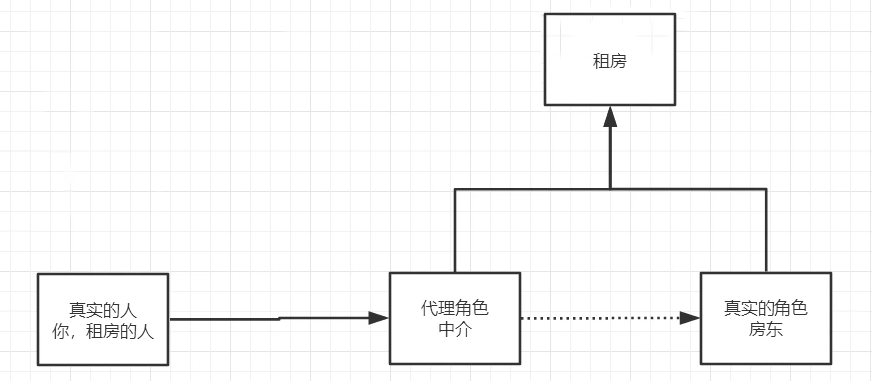


#### 6.1、静态代理

角色分析：

- 抽象角色：一般会使用接口或者抽象类来解决
- 真实角色：被代理的角色
- 代理角色：代理真实角色，代理真实角色后，一般会做一些附属操作
- 客户：访问代理对象的人

好处：

- 可以使真实角色的操作更加纯粹，不同去关注一些公共的业务
- 公共业务交给代理角色，实现了业务分工
- 公共业务发生扩展时，方便集中管理

缺点：

- 一个真实角色就会产生一个代理角色，代码量会翻倍


代码实现步骤：

1. 接口

```java
//租房
public interface Rent {
    public void rent();
}
```

2. 真实角色

```java
//房东
public class Host implements Rent{
    @Override
    public void rent() {
        System.out.println("房东要出租房子");
    }
}
```

3. 代理角色

```java
public class Proxy implements Rent{

    private Host host;

    public Proxy() {
    }

    public Proxy(Host host) {
        this.host = host;
    }

    @Override
    public void rent() {
        host.rent();
        seeHouse();
        fare();
        hetong();
    }

    public void seeHouse(){
        System.out.println("中介带着看房");
    }

    public void fare(){
        System.out.println("收中介费");
    }

    public void hetong(){
        System.out.println("签合同");
    }
}
```

4. 客户端

```java
public class Client {
    public static void main(String[] args) {
        Host host = new Host();
        Proxy proxy = new Proxy(host);
        proxy.rent();
    }
}
```


#### 6.2、动态代理

动态代理和静态代理的角色一样

动态代理的代理是动态生成的，不是直接写好的

两种方式实现：

- 基于接口的动态代理
- 基于类的动态代理

需要了解两个类：

- Proxy：代理
- InvocationHandler：调用处理程序


#### 6.3、AOP介绍

AOP，面向切面编程，通过预编译方式和运行期动态代理实现程序功能的统一维护的一种技术

利用AOP可以对业务逻辑的各个部分进行隔离，降低耦合度，提供程序重用性，提高开发效率

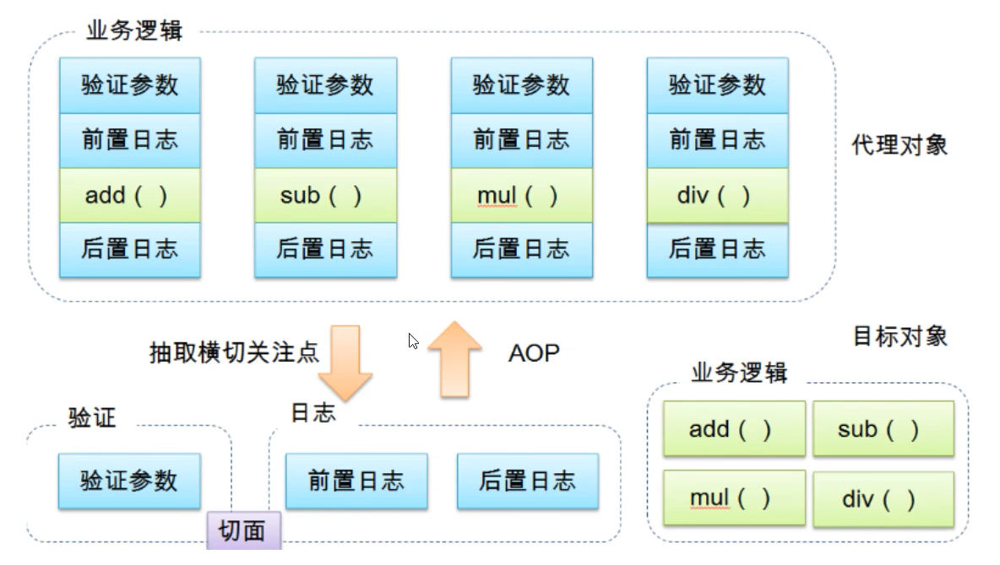

 Spring的AOP中，通过Advice定义横切逻辑，Spring中支持5中类型的Advice：

| 通知类型     | 连接点               | 实现接口                                        |
| ------------ | -------------------- | ----------------------------------------------- |
| 前置通知     | 方法前               | org.springframework.aop.MethodBeforeAdvice      |
| 后置通知     | 方法后               | org.springframework.aop.AfterReturningAdvice    |
| 环绕通知     | 方法前后             | org.aopalliance.intercept.MethodInterceptor     |
| 异常抛出通知 | 方法抛出异常         | org.springframework.aop.ThrowsAdvice            |
| 引介通知     | 类中增加新的方法属性 | org.springframework.aop.IntroductionInterceptor |


#### 6.4、使用AOP


使用AOP，需要导入依赖包：

```xml
<dependency>
    <groupId>org.springframework</groupId>
    <artifactId>spring-aop</artifactId>
    <version>5.3.19</version>
</dependency>

<!-- https://mvnrepository.com/artifact/org.aspectj/aspectjweaver -->
<dependency>
    <groupId>org.aspectj</groupId>
    <artifactId>aspectjweaver</artifactId>
    <version>1.9.9.1</version>
</dependency>
```


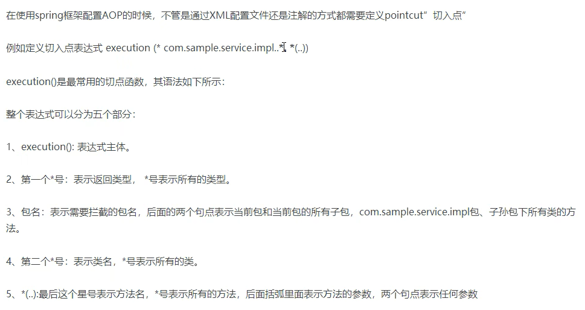


##### 方式一：使用Spring的API接口

1、创建前置通知和后置通知，代码如下：

```java
public class AfterLog implements AfterReturningAdvice {

    //returnValue：返回值
    @Override
    public void afterReturning(Object returnValue, Method method, Object[] args, Object target) throws Throwable {
        System.out.println("执行的" + method.getName() + "方法，返回结果：" + returnValue);
    }
}

public class BeforeLog implements MethodBeforeAdvice {

    //method：要执行的目标对象的方法
    //args：参数
    //target：目标对象
    @Override
    public void before(Method method, Object[] args, Object target) throws Throwable {
        System.out.println(target.getClass().getName() + "的" + method.getName() + "被执行");
    }
}
```

2、新建接口和实现类，代码如下：

```java
public interface UserService {
    public void add();
    public void delete();
    public void update();
    public void select();
}

public class UserServiceImpl implements UserService{
    @Override
    public void add() {
        System.out.println("增加一个用户");
    }

    @Override
    public void delete() {
        System.out.println("删除一个用户");
    }

    @Override
    public void update() {
        System.out.println("修改一个用户");
    }

    @Override
    public void select() {
        System.out.println("查询一个用户");
    }
}
```

3、applicationContext,xml实现AOP，代码如下：

```xml
<beans xmlns="http://www.springframework.org/schema/beans"
       xmlns:xsi="http://www.w3.org/2001/XMLSchema-instance"
       xmlns:aop="http://www.springframework.org/schema/aop"
       xsi:schemaLocation="http://www.springframework.org/schema/beans
       https://www.springframework.org/schema/beans/spring-beans.xsd
       http://www.springframework.org/schema/aop
       https://www.springframework.org/schema/aop/spring-aop.xsd">

    <bean id="userService" class="com.lcxuan.service.UserServiceImpl"/>
    <bean id="beforeLog" class="com.lcxuan.log.BeforeLog"/>
    <bean id="afterLog" class="com.lcxuan.log.AfterLog"/>

    <!--配置aop：需要导入aop的约束-->
    <aop:config>
        <!--
        expression=execution(返回类型 方法返回值【必须】 方法声明(参数)【必须】 异常类型【可选】)
        *：0至多个任意字符
        ..：用在方法参数中，表示任意多个参数，用在包名后，表示当前包及其子包路径
        +：用在类名后，表示当前类及其子类，用在接口后，表示当前接口及其实现类
        -->
        <aop:pointcut id="pointcut" expression="execution(* com.lcxuan.service.UserServiceImpl.* (..))"/>

        <!--执行环绕增加-->
        <aop:advisor advice-ref="beforeLog" pointcut-ref="pointcut"/>
        <aop:advisor advice-ref="afterLog" pointcut-ref="pointcut"/>
    </aop:config>
</beans>
```

4、测代码如下：

```java
public class MyTest {
    public static void main(String[] args) {
        ApplicationContext context = new ClassPathXmlApplicationContext("applicationContext.xml");
        UserService userService = context.getBean("userService", UserService.class);
        userService.add();
    }
}

/*
测试结果：
com.lcxuan.service.UserServiceImpl的add被执行
增加一个用户
执行的add方法，返回结果：null
*/
```


##### 方式二：自定义类实现AOP

1、创建一个类，创建两个方法，分别对应前置通知和后置通知，代码如下：

```java
public class DiyPointCut {

    public void before(){
        System.out.println("方法执行前....");
    }

    public void after(){
        System.out.println("方法执行后....");
    }
}
```

2、applicationContext.xml文件实现，代码如下：

```xml
<beans xmlns="http://www.springframework.org/schema/beans"
       xmlns:xsi="http://www.w3.org/2001/XMLSchema-instance"
       xmlns:aop="http://www.springframework.org/schema/aop"
       xsi:schemaLocation="http://www.springframework.org/schema/beans
       https://www.springframework.org/schema/beans/spring-beans.xsd
       http://www.springframework.org/schema/aop
       https://www.springframework.org/schema/aop/spring-aop.xsd">

    <bean id="userService" class="com.lcxuan.service.UserServiceImpl"/>
    <bean id="diyPointCut" class="com.lcxuan.diy.DiyPointCut"/>
    
    <aop:config>
        <!--自定义切面，ref：表示要引用的类-->
        <aop:aspect ref="diyPointCut">
            <!--切面点-->
            <aop:pointcut id="point" expression="execution(* com.lcxuan.service.UserService.* (..))"/>

            <!--通知-->
            <aop:before method="before" pointcut-ref="point"/>
            <aop:after method="after" pointcut-ref="point"/>
        </aop:aspect>
    </aop:config>
</beans>
```

3、测试，代码如下：

```java
 public class MyTest {
    public static void main(String[] args) {
        ApplicationContext context = new ClassPathXmlApplicationContext("applicationContext.xml");
        UserService userService = context.getBean("userService", UserService.class);
        userService.add();
    }
}
/*
测试结果：
	方法执行前....
	增加一个用户
	方法执行后....
*/
```


##### 方式三：使用注解实现

1、新建类使用注解声明为一个切面类，并实现通知，代码如下：

```java
//使用注解实现AOP
@Aspect //标注这个类是一个切面
public class AnnotationPointCut {
    @Before("execution(* com.lcxuan.service.UserServiceImpl.* (..))")
    public void before(){
        System.out.println("方法执行前。。。。。");
    }
    
    //环绕增强中，可以给定一个参数，代表我们要获取处理切入的点
    @Around("execution(* com.lcxuan.service.UserServiceImpl.* (..))")
    public void around(ProceedingJoinPoint joinPoint){
        System.out.println("环绕前...");

        //方法执行
        try {
            joinPoint.proceed();
        } catch (Throwable throwable) {
            throwable.printStackTrace();
        }

        System.out.println("环绕后...");
    }
}
```

2、applicationContext.xml，开启aop注解，并声明AnnotationPointCut，代码如下：

```xml
<beans xmlns="http://www.springframework.org/schema/beans"
       xmlns:xsi="http://www.w3.org/2001/XMLSchema-instance"
       xmlns:aop="http://www.springframework.org/schema/aop"
       xsi:schemaLocation="http://www.springframework.org/schema/beans
       https://www.springframework.org/schema/beans/spring-beans.xsd
       http://www.springframework.org/schema/aop
       https://www.springframework.org/schema/aop/spring-aop.xsd">

    <!--开启注解支持-->
    <aop:aspectj-autoproxy/>

    <bean id="annotationPointCut" class="com.lcxuan.diy.AnnotationPointCut"/>
    <bean id="userService" class="com.lcxuan.service.UserServiceImpl"/>
</beans>
```

3、测试类，代码如下：

```java
  public class MyTest {
    public static void main(String[] args) {
        ApplicationContext context = new ClassPathXmlApplicationContext("applicationContext.xml");
        UserService userService = context.getBean("userService", UserService.class);
        userService.add();
    }
}
/*
测试结果：
	方法执行前....
	增加一个用户
*/
```


### 7、Mybatis-spring

[mybatis-spring –](http://mybatis.org/spring/zh/index.html)

```xml
<!-- https://mvnrepository.com/artifact/org.mybatis/mybatis-spring -->
<dependency>
    <groupId>org.mybatis</groupId>
    <artifactId>mybatis-spring</artifactId>
    <version>2.0.7</version>
</dependency>
```


实现步骤：

1. 修改mybatis-config.xml文件，并创建一个spring-dao.xml用于在spring中配置mybatis，代码如下：

```xml
<!-- mybatis-config.xml文件 -->
<?xml version="1.0" encoding="UTF-8" ?>
<!DOCTYPE configuration
        PUBLIC "-//mybatis.org//DTD Config 3.0//EN"
        "http://mybatis.org/dtd/mybatis-3-config.dtd">
<!--核心配置文件-->
<configuration>
    <!--设置实体类的别名-->
    <typeAliases>
        <package name="com.lcxuan.pojo"/>
    </typeAliases>
</configuration>

<!-- 新创建的spring-dao.xml文件 -->
<beans xmlns="http://www.springframework.org/schema/beans"
       xmlns:xsi="http://www.w3.org/2001/XMLSchema-instance"
       xsi:schemaLocation="http://www.springframework.org/schema/beans
       https://www.springframework.org/schema/beans/spring-beans.xsd">

    <!--DataSource：使用Spring的数据源替换Mybatis的配置-->
    <bean id="datasource" class="org.springframework.jdbc.datasource.DriverManagerDataSource">
        <property name="driverClassName" value="com.mysql.jdbc.Driver"/>
        <property name="url" value="jdbc:mysql://localhost:3306/mybatis?useSSL=true&amp;useUnicode=true&amp;characterEncoding=UTF-8"/>
        <property name="username" value="root"/>
        <property name="password" value="123456"/>
    </bean>

    <!--配置SqlSessionFactory-->
    <bean id="sqlSessionFactory" class="org.mybatis.spring.SqlSessionFactoryBean">
        <!--设置数据源-->
        <property name="dataSource" ref="datasource"/>
        <!--绑定Mybatis 配置文件-->
        <property name="configLocation" value="classpath:mybatis-config.xml"/>
        <property name="mapperLocations" value="classpath:com/lcxuan/mapper/*.xml"/>
    </bean>

    <!--
	获取SqlSession
	SqlSessionTemplate 是 MyBatis-Spring 的核心。作为 SqlSession 的一个实现，这意味着可以使用它无缝代替你代码中已经在使用的 SqlSession。 SqlSessionTemplate 是线程安全的，可以被多个 DAO 或映射器所共享使用。
	-->
    <bean id="sqlSession" class="org.mybatis.spring.SqlSessionTemplate">
        <constructor-arg index="0" ref="sqlSessionFactory"/>
    </bean>

</beans>
```

2、创建操作数据库的接口类UserMapper.java文件和执行sql的UserMapper.xml文件，代码如下：

```java
public interface UserMapper {
    //获取所有用户信息
    List<User> getUserList();
}
```

```xml
<?xml version="1.0" encoding="UTF-8" ?>
<!DOCTYPE mapper
        PUBLIC "-//mybatis.org//DTD Mapper 3.0//EN"
        "http://mybatis.org/dtd/mybatis-3-mapper.dtd">
<mapper namespace="com.lcxuan.mapper.UserMapper">
    <select id="getUserList" resultType="User">
        select * from user
    </select>
</mapper>
```

3、创建接口实现类UserMapperImpl.java，并设置SqlSession的set方法，代码如下：

```java
public class UserMapperImpl implements UserMapper{

    private SqlSessionTemplate sqlSession;

    public void setSqlSession(SqlSessionTemplate sqlSession) {
        this.sqlSession = sqlSession;
    }

    @Override
    public List<User> getUserList() {
        UserMapper userMapper = sqlSession.getMapper(UserMapper.class);
        List<User> userList = userMapper.getUserList();
        return userList;
    }
}
```

4、创建applicationContext.xml文件，并引入spring-dao.xml，传入SqlSession到接口实现类UserMapperImpl.java文件中，代码如下：

```xml
<?xml version="1.0" encoding="UTF-8"?>
<beans xmlns="http://www.springframework.org/schema/beans"
       xmlns:xsi="http://www.w3.org/2001/XMLSchema-instance"
       xsi:schemaLocation="http://www.springframework.org/schema/beans
        https://www.springframework.org/schema/beans/spring-beans.xsd">

    <!--引入Spring-dao.xml-->
    <import resource="spring-dao.xml"/>

    <!--实例化UserMapperImpl，并设置SqlSession-->
    <bean id="userMapper" class="com.lcxuan.mapper.UserMapperImpl">
        <property name="sqlSession" ref="sqlSession"/>
    </bean>

</beans>
```

5、测试

```java
public class MyTest {
    public static void main(String[] args) {
        ApplicationContext context = new ClassPathXmlApplicationContext("applicationContext.xml");
        UserMapperImpl userMapper = context.getBean("userMapper", UserMapperImpl.class);
        List<User> userList = userMapper.getUserList();
        for (User user : userList) {
            System.out.println(user);
        }
    }
}
```


获取SqlSession另外一种方式：通过SqlSessionDaoSupport

1、在applicationContext.xml文件中，修改代码为：

```java
<?xml version="1.0" encoding="UTF-8"?>
<beans xmlns="http://www.springframework.org/schema/beans"
       xmlns:xsi="http://www.w3.org/2001/XMLSchema-instance"
       xsi:schemaLocation="http://www.springframework.org/schema/beans
        https://www.springframework.org/schema/beans/spring-beans.xsd">

    <!--引入Spring-dao.xml-->
    <import resource="spring-dao.xml"/>

    <!--实例化UserMapperImpl，并设置SqlSession-->
    <bean id="userMapper" class="com.lcxuan.mapper.UserMapperImpl">
        <property name="sqlSession" ref="sqlSession"/>
    </bean>

    <!-- 实例化UserMapper2，并设置sqlSessionFactory -->
    <bean id="userMapper2" class="com.lcxuan.mapper.UserMapperImpl2">
        <property name="sqlSessionFactory" ref="sqlSessionFactory"/>
    </bean>

</beans>
```

2、新建UserMapperImpl2.java实现类，继承SqlSessionDaoSupport，实现UserMapper，代码如下：

可以通过getSqlSession()获取SqlSession

```java
public class UserMapperImpl2 extends SqlSessionDaoSupport implements UserMapper{
    @Override
    public List<User> getUserList() {
        return getSqlSession().getMapper(UserMapper.class).getUserList();
    }
}
```

3、测试，代码如下：

```java
public class MyTest {
    public static void main(String[] args) {
        ApplicationContext context = new ClassPathXmlApplicationContext("applicationContext.xml");
        UserMapper userMapper = context.getBean("userMapper2", UserMapper.class);
        List<User> userList = userMapper.getUserList();
        for (User user : userList) {
            System.out.println(user);
        }
    }
}
```


### 8、事务

一个业务要么都成功，要么都失败

确保完整性和一致性

1、实现接口，代码如下：

```java
public interface UserMapper {

    //获取所有用户信息
    List<User> getUserList();

    //添加一个用户
    int addUser(User user);

    //删除一个用户
    int deleteUser(int id);
}
```

2、实现接口类，代码如下：

```java
public class UserMapperImpl implements UserMapper{

    private SqlSessionTemplate sqlSession;

    public void setSqlSession(SqlSessionTemplate sqlSession) {
        this.sqlSession = sqlSession;
    }

    @Override
    public List<User> getUserList() {

        User user = new User();
        user.setName("张三三");
        user.setPwd("123456");

        UserMapper userMapper = sqlSession.getMapper(UserMapper.class);

        userMapper.addUser(user);
        userMapper.deleteUser(3);

        List<User> userList = userMapper.getUserList();
        return userList;
    }

    @Override
    public int addUser(User user) {
        return sqlSession.getMapper(UserMapper.class).addUser(user);
    }

    @Override
    public int deleteUser(int id) {
        return sqlSession.getMapper(UserMapper.class).deleteUser(id);
    }
}
```

3、Mapper实现，代码如下：

```xml
<?xml version="1.0" encoding="UTF-8" ?>
<!DOCTYPE mapper
        PUBLIC "-//mybatis.org//DTD Mapper 3.0//EN"
        "http://mybatis.org/dtd/mybatis-3-mapper.dtd">
<mapper namespace="com.lcxuan.mapper.UserMapper">
    <select id="getUserList" resultType="User">
        select * from user
    </select>

    <insert id="addUser" parameterType="user">
        insert into user(name, pwd) values (#{name}, #{pwd});
    </insert>

    <delete id="deleteUser" parameterType="int">
        deletes from user where id = #{id}
    </delete>
</mapper>
```

4、applicationContext.xml，代码如下：

```xml
<?xml version="1.0" encoding="UTF-8"?>
<beans xmlns="http://www.springframework.org/schema/beans"
       xmlns:xsi="http://www.w3.org/2001/XMLSchema-instance"
       xmlns:tx="http://www.springframework.org/schema/tx"
       xmlns:aop="http://www.springframework.org/schema/aop"
       xsi:schemaLocation="http://www.springframework.org/schema/beans
       https://www.springframework.org/schema/beans/spring-beans.xsd
       http://www.springframework.org/schema/tx
       http://www.springframework.org/schema/tx/spring-tx.xsd
       http://www.springframework.org/schema/aop
       https://www.springframework.org/schema/aop/spring-aop.xsd">

    <!--引入Spring-dao.xml-->
    <import resource="spring-dao.xml"/>

    <!--实例化UserMapperImpl，并设置SqlSession-->
    <bean id="userMapper" class="com.lcxuan.mapper.UserMapperImpl">
        <property name="sqlSession" ref="sqlSession"/>
    </bean>

    <!--开启事务事务-->
    <bean id="transactionManager" class="org.springframework.jdbc.datasource.DataSourceTransactionManager">
        <property name="dataSource" ref="datasource"/>
    </bean>

    <!--配置事务通知-->
    <tx:advice id="txAdvice" transaction-manager="transactionManager">
        <!--给那些方法配置事务-->
        <tx:attributes>
            <tx:method name="*" propagation="REQUIRED"/>
        </tx:attributes>
    </tx:advice>

    <!--配置事务切入-->
    <aop:config>
        <aop:pointcut id="txPointCut" expression="execution(* com.lcxuan.mapper.*.*(..))"/>
         <aop:advisor advice-ref="txAdvice" pointcut-ref="txPointCut"/>
    </aop:config>
</beans>
```

