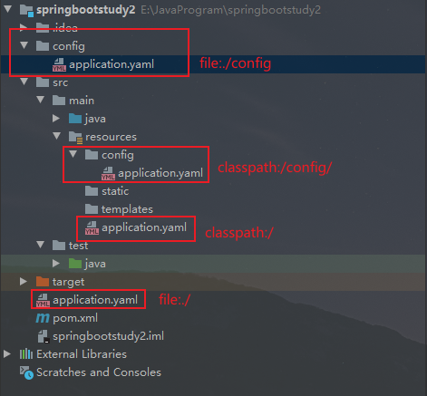
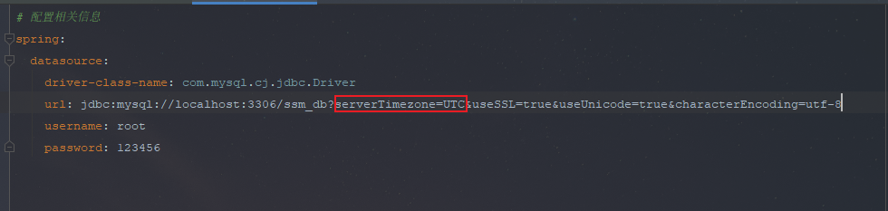

## Spring Boot

Spring Boot是基于Spring开发的，Spring Boot本身不提供Spring框架的核心特性以及扩展功能，只是用于快速、敏捷地开发新一代基于Spring框架的应用程序。

同时它还集成了大量常用的第三方库配置（例如：Redis、MongoDB等）

思想：**约定大于配置**

### 介绍

#### 微服务

微服务是一种架构风格，要求我们在开发一个应用的时候，这个应用必须构建成一系列小服务的组合，可以通过http的方式进行互通

业务：service ===> 模块

#### 单体应用架构

单体应用架构（all in one），指的是将一个应用中的所有应用服务都封装在一个应用中

好处：易于开发和测试，十分方便部署，当需要扩展时，只需将war复制多份，然后放到多个服务器上即可

缺点：当需要修改一个非常小的地方，都需要停掉整个服务，重新打包，部署这个应用war包

#### 微服务架构

微服务架构，就是打破all in one的架构方式，将每个功能元素独立出来，把独立出来的功能元素动态组合，需要的功能元素才拿去进行组合

好处：节省了调用资源，每个功能元素的服务都是一个可替换的，可独立升级的软件代码

Spring为我们提供了构建大型分布式微服务的全套：

- 构建一个个功能独立的微服务应用单元，可以使用SpringBoot，可以快速构建一个应用
- 大型分布式网络服务的应用，这个部分由Spring Cloud来完成，实现分布式
- 在分布式中间，进行流式数据计算、批处理，有spring cloud data flow

### 创建Spring Boot

官方提供了一个快速生成的网站，IDEA集成了这个网站

- 方式一：可以在官网直接下载后，导入idea开发
- 方式二：直接使用idea创建一个Spring Boot项目【推荐】

#### 第一个Spring Boot项目


HelloController.java，代码如下：

```java
@RestController
public class HelloController {
    //接口地址：http://localhost:8080/hello
    @RequestMapping("/hello")
    public String hello(){
        //调用业务，接收前段参数
        return "Hello, world";
    }
}
```

打包成jar：


修改端口：在application.properties配置文件中，添加：

```properties
server.port=8081
```

修改后的访问地址：http://localhost:8081

### 原理

自动配置：

pom.xml

- spring-boot-dependencies：核心依赖父工程中
- 在写或者引入一些Spring Boot依赖时，不需要指定版本，因为有这些版本仓库

#### 启动器

```xml
<!--Web启动器-->
<dependency>
    <groupId>org.springframework.boot</groupId>
    <artifactId>spring-boot-starter-web</artifactId>
</dependency>
```

启动器，就是Spring Boot的启动场景

例如：spring-boot-starter-web，就会帮我们自动导入Web环境所有的依赖

Spring Boot会将所有功能场景，都变成一个个的启动器

要使用什么功能，只需找到对应的启动器即可

#### 主程序

```java
//@SpringBootApplication：标注这个类是一个Spring Boot的应用
@SpringBootApplication
public class SpringbootstudyApplication {

    public static void main(String[] args) {
        //将SpringBoot应用启动
        SpringApplication.run(SpringbootstudyApplication.class, args);
    }
}
```

META-INF/spring.factories：自动配置的核心文件


 结论：Spring Boot所有自动配置都会在启动时扫描并加载：`spring.factories`所有的自动配置类都在这里面，但是不一定会生效，要判断条件是否成立，只要导入对应的Strart，就会对应的启动器，有了启动器，自动装配就会生效，就会自动配置成功

### 主启动类

主要有两个部分：一部分是SpringApplication的实例化，二是run方法的执行

主要做了四件事情：

1. 推断应用类型是普通项目还是Web项目
2. 查找并加载所有可用初始化器，设置到initializers属性中
3. 找出所有的应用程序监听器，设置到listeners属性中
4. 推断并设置main方法的定义类，找到运行的主类

### 配置

SpringBoot使用一个全局的配置文件，配置文件名称是固定的：

- application.properties
  - 语法结构：key=value
- application.yaml
  - 语法结构：key：空格 value

配置文件的作用：修改SpringBoot自动配置的默认值，因为SpringBoot底层已经配置好

#### yaml

YAML，一种数据序列化格式

##### 优点

- 容易阅读
- 容易与脚本语言交互
- 以数据为核心，重数据轻格式

##### 文件后缀名

- .yml（主流）

- .yaml

##### 语法规则

- 大小写敏感
- 属性层级关系使用多行描述，每行结尾使用冒号结束
- 使用缩进表示层级关系，同层级左侧对齐，只允许使用格式（不允许使用Tab键）
- 属性值前面添加空格（属性名与属性值之前使用冒号 + 空格作为分隔）
- #表示注释

代码如下：

```yaml
# 对空格的要求十分高
server:
  port: 8081

# 普通的key-value
name: Lcxuan

# 对象
student:
  name: Lcxuan
  age: 3

# 行内写法
student2: {name: Lcxian, age: 3}

# 数组
pets:
  - cat
  - dog

pets2: [cat, dog, pig]

# 对象数组
users:
  - name: 张三
    age: 18
  - name: 李四
    age: 19

users2: [{name: 张三, age: 18},{name: 李四, age: 19}]
```


#### 属性配置

##### 1、端口

使用properties配置，在application.properties文件中，编写如下代码：

```properties
server.port=80
```

使用yaml配置，在application.yaml文件中，编写如下代码：

```yaml
server:
  port: 8081
```

优先级：properties > yml > yaml

##### 2、修改banner

使用properties配置，在application.properties文件中，编写如下代码：

```properties
# 关闭banner
spring.main.banner-mode=off
# 修改内容，使用图片
spring.banner.image.location=text.png
```


### 读取yaml数据

#### 单一属性

使用`@Value`读取单个数据，属性名引用方式：${一级属性名.二级属性名...}

application.yml文件中，代码如下：

```yaml
country: china
province: beijing
city: beijing
area: haidian

user:
  name: lcxuan

likes:
  - code
  - music
  - book
users:
  - name: 张三
    age: 18
  - name: 李四
    age: 19
```

测试类，代码如下：

```java
@SpringBootTest
class SpringbootWebApplicationTests {

    //读取yaml数据中的单一数据
    @Value("${country}")
    private String country1;

    //获取多级下的数据
    @Value("${user.name}")
    private String name;

    //获取数组中的数据
    @Value("${likes[1]}")
    private String likes;

    //获取对象数组中的数据
    @Value("${users[0].age}")
    private String age;

    @Test
    void contextLoads() {
        System.out.println("country ===> " + country1);
        System.out.println("name ===> " + name);
        System.out.println("likes ===> " + likes);
        System.out.println("age ===> " + age);
    }
}
```

在配置文件中可以使用属性名引用方式引用属性：

```yaml
baseDir: c:\window
# tempDir: c:\window\temp
tempDir: ${baseDir}\temp
```

属性值中存在转义字符，并且需要生效，需要使用双引号包裹：

```yaml
# yaml是支持转义字符的，但是需要加上双引号""
escape: "hello\tworld"
```

#### 所有属性

封装全部数据到Environment对象中

```java
@SpringBootTest
class SpringbootWebApplicationTests {

    //使用自动装配将所有数据封装到一个对象Environment中
    @Autowired
    private Environment env;

    @Test
    void contextLoads() {
        //通过getProperty()方法获取yaml中的属性
        String country = env.getProperty("country");
        System.out.println("country ===> " + country);

        String name = env.getProperty("user.name");
        System.out.println("name ===> " + name);
    }
}
```

#### 引用类型属性

使用`@ConfigurationProperties`注解绑定配置信息到封装类中

封装类需要定义为Spring管控的bean，否则无法进行属性注入

```xml
<dependency>
    <groupId>org.springframework.boot</groupId>
    <artifactId>spring-boot-configuration-processor</artifactId>
    <optional>true</optional>
</dependency>
```

1、自定义对象封转的数据：

```yaml
# 创建类，用于封装下面的数据
# 由Spring帮我们去加载数据到对象中，一定要告诉Spring加载这组信息
# 使用时从Spring中直接获取信息使用

datasource:
  driver: con.mysql.jdbc.Driver
  url: jdbc:mysql://localhost/springboot_db
  user: root
  password: 123456
```

2、定义对应封装的模型类：

```java
//1. 定义数据模型封装yaml文件中对应的数据
//2. 定义为Spring管控的bean
@Component
//3. 指定加载的数据
@ConfigurationProperties(prefix = "datasource")
public class MyDataSource {

    private String driver;
    private String url;
    private String user;
    private String password;

    //省略set()、get()和toString()
}
```

3、测试：

```java
@SpringBootTest
class SpringbootWebApplicationTests {

    @Autowired
    private MyDataSource dataSource;

    @Test
    void contextLoads() {
        System.out.println("driver ===> " + dataSource.getDriver());
        System.out.println("url ===> " + dataSource.getUrl());
        System.out.println("user ===> " + dataSource.getUser());
        System.out.println("password ===> " + dataSource.getPassword());
    }
}
```

### 属性赋值

#### 方式一：使用@Value()

实体类，代码如下：

```java
@Component
public class Dog {
    @Value("旺财")
    private String name;
    @Value("3")
    private Integer age;

    public Dog() {
    }

    public Dog(String name, Integer age) {
        this.name = name;
        this.age = age;
    }

    //省略set()、get()和toString()方法
}
```

测试，代码如下：

```java
@SpringBootTest
class SpringbootstudyApplicationTests {
    @Autowired
    private Dog dog;

    @Test
    void contextLoads() {
        System.out.println(dog);
    }
}
```

#### 方式二：使用yaml【推荐】

添加依赖：

```xml
<dependency>
    <groupId>org.springframework.boot</groupId>
    <artifactId>spring-boot-configuration-processor</artifactId>
    <optional>true</optional>
</dependency>
```

实体类，代码如下：

```java
@Component
@ConfigurationProperties(prefix = "person") //将实体类和application.yaml给绑定起来
public class Person {
    private String name;
    private String age;
    private Boolean happy;
    private Date birth;
    private Map<String, Object> maps;
    private List<Object> lists;
    private Dog dog;

    public Person() {
    }

    public Person(String name, String age, Boolean happy, Date birth, Map<String, Object> maps, List<Object> lists, Dog dog) {
        this.name = name;
        this.age = age;
        this.happy = happy;
        this.birth = birth;
        this.maps = maps;
        this.lists = lists;
        this.dog = dog;
    }

    //省略get()、set()和toString()方法
}
```

application.yaml文件，代码如下：

```yaml
person:
  name: Lcxuan
  age: 3
  happy: false
  birth: 2019/11/02
  maps: {k1: v1, k2: v2}
  lists:
    - code
    - music
  dog:
    name: 旺财
    age: 3
```

测试，代码如下：

```java
@SpringBootTest
class SpringbootstudyApplicationTests {
    @Autowired
    private Person person;

    @Test
    void contextLoads() {
        System.out.println(person);
        //输出：
        // Person{
        //  name='Lcxuan', 
        //  age='3', 
        //  happy=false, 
        //  birth=Sat Nov 02 00:00:00 CST 2019, 
        //  maps={k1=v1, k2=v2}, 
        //  lists=[code, music], 
        //  dog=Dog{name='旺财', age=3}
        // }
    }
}
```

#### 方式三：使用properties

实体类，代码如下：

```java
@Component
@PropertySource(value = "classpath:application.properties") //加载指定的配置文件
public class Cat {
    //从配置文件中取值
    @Value("${name}")
    private String cat;
    @Value("${age}")
    private Integer age;

    public Cat() {
    }

    public Cat(String cat, Integer age) {
        this.cat = cat;
        this.age = age;
    }

    //省略get()、set()和toString()方法
}
```

application.properties，代码如下：

```properties
name=Lcxuan
age=18
```

测试，代码如下：

```java
@SpringBootTest
class SpringbootstudyApplicationTests {
    @Autowired
    private Cat cat;

    @Test
    void contextLoads() {
        System.out.println(cat);
        //输出：Cat{cat='Lcxuan', age=18}
    }
}
```

#### 松散绑定

例如：在yml中写的last-name，这个和lastName是一样的，后面跟着的字母默认大写

实体类，代码如下：

```java
@Component
@ConfigurationProperties(prefix = "dog")
public class Dog {
    private String lastName;
    private Integer age;

    public Dog() {
    }

    public Dog(String lastName, Integer age) {
        this.lastName = lastName;
        this.age = age;
    }
    //省略get()、set()和toString()方法
}
```

application.yaml，代码如下：

```yaml
dog:
  last-name: 旺财
  age: 3
```

测试，代码如下：

```java
@SpringBootTest
class SpringbootstudyApplicationTests {
    @Autowired
    private Dog dog;

    @Test
    void contextLoads() {
        System.out.println(dog);
    }
}
```

### JSR303校验


引入依赖：

```xml
<dependency>
    <groupId>org.springframework.boot</groupId>
    <artifactId>spring-boot-starter-validation</artifactId>
</dependency>
```

实体类，代码如下：

```java
@Component
@ConfigurationProperties(prefix = "person")
@Validated  //数据校验
public class Person {

    //@Email：默认格式
    @Email(message = "请输入正确的邮箱格式")
    private String name;

    private String age;
    private Boolean happy;
    private Date birth;
    private Map<String, Object> maps;
    private List<Object> lists;
    private Dog dog;

    public Person() {
    }

    public Person(String name, String age, Boolean happy, Date birth, Map<String, Object> maps, List<Object> lists, Dog dog) {
        this.name = name;
        this.age = age;
        this.happy = happy;
        this.birth = birth;
        this.maps = maps;
        this.lists = lists;
        this.dog = dog;
    }

    //省略get()、set()和toString()方法
}
```

测试，代码如下：

```java
@SpringBootTest
class SpringbootstudyApplicationTests {
    @Autowired
    private Person person;

    @Test
    void contextLoads() {
        System.out.println(person);
    }
}
/*
Description:

Binding to target org.springframework.boot.context.properties.bind.BindException: Failed to bind properties under 'person' to com.lcxuan.springbootstudy.pojo.Person failed:

    Property: person.name
    Value: Lcxuan
    Origin: class path resource [application.yaml] - 2:9
    Reason: 请输入正确的邮箱格式
*/
```

### 配置文件位置



优先级：file:./config --> file:./ --> classpath:/config --> classpath:/

SpringBoot中4级配置文件：

- file:config/application.yml
- file:application.yml
- classpath:config/application.yml
- classpath:application.yml

作用：

- 1级与2级留做系统打包后设置通用属性，1级常用于运维经理进行线上整体项目部署方案调控
- 3级与4级用于系统开发阶段设置通用属性，3级常用于项目经理进行整体项目属性调控

### 自定义配置文件

1. 通过启动参数加载配置文件（无需书写配置文件扩展名）
   
   --spring.config.name还支持加载多个属性
   

### 多环境切换

#### 使用properties方式

测试环境：application-test.properties

生产环境：application-dev.properties


可以在application.properties中选择激活的环境，代码如下：

```properties
# 多环境配置，可以选择激活哪一个配置文件
spring.profiles.active=dev
```

#### 使用yaml方式【推荐】

使用`---`隔开每个开发环境，代码如下：

```yaml
server:
  port: 8081

# 选择激活环境
spring:
  profiles:
    active: test

---
server:
  port: 8082

# 2.4之前的方式
#spring:
#  profiles: dev

# 2.4之后的方式
spring:
  config:
    activate:
      on-profile: dev
---

server:
  port: 8080

spring:
  config:
    activate:
      on-profile: test
```

#### 多环境开发多文件版本（yaml）


#### 功能配置文件

- 根据功能对配置文件中的信息进行拆分 ，并制作成独立的配置文件，命名规则如下 ：
  
  - application-devDB.yml
  
  - application-devRedis.yml
  
  - application-devMVC.yml
    可以使用include属性在激活指定环境的情况下，同时对多个环境进行加载使其生效，多个环境间使用逗号分隔：
    
    ```yyaml
    spring:  
    profiles:  
    active: dev  
    include: devDB, devRedis
    ```
    
    

在2.4的版本之后，可以使用group命令来进行分组

```yaml
spring:  
  profiles:  
    active: dev  
    group:  
      "dev": devDB, devRedis  
      "pro": proDB, proRedis
```

### 自动配置原理

SpringBoot在启动时会加载大量的自动配置类

只要我们需要使用的组件在自动配置类中，则不需要再手动配置了

在给容器中自动配置类添加组件时，会从properties类中获取某些属性，我们只需要在配置文件中指定这些属性的值即可

- xxxxAutoConfigurartion：自动配置类，给容器中添加组件
- xxxxProperties：封装配置文件中相关属性

[弹簧启动参考文档 (spring.io)](https://docs.spring.io/spring-boot/docs/2.6.6/reference/htmlsingle/#appendix.application-properties)

### SpringBoot Web开发

#### 静态资源

可以使用以下方式处理静态资源

- webjars


- public、static、/**、resources（优先级：resouces > static > public）


#### Thymeleaf模版引擎

### 整合第三方技术

#### Mybatis


配置相关信息：

```yaml
# 配置相关信息
spring:
  datasource:
    driver-class-name: com.mysql.cj.jdbc.Driver
    url: jdbc:mysql://localhost:3306/ssm_db?serverTimezone=UTC&useSSL=true&useUnicode=true&characterEncoding=utf-8
    username: root
    password: 123456
```

测试：

1、新建实体类

```java
public class Book {

    private Integer id;
    private String type;
    private String name;
    private String description;

    //省略set()、get()和toString()方法
}
```

2、新建接口，用于实现操作数据库的方法

```java
@Mapper
public interface BookDao {
    @Select("select * from book where id = #{id}")
    Book getBookById(Integer id);
}
```

3、测试

```java
@SpringBootTest
class SpringMybatisApplicationTests {

    @Autowired
    private BookDao bookDao;

    @Test
    void contextLoads() {
        System.out.println(bookDao.getBookById(1));
    }
}
```

常见问题：


这是由于没有设置时区问题，解决方法：



#### Mybatis-Plus

Mybatis-Plus和Mybatis区别：

- 导入坐标不同
- 数据层实现简化

1、导入依赖

```xml
<!-- https://mvnrepository.com/artifact/com.baomidou/mybatis-plus-boot-starter -->
<dependency>
    <groupId>com.baomidou</groupId>
    <artifactId>mybatis-plus-boot-starter</artifactId>
    <version>3.5.1</version>
</dependency>
```

2、定义数据层几口与映射配置，继承BaseMapper

```java
@Mapper
public interface BookDao extends BaseMapper<Book> {

}
```

3、测试

```java
@SpringBootTest
class MybatisPlusApplicationTests {

    @Autowired
    private BookDao bookDao;

    @Test
    void contextLoads() {
        System.out.println(bookDao.selectById(1));
    }

}
```

设置自增策略

```yaml
# 设置自增策略
mybatis-plus:
  global-config:
    db-config:
      id-type: auto
```

设置日志输出

```xml
mybatis-plus:
  configuration:
    log-impl: org.apache.ibatis.logging.stdout.StdOutImpl
```

实现分页

1、设置分页拦截器，否则会出现没有分页功能

```java
@Configuration
public class MPConfig {
    @Bean
    public MybatisPlusInterceptor mybatisPlusInterceptor(){
        MybatisPlusInterceptor interceptor = new MybatisPlusInterceptor();
        interceptor.addInnerInterceptor(new PaginationInnerInterceptor());
        return interceptor;
    }
}
```

测试

```java
IPage page = new Page(2, 5);
bookMapper.selectPage(page, null);
System.out.println(page.getRecords());
```


### Lombok

Lombok，是一个Java类库，提供了一组注解，简化Pojo实体类的开发

引入依赖

```xml
<dependency>
    <groupId>org.projectlombok</groupId>
    <artifactId>lombok</artifactId>
</dependency>
```

| 注解                  | 作用                 |
| ------------------- | ------------------ |
| @Getter             | Get方法              |
| @Setter             | Set方法              |
| @ToString           | ToString方法         |
| @Data               | Get、Set、ToString方法 |
| @NoArgsConstructor  | 无参构造               |
| @AllArgsConstructor | 所有参数构造             |

```java
@Data
public class Book {
    private Integer id;
    private String type;
    private String name;
    private String description;
}
```

### 配置SpringBoot

#### 1、pom.xml

配置开始依赖

```xml
<dependencies>
    <dependency>
        <groupId>org.springframework.boot</groupId>
        <artifactId>spring-boot-starter-web</artifactId>
    </dependency>

    <dependency>
        <groupId>mysql</groupId>
        <artifactId>mysql-connector-java</artifactId>
        <scope>runtime</scope>
    </dependency>
    <dependency>
        <groupId>org.springframework.boot</groupId>
        <artifactId>spring-boot-starter-test</artifactId>
        <scope>test</scope>
    </dependency>
    <!-- https://mvnrepository.com/artifact/com.baomidou/mybatis-plus-boot-starter -->
    <dependency>
        <groupId>com.baomidou</groupId>
        <artifactId>mybatis-plus-boot-starter</artifactId>
        <version>3.5.1</version>
    </dependency>
    <!-- https://mvnrepository.com/artifact/com.alibaba/druid-spring-boot-starter -->
    <dependency>
        <groupId>com.alibaba</groupId>
        <artifactId>druid-spring-boot-starter</artifactId>
        <version>1.2.9</version>
    </dependency>

    <!--Lombok-->
    <dependency>
        <groupId>org.projectlombok</groupId>
        <artifactId>lombok</artifactId>
    </dependency>

</dependencies>
```

#### 2、application.yml

设置数据源、端口、框架相关配置

```yaml
server:
  port: 8080
spring:
  datasource:
    druid:
      driver-class-name: com.mysql.cj.jdbc.Driver
      url: jdbc:mysql://localhost:3306/ssm_db?serverTimezone=UTC
      username: root
      password: 123456

# 设置自增策略
mybatis-plus:
  global-config:
    db-config:
      id-type: auto
  configuration:
    log-impl: org.apache.ibatis.logging.stdout.StdOutImpl
```

#### 3、dao

继承BaseMapper、设置@Mapper

```java
@Mapper
public interface BookMapper extends BaseMapper<Book> {
}
```

#### 4、service

调用数据层接口或者使用MyBatis-Plus提供的接口进行快速开发

##### 方式一：调用数据层接口

1、提供方法接口

```java
public interface BookService {
    boolean save(Book book);
    boolean update(Book book);
    boolean delete(Integer id);
    Book getBookById(Integer id);
    List<Book> getBookAll();
    IPage<Book> getPage(int currentPage, int pageSize);
}
```

2、接口实现

```java
@Service
public class BookServiceImpl implements BookService{

    @Autowired
    private BookMapper bookMapper;

    @Override
    public boolean save(Book book) {
        return bookMapper.insert(book) > 0;
    }

    @Override
    public boolean update(Book book) {
        return bookMapper.updateById(book) > 0;
    }

    @Override
    public boolean delete(Integer id) {
        return bookMapper.deleteById(id) > 0;
    }

    @Override
    public Book getBookById(Integer id) {
        return bookMapper.selectById(id);
    }

    @Override
    public List<Book> getBookAll() {
        return bookMapper.selectList(null);
    }

    @Override
    public IPage<Book> getPage(int currentPage, int pageSize) {
        IPage page = new Page(currentPage, pageSize);
        bookMapper.selectPage(page, null);
        return page;
    }
}
```

##### 方式二：使用MyBatis-Plus提供的接口

1、提供接口，继承IService

```java
public interface IBookService extends IService<Book> {
}
```

2、实现提供的接口，并继承ServiceImpl

```java
@Service
public class BookServiceImpl2 extends ServiceImpl<BookMapper, Book> implements IBookService {
}
```

#### 5、controller

基于Restful开发

```java
@RestController
@RequestMapping("/books")
public class BookController {

    @Autowired
    private IBookService iBookService;

    @GetMapping
    public List<Book> getAll(){
        return iBookService.list();
    }

}
```

### 启动SpringBoot

#### window版本

1. 将项目进行打包


2. 运行项目

```shell
java -jar springboot.jar
```

注意：jar支持命令行启动需要依赖maven插件支持，所以打包时需要确保SpringBoot有对应的maven插件

```xml
<build>
    <plugins>
        <plugin>
            <groupId>org.springframework.boot</groupId>
            <artifactId>spring-boot-maven-plugin</artifactId>
        </plugin>
    </plugins>
</build>
```

#### Linux版本

搭建Java环境：https://blog.csdn.net/csethcrm/article/details/112221486

1、将项目进行打包

2、将jra包放入到Linux服务器上


3、运行jar包

- 显示到屏幕上
  
  ```shell
  java -jar 项目.jar
  ```

- 后台运行
  
  - 后台运行环境
    
    ```shell
    nohup java -jar 项目.jar > 项目日志.log 2>&1 &
    ```
  
  - 获取运行的后台端口
    
    ```shell
     ps -ef | grep "java -jar"
    ```
  
  - 停止服务
    
    ```shell
     kill -9 19758
    ```

### 临时属性

修改端口：

```shell
java -jar 项目.jar --server.port=8080
```

**注意：如果携带多个属性启动SpringBoot，属性间使用空格分隔**

##### 开发环境（IDEA）


##### 取消临时属性

```java
@SpringBootApplication  
public class SsmpApplication {  
    public static void main(String\[\] args) {  
        //SpringApplication.run(SsmpApplication.class, args);  

        //可以在启动boot程序时断开读取外部配置文件对应的入口，即去掉读取外部参数的形参
        SpringApplication.run(SsmpApplication.class);  
   }  
}
```

### 配置文件-config


### 日志

#### 日志级别

- TRACE：运行堆栈信息，使用率低

- DEBUG：程序员调试代码使用

- INFO：记录运维过程数据

- WARN：记录运维过程报警数据

- ERROR：记录错误堆栈信息

- FATAL：灾难信息，合并计入ERROR

常用日志级别：DEBUG、INFO、WARN、ERROR

#### 作用

主要有两种作用：

- 编程期间调式代码

- 运营期间记录信息
  
  - 记录日常运营重要信息（峰值流量、平均响应时长...）
  
  - 记录应用报错信息（错误堆栈）
  
  - 记录运维过程数据（扩容、宕机、报警......）

#### 开启Debug

- 方式一：
  
  ```yaml
  # 开启debug模式，输出调试信息，常用于检查系统运行状况系统
  debug: true
  ```

- 方式二：
  
  ```yaml
    logging:
      # 设置分组
      group:
        ebank: com.lcxuan.controller, com.lcxuan.server
        iservice: com.alibaba
      level:
        # 设置日志级别，root表示根节点，即整体应用日志
        root: debug
        # 设置某个包的日志级别
        com.lcxuan.controller: debug
        # 设置某个组的日志级别
        ebank: warn
  ```

#### 基本使用

- 方式一：手动创建日志对象
  
  ```java
  public class BookController {
  
      //创建记录日志的对象
      private static final Logger log = LoggerFactory.getLogger(BookController.class);
  
      @GetMapping
      public String getBookById(){
          String value = "spring boot running ...";
          System.out.println(value);
  
          log.debug("debug..." + value);
          log.info("info..." + value);
          log.warn("warn..." + value);
          log.error("error..." + value);
  
          return value;
      }
  }
  ```

- 方式二：使用lombok提供的注解
  
  注意：需要引入lombok依赖
  
  ```java
  @Slf4j
  @RestController
  @RequestMapping("/books")
  public class BookController {
  
      @GetMapping
      public String getBookById(){
          String value = "spring boot running ...";
          System.out.println(value);
  
          log.debug("debug..." + value);
          log.info("info..." + value);
          log.warn("warn..." + value);
          log.error("error..." + value);
  
          return value;
      }
  }
  ```

#### 日志输出格式


设置日志输出格式：

```yaml
# 设置日志输出格式
logging:
  pattern:
#    console: "%d - %m %n"
    console: "%d %clr(%5p) --- [%16t] %clr(%-40.40c){cyan} : %m %n"
```

- %d：日期

- %m：消息

- %n：换行

#### 文件记录日志

- 设置日志文件：
  
  ```yaml
  # 设置记录日志的文件
  logging:
    file:
      name: server.log
  ```

- 设置日志文件详细配置：
  
  ```yaml
  # 设置记录日志的文件
  logging:
    file:
      name: server.log
    # 设置文件大小和文件名规则
    logback:
      rollingpolicy:
        max-file-size: 4KB
        file-name-pattern: server.%d{yyyy-MM-dd}.%i.log
  ```

### 热部署

热部署，就是在应用正在运行的时候升级软件，却不需要重新启动应用。

**引入依赖：**

```xml
<dependency>
    <groupId>org.springframework.boot</groupId>
    <artifactId>spring-boot-devtools</artifactId>
</dependency>cy>
```

#### 手动热部署

**注意：使用时需要重新Build Project 或者Ctrl + F9**


#### 自动热部署

首先在设置中设置自动Build Project


接着按住 Ctrl + Shift + Alt + /，出现以下界面，选择第一个


#### 热部署范围配置

以下目录默认不触发重启：

- /META-INF/maven

- /META-INF/resources

- /resources

- /static

- /public

- /templates

可以手动配置哪些文件不参与热部署

```yaml
spring:
  devtools:
    restart:
      exclude: static/**,public/**
```

#### 热部署的关闭和启动

```yaml
spring:
  devtools:
    restart:
      exclude: static/**,public/**
      enabled: false
```

设置高优先级属性禁用热部署：

```java
public static void main(String[] args) {
    System.setProperty("spring.devtools.restart.enabled", "false");
    SpringApplication.run(HotDeployApplication.class, args);
}
```
