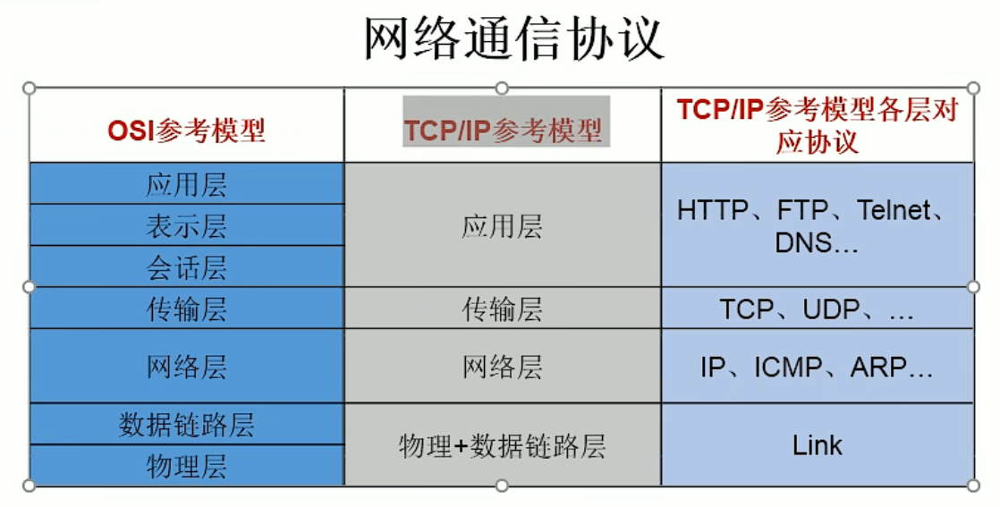

## 网络编程

直接或者间接地通过网络协议与其他计算机实现数据交换，进行通讯

### 网络通信要素

网络编程中的两个要素：

- IP和端口号

- 提供网络通信协议



### InetAddress

- 唯一标识Internet上的计算机，用于表示IP地址

- IP分类：IPv4和IPv6

- 域名：例如www.baidu.com、www.jd.com

- **本机IP：127.0.01 / 本机域名：localhost**

- 端口号：正在计算机上运行的进程，不同进程有不同端口号，范围：一个16位的整数0-65535

- 端口号和IP地址组合就得出一个网络套接字：**Socket**

#### 实例化InetAddress

- 通过getByName(String host) / getLocalHost()方法
  
  ```java
  public class InetAddressTest {
      public static void main(String[] args) {
          try {
              InetAddress address1 = InetAddress.getByName("192.168.34.1");
              InetAddress address2 = InetAddress.getByName("www.baidu.com");
              System.out.println("IP:" + address1);
              System.out.println("域名:" + address2);
  
              // 本机地址
              InetAddress localHost = InetAddress.getLocalHost();
              System.out.println("本机地址：" + localHost);
          } catch (UnknownHostException e) {
              e.printStackTrace();
          }
      }
  }
  ```

### 常用方法

- getHostName()方法
  
  ```java
      @Test
      public void test1(){
          try {
              InetAddress address = InetAddress.getByName("www.baidu.com");
              System.out.println("域名：" + address.getHostName());
          } catch (UnknownHostException e) {
              e.printStackTrace();
          }
      }
  ```

- getHostAddress()方法
  
  ```java
      @Test
      public void test2(){
          try {
              InetAddress address = InetAddress.getByName("www.baidu.com");
              System.out.println("IP：" + address.getHostAddress());
          } catch (UnknownHostException e) {
              e.printStackTrace();
          }
      }
  ```

### TCP/IP协议

- 传输控制协议TCP（Transmission Control Protocol）

- 用户数据报协议UDP（User Datagram Protocol）

#### TCP协议

- 使用TCP协议前，需要建立TCP连接，形成传输数据通道

- 传输前，采用“**三次握手**”方式，点对点通信，**是可靠的**

- TCP协议进行通信的两个应用进程：客户端、服务端

- 在链接中可以进行大数据量的传输

- **传输完毕，需要释放已经建立的连接，但是效率较低**

- 例如：打电话

#### UDP协议

- 将数据、源、目的封装成数据包，不需要建立连接

- 每个数据包的大小限制在64K内

- 发送不管对方是否准备好，接收方收到也不确定，**是不可靠的**

- 可以广播发送

- **发送数据结束时无需释放资源，开销小，速度快**

- 例如：发送短信

### TCP网络编程

- 客户端需要使用new Socket()获取服务端的连接，并指明IP地址和端口

- 服务端需要使用new ServerSocket()指明服务端的端口号
  
  - 使用accept()方法等待客户端连接，获取客户端的Socket

- 当有多个流操作时，需要使用shutdownOutput() / shutdownInput()

### TCP网络编程例子

#### 例子1

```java
// 实现：客户端发送信息给服务端，服务端将信息显示到控制台上
public class TCPTest1 {

    // 客户端
    @Test
    public void client(){
        Socket socket = null;
        OutputStream outputStream = null;
        try {
            // 1. 创建Socket对象，指明服务器端的IP和端口
            InetAddress address = InetAddress.getByName("127.0.0.1");
            socket = new Socket(address, 8888);

            // 2. 发送信息
            outputStream = socket.getOutputStream();
            outputStream.write("客户端发送的数据".getBytes());
        } catch (IOException e) {
            e.printStackTrace();
        } finally {
            // 3. 资源关闭
            if (outputStream != null){
                try {
                    outputStream.close();
                } catch (IOException e) {
                    e.printStackTrace();
                }
            }

            if (socket != null){
                try {
                    socket.close();
                } catch (IOException e) {
                    e.printStackTrace();
                }
            }
        }
    }

    // 服务端
    @Test
    public void server(){
        ServerSocket serverSocket = null;
        Socket socket = null;
        InputStream inputStream = null;
        ByteArrayOutputStream byteArrayOutputStream = null;
        try {
            // 1. 创建服务端的Socket，指明自己的端口号
            serverSocket = new ServerSocket(8888);

            // 2. 接收客户端的Socket
            socket = serverSocket.accept();

            System.out.println("客户端：" + socket.getInetAddress().getHostAddress() + "发送的数据");

            // 3. 获取客户端发送的信息
            inputStream = socket.getInputStream();

            //这种方式可能出现乱码
            //byte[] bytes = new byte[1024];
            //int len;
            //while ((len = inputStream.read(bytes)) != -1){
            //    System.out.print(new String(bytes, 0, len));
            //}

            byteArrayOutputStream = new ByteArrayOutputStream();
            byte[] bytes = new byte[1024];
            int len;
            while ((len = inputStream.read(bytes)) != -1){
               byteArrayOutputStream.write(bytes, 0, len);
            }

            System.out.println(byteArrayOutputStream.toString());
        } catch (IOException e) {
            e.printStackTrace();
        } finally {
            // 4. 关闭资源
            if (byteArrayOutputStream != null){
                try {
                    byteArrayOutputStream.close();
                } catch (IOException e) {
                    e.printStackTrace();
                }
            }
            if (inputStream != null){
                try {
                    inputStream.close();
                } catch (IOException e) {
                    e.printStackTrace();
                }
            }
            if (socket != null){
                try {
                    socket.close();
                } catch (IOException e) {
                    e.printStackTrace();
                }
            }
            if (serverSocket != null){
                try {
                    serverSocket.close();
                } catch (IOException e) {
                    e.printStackTrace();
                }
            }
        }
    }
}
```

#### 例子2

```java
// 客户端发送文件给服务端，服务端保存文件
public class TCPTest2 {
    @Test
    public void client(){
        Socket socket = null;
        OutputStream outputStream = null;
        FileInputStream fileInputStream = null;
        try {
            InetAddress address = InetAddress.getByName("127.0.0.1");
            socket = new Socket(address, 8889);

            outputStream = socket.getOutputStream();
            fileInputStream = new FileInputStream("image.jpg");

            byte[] bytes = new byte[1024];
            int len;
            while ((len = fileInputStream.read(bytes)) != -1){
                outputStream.write(bytes, 0, len);
            }
        } catch (IOException e) {
            e.printStackTrace();
        } finally {
            if (fileInputStream != null){
                try {
                    fileInputStream.close();
                } catch (IOException e) {
                    e.printStackTrace();
                }
            }
            if (outputStream != null){
                try {
                    outputStream.close();
                } catch (IOException e) {
                    e.printStackTrace();
                }
            }
            if (socket != null){
                try {
                    socket.close();
                } catch (IOException e) {
                    e.printStackTrace();
                }
            }
        }
    }

    @Test
    public void server(){
        ServerSocket serverSocket = null;
        Socket socket = null;
        InputStream inputStream = null;
        FileOutputStream fileOutputStream = null;
        try {
            serverSocket = new ServerSocket(8889);
            socket = serverSocket.accept();

            inputStream = socket.getInputStream();
            fileOutputStream = new FileOutputStream("clientSendImage.jpg");

            byte[] bytes = new byte[1024];
            int len;
            while ((len = inputStream.read(bytes)) != -1){
                fileOutputStream.write(bytes, 0, len);
            }
        } catch (IOException e) {
            e.printStackTrace();
        } finally {
            if (fileOutputStream != null){
                try {
                    fileOutputStream.close();
                } catch (IOException e) {
                    e.printStackTrace();
                }
            }
            if (inputStream != null){
                try {
                    inputStream.close();
                } catch (IOException e) {
                    e.printStackTrace();
                }
            }
            if (socket != null){
                try {
                    socket.close();
                } catch (IOException e) {
                    e.printStackTrace();
                }
            }
            if (serverSocket != null){
                try {
                    serverSocket.close();
                } catch (IOException e) {
                    e.printStackTrace();
                }
            }
        }
    }
}
```

#### 例子3

```java
// 客户端发送文件给服务端，服务端保存到本地，并返回“发送成功”给客户端，并关闭相应的连接
public class TCPTest3 {
    @Test
    public void client(){
        Socket socket = null;
        OutputStream outputStream = null;
        FileInputStream fileInputStream = null;
        InputStream inputStream = null;
        ByteArrayOutputStream byteArrayOutputStream = null;
        try {
            InetAddress address = InetAddress.getByName("127.0.0.1");
            socket = new Socket(address, 8890);

            outputStream = socket.getOutputStream();
            fileInputStream = new FileInputStream("image.jpg");

            byte[] bytes = new byte[1024];
            int len;
            while ((len = fileInputStream.read(bytes)) != -1){
                outputStream.write(bytes, 0, len);
            }

            // 关闭数据的输出
            socket.shutdownOutput();

            // 接收服务端返回得数据，并显示到控制台上
            inputStream = socket.getInputStream();
            byteArrayOutputStream = new ByteArrayOutputStream();
            byte[] bytes1 = new byte[1024];
            int len1;
            while ((len1 = inputStream.read(bytes1)) != -1){
                byteArrayOutputStream.write(bytes1, 0, len1);
            }

            System.out.println(byteArrayOutputStream.toString());
        } catch (IOException e) {
            e.printStackTrace();
        } finally {
            if (byteArrayOutputStream != null){
                try {
                    byteArrayOutputStream.close();
                } catch (IOException e) {
                    e.printStackTrace();
                }
            }
            if (inputStream != null){
                try {
                    inputStream.close();
                } catch (IOException e) {
                    e.printStackTrace();
                }
            }
            if (fileInputStream != null){
                try {
                    fileInputStream.close();
                } catch (IOException e) {
                    e.printStackTrace();
                }
            }
            if (outputStream != null){
                try {
                    outputStream.close();
                } catch (IOException e) {
                    e.printStackTrace();
                }
            }
            if (socket != null){
                try {
                    socket.close();
                } catch (IOException e) {
                    e.printStackTrace();
                }
            }
        }
    }

    @Test
    public void server(){
        ServerSocket serverSocket = null;
        Socket socket = null;
        InputStream inputStream = null;
        FileOutputStream fileOutputStream = null;
        OutputStream outputStream = null;
        try {
            serverSocket = new ServerSocket(8890);
            socket = serverSocket.accept();

            inputStream = socket.getInputStream();
            fileOutputStream = new FileOutputStream("clientSendImage2.jpg");

            byte[] bytes = new byte[1024];
            int len;
            while ((len = inputStream.read(bytes)) != -1){
                fileOutputStream.write(bytes, 0, len);
            }

            // 返回数据给客户端
            outputStream = socket.getOutputStream();
            outputStream.write("发送成功".getBytes());


        } catch (IOException e) {
            e.printStackTrace();
        } finally {
            if (outputStream != null){
                try {
                    outputStream.close();
                } catch (IOException e) {
                    e.printStackTrace();
                }
            }

            if (fileOutputStream != null){
                try {
                    fileOutputStream.close();
                } catch (IOException e) {
                    e.printStackTrace();
                }
            }
            if (inputStream != null){
                try {
                    inputStream.close();
                } catch (IOException e) {
                    e.printStackTrace();
                }
            }
            if (socket != null){
                try {
                    socket.close();
                } catch (IOException e) {
                    e.printStackTrace();
                }
            }
            if (serverSocket != null){
                try {
                    serverSocket.close();
                } catch (IOException e) {
                    e.printStackTrace();
                }
            }
        }
    }
}
```

### UDP网络编程

- 使用DatagramSocket和DatagramPacket实现基于UDP协议的网络程序

- UDP数据包通过数据包套接字DatagramSocket发送和接收，**不保证一定能够安全送到目的地，也不确定什么时候可以到达**

- DatagramPacket对象封装了UDP数据包，数据包中包含了发送端的IP地址和端口号以及接收端的IP地址和端口号

```java
public class UDPTest1 {
    // 发送端
    @Test
    public void send() throws IOException {
        DatagramSocket socket = new DatagramSocket();

        // 指明发送的数据包、接收方的Ip地址和端口号
        byte[] data = "使用UDP方式发送的信息".getBytes();
        InetAddress address = InetAddress.getLocalHost();
        DatagramPacket packet = new DatagramPacket(data, 0, data.length, address, 9000);

        socket.send(packet);

        if (socket != null){
            socket.close();
        }
    }

    // 接收端
    @Test
    public void receiver() throws IOException {
        // 指明接收端的端口号
        DatagramSocket socket = new DatagramSocket(9000);

        byte[] bytes = new byte[1024];
        DatagramPacket packet = new DatagramPacket(bytes, 0, bytes.length);
        socket.receive(packet);

        String data = new String(packet.getData(), 0, packet.getLength());
        System.out.println(data);
    }
}
```

### URL编程

- URL：统一资源定位符，表示Internet上某一个资源的地址

- URL基本结构由五个部分组成：
  
  - <传输协议>://<主机名>:<端口号>/<文件名>#片段名?参数列表
  
  - 例如：http://192.168.1.100:8080/index.html#a?username=张三&password=123
  
  ```java
  public class URLTest {
      public static void main(String[] args) throws MalformedURLException {
          URL url = new URL("http://localhost:80/index.php");
  
          // 获取该URL的协议名：getProtocol()
          System.out.println(url.getProtocol());
          // 获取该URL的主机名: getHost()
          System.out.println(url.getHost());
          // 获取该URL的端口号：getPort()
          System.out.println(url.getPort());
          // 获取该URL的文件路径: getPath()
          System.out.println(url.getPath());
          // 获取该URL的文件名: getFile()
          System.out.println(url.getFile());
          // 获取该URL的查询名
          System.out.println(url.getQuery());
      }
  }
  ```

#### URL网络编程实现数据下载

```java
public class URLTest2 {
    public static void main(String[] args) {
        HttpURLConnection urlConnection = null;
        InputStream inputStream = null;
        FileOutputStream fileOutputStream = null;
        try {
            URL url = new URL("http://localhost:80/index.php");
            urlConnection = (HttpURLConnection) url.openConnection();
            // 获取URL连接
            urlConnection.connect();

            inputStream = urlConnection.getInputStream();
            fileOutputStream = new FileOutputStream("network\\urlCopyFile.php");
            byte[] bytes = new byte[1024];
            int len;
            while ((len = inputStream.read(bytes)) != -1){
                fileOutputStream.write(bytes, 0, len);
            }

            System.out.println("下载完成");
        } catch (IOException e) {
            e.printStackTrace();
        } finally {
            // 关闭连接
            if (fileOutputStream != null){
                try {
                    fileOutputStream.close();
                } catch (IOException e) {
                    e.printStackTrace();
                }
            }
            if (inputStream != null){
                try {
                    inputStream.close();
                } catch (IOException e) {
                    e.printStackTrace();
                }
            }
            if (urlConnection != null){
                urlConnection.disconnect();
            }
        }
    }
}
```
