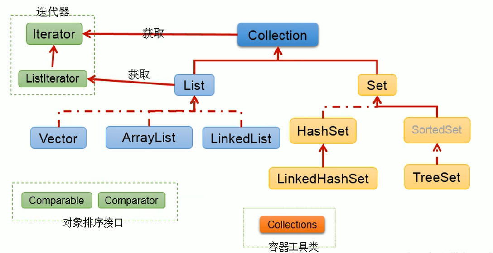
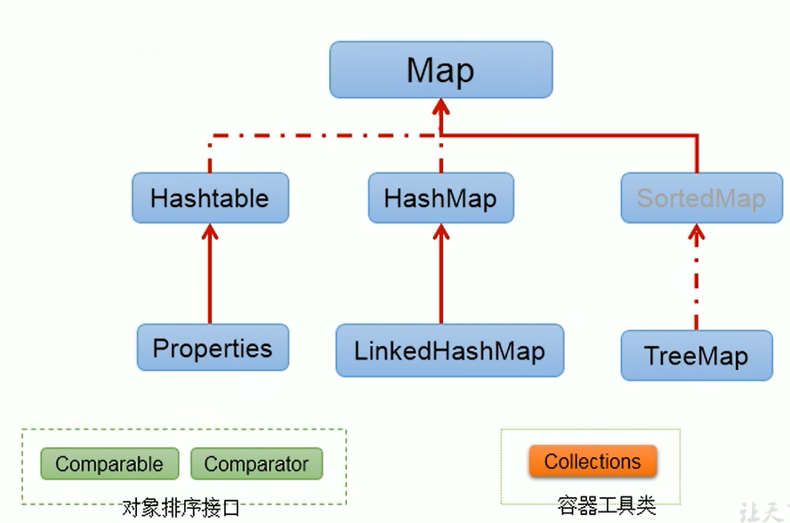
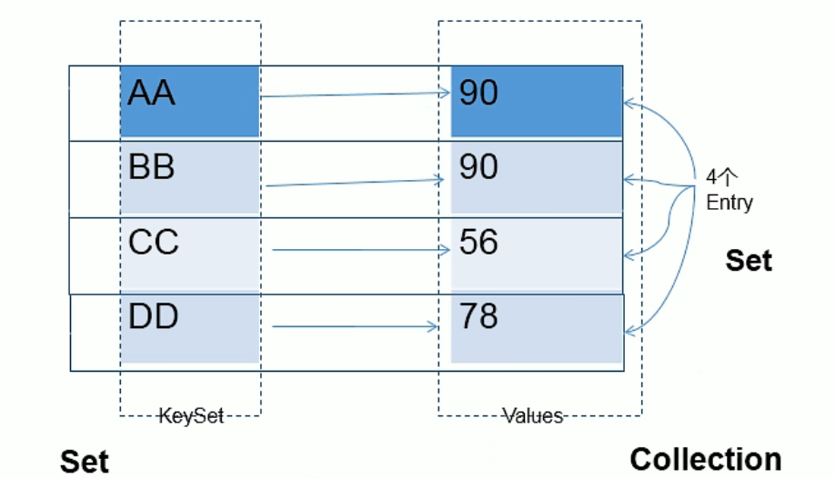
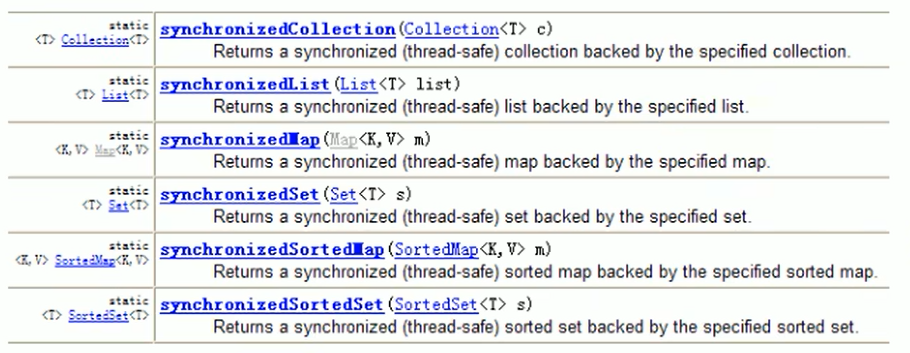

## 集合

面向对象语言对事务的体现都是以对象的形式，为了方法对多个对象的操作，就要对对象进行存储

另一方面，**使用Array存储对象具有一些弊端**

Java集合就像一种容器，可以动态地把多个对象的引用放入到容器中

### 数组的特点和弊端

特点：

- 数组初始化后，长度就确定了

- 数组声明的类型，决定了元素初始化时的类型

弊端：

- 数组初始化后，长度就不能变了，不便于扩展

- 数组提供的属性和方法少，不便于其他操作，且效率不高，同时无法直接获取存储元素的个数

- 数组存储的数据是有序、可重复的 ---> 存储数据的特点单一

### 集合的特点

- Java集合类可以用于存储数量不等的多个对象

- 可以用于保存具有映射关系的关联数组

### 集合中的API

Java集合可以分为Collection和Map两种体系：

- Collection接口：单列数据，定义了存储一组对象的方法集合
  
  - List接口：元素有序、可重复的集合【动态数组】
  
  - Set接口：元素无序、不可重复的集合

- Map接口：双列数据，保存具有映射关系“key-value”的集合

### Collection接口



#### Collection接口的方法使用

##### 1、add(E e)方法

- 添加元素到容器中
  
  ```java
      Collection coll = new ArrayList();
      coll.add("AA");
      coll.add("BB");
      coll.add("CC");
      coll.add(11);
  ```

##### 2、size()方法

- 获取集合长度

- 没有元素则为0
  
  ```java
      Collection coll = new ArrayList();
      coll.add("AA");
      coll.add("BB");
      coll.add("CC");
      System.out.println("长度：" + coll.size()); // 3
  ```

##### 3、addAll()方法

- 将集合中的元素添加到当前集合中
  
  ```java
      @Test
      public void test2(){
          Collection coll = new ArrayList();
          coll.add("AA");
          Collection coll2 = new ArrayList();
          coll2.add("BB");
          coll2.add("CC");
          coll.addAll(coll2);
          System.out.println(coll); // [AA, BB, CC]
      }
  ```

##### 4、isEmpty()方法

- 判断当前集合是否为空
  
  ```java
      @Test
      public void test3(){
          Collection coll = new ArrayList();
          coll.add("AA");
          System.out.println("当前集合是否为空：" + coll.isEmpty()); // false
      }
  ```

##### 5、clear()方法

- 清空集合元素
  
  ```java
      @Test
      public void test4(){
          Collection coll = new ArrayList();
          coll.add("AA");
          coll.clear();
          System.out.println(coll); // []
      }
  ```

##### 6、contains(Object obj)方法

- 通过equals方法判断当前集合中是否包含obj
  
  ```java
      public void test5(){
          Collection coll = new ArrayList();
          coll.add("AA");
          coll.add("BB");
          System.out.println("是否包含AA：" + coll.contains("AA")); // true
      }
  ```

##### 7、containsAll(Collection c)方法

- 通过元素的equals方法来判断形参中的所有元素是否都存在于当前集合中
  
  ```java
      @Test
      public void test6(){
          Collection coll = new ArrayList();
          coll.add("AA");
          coll.add("BB");
          Collection coll2 = new ArrayList();
          coll2.add("AA");
          coll2.add("CC");
          System.out.println("是否所有元素相等：" + coll.containsAll(coll2)); // false
      }
  ```

##### 8、remove(Object obj)方法

- 通过元素的equals方法判断是否是要删除的元素，只会删除找到的第一个元素
  
  ```java
      @Test
      public void test1(){
          Collection collection = new ArrayList();
          collection.add("AA");
          collection.add("BB");
          collection.add("CC");
          collection.add("BB");
          collection.remove("BB");
          System.out.println(collection); // [AA, CC, BB]
      }
  ```

##### 9、removeAll(Collection c)方法

- 从当前集合中移除c中的所有元素
  
  ```java
      @Test
      public void test2(){
          Collection collection = new ArrayList();
          collection.add("AA");
          collection.add("BB");
          collection.add("CC");
          collection.add("BB");
          Collection collection2 = new ArrayList();
          collection2.add("BB");
          collection2.add("CC");
          collection.removeAll(collection2);
          System.out.println(collection); // [AA]
      }
  ```

##### 10、retainAll(Collection c)方法

- 把交集的结果存在当前集合中
  
  ```java
      @Test
      public void test3(){
          Collection collection = new ArrayList();
          collection.add("AA");
          collection.add("BB");
          collection.add("CC");
          collection.add("BB");
          Collection collection2 = new ArrayList();
          collection2.add("BB");
          collection2.add("CC");
          collection.retainAll(collection2);
          System.out.println(collection); // [BB, CC, BB]
      }
  ```

##### 11、equals(Object obj)方法

- 判断当前集合和形参是否相等
  
  ```java
      @Test
      public void test4(){
          Collection collection = new ArrayList();
          collection.add("AA");
          collection.add("BB");
          Collection collection2 = new ArrayList();
          collection2.add("AA");
          collection2.add("BB");
          System.out.println("集合是否相等：" + collection.equals(collection2));
      }
  ```

##### 12、toArray()方法

- 转换成对象数组
  
  ```java
      @Test
      public void test1(){
          Collection coll = new ArrayList();
          coll.add("AA");
          coll.add("BB");
          System.out.println("集合转换成数组：" + Arrays.toString(coll.toArray())); // [AA, BB]
      }
  ```

##### 13、hashCode()方法

- 获取集合对象的哈希值
  
  ```java
      @Test
      public void test2(){
          Collection coll = new ArrayList();
          coll.add("AA");
          coll.add("BB");
          System.out.println("当前集合哈希值：" + coll.hashCode()); // 67553
      }
  ```

##### 14、iterator()方法

- 返回iterator对象（称为迭代器，设计模式的一种），用于集合遍历

- hasNext()方法：判断是否还有下一个元素

- next()方法：指针下移，将下移后集合位置上的元素返回

- remove()方法：删除集合中的元素
  
  ```java
  public class IteratorTest {
      public static void main(String[] args) {
          Collection collection = new ArrayList();
          collection.add("AA");
          collection.add("BB");
          collection.add("CC");
          collection.add("DD");
  
          Iterator iterator = collection.iterator();
          while (iterator.hasNext()){
              Object obj = iterator.next();
              System.out.println(obj);
              if (obj.equals("AA")){
                  iterator.remove();
              }
          }
          System.out.println(collection); // [BB, CC, DD]
      }
  }
  ```

##### 使用增加for（即foreach）遍历集合

- 内部仍然调用了迭代器
  
  ```java
  public class ForTest {
      public static void main(String[] args) {
          Collection collection = new ArrayList();
          collection.add("AA");
          collection.add("BB");
          collection.add("CC");
          collection.add("DD");
  
          for (Object o : collection) {
              System.out.println(o);
          }
      }
  }
  ```

#### List接口

- 元素有序、且可重复的

- 集合中每个元素都有其对应的顺序索引

- 用于替换原有的数组

- List接口的实现类：ArrayList、LinkedList和Vector

##### ArrayList、LinkedList和Vector对比

- 相同：三个类都实现了List接口，存储数据特点相同：存储有序、可重复的数据

- 不同：
  
  - ArrayList：List接口的主要实现类，线程不安全，效率高，底层使用顺序存储
  
  - LinkedList：底层使用双向链表，对于频繁的插入、删除操作效率比ArrayList高
  
  - Vector：List接口的古老实现类，线程安全，效率不高，底层使用顺序存储

##### ArrayList源码分析

- JDK 7的源码分析：
  
  - ArrayList list = new ArrayList(); //底层创建了长度为10的Object[] elementData
  
  - list.add(123); //elementData[0] = new Integer(123);
  
  - list.add(11); //如果此次的添加导致底层elementData数组的容量不够，则扩容。默认情况下，扩容为原来容量的1.5倍，同时需要讲原有数组中的数据复制到新的数组中

- JDK 8的源码分析：
  
  - ArrayList list = new ArrayList(); //底层Object[] elementData = {}，并没有创建长度为10的数组
  
  - list.add(123); //第一次调用add()时，底层才创建了长度为10的数组，并将数据123添加到elementData[0]中
  
  - 后续的添加和扩容操作和JDK 7一样

##### LinkedList源码分析

- LinkedList list = new LinkedList(); //内部声明了Node类型的first和last属，默认值为null

- list.add(123); //将123封装到Node中，创建了Node对象

- 其中，Node定义为：
  
  ```java
  private static class Node<E>{
      E item;
      Node<E> next;
      Node<E> prev;
  
      Node(Node<E> prev, E element, Node<E> next){
          this.item = element;
          this.next = next;
          this.prev = prev;
      }
  }
  ```

##### List接口方法

###### 1、add(int index, Object ele)方法

- 在index位置插入元素
  
  ```java
      @Test
      public void test1(){
          ArrayList list = new ArrayList();
          list.add("AA");
          list.add("BB");
          list.add("CC");
          list.add(1, "DD");
          System.out.println(list); // [AA, DD, BB, CC]
      }
  ```

###### 2、addAll(int index, Collection eles)方法

- 从index位置开始将eles中的所有元素添加进来
  
  ```java
      @Test
      public void test2(){
          ArrayList list = new ArrayList();
          list.add("AA");
          list.add("BB");
          list.add("CC");
  
          List asList = Arrays.asList("DD", "EE");
          list.addAll(2, asList);
          System.out.println(list); // [AA, BB, DD, EE, CC]
      }
  ```

###### 3、get(int index)方法

- 获取指定index位置的元素
  
  ```java
      @Test
      public void test3(){
          ArrayList list = new ArrayList();
          list.add("AA");
          list.add("BB");
          list.add("CC");
          System.out.println("获取指定位置的元素：" + list.get(2)); // CC
      }
  ```

###### 4、indexOf(Object obj)方法

- 返回obj在集合中首次出现的位置

- 没有则返回-1
  
  ```java
      @Test
      public void test4(){
          ArrayList list = new ArrayList();
          list.add("AA");
          list.add("BB");
          list.add("CC");
          list.add("BB");
          System.out.println("获取首次出现的位置：" + list.indexOf("BB")); // 1
      }
  ```

###### 5、lastIndexOf()方法

- 返回obj在当前集合中末次出现的位置
  
  ```java
      @Test
      public void test5(){
          ArrayList list = new ArrayList();
          list.add("AA");
          list.add("BB");
          list.add("CC");
          list.add("BB");
          System.out.println("获取末次出现的位置：" + list.lastIndexOf("BB")); // 3
      }
  ```

###### 6、remove(int index)方法

- 移除指定index位置的元素，并返回此元素
  
  ```java
      @Test
      public void test6(){
          ArrayList list = new ArrayList();
          list.add("AA");
          list.add("BB");
          list.add("CC");
          list.add("BB");
  
          list.remove(2);
  
          System.out.println(list); // [AA, BB, BB]
      }
  ```

###### 7、set(int index, Object ele)方法

- 设置指定index位置的元素为ele
  
  ```java
      @Test
      public void test7(){
          ArrayList list = new ArrayList();
          list.add("AA");
          list.add("BB");
          list.add("CC");
          list.add("BB");
  
          list.set(2, "DD");
  
          System.out.println(list); // [AA, BB, DD, BB]
      }
  ```

###### 8、subList(int fromIndex, int toIndex)方法

- 返回从fromIndex到toIndex位置的子集合
  
  ```java
      @Test
      public void test8(){
          ArrayList list = new ArrayList();
          list.add("AA");
          list.add("BB");
          list.add("CC");
          list.add("BB");
          System.out.println("获取指定返回的子集：" + list.subList(1, list.size()));
      }
  ```

#### Set接口

存储无序、不可重复的数据

Set接口中没有额外定义新的方法，使用得都是Collection中声明的方法

##### HashSet、LinkedHashSet、TreeSet对比

- HashSet：Set接口的主要实现类，线程不安全，可以存储null值
  
  - LinkedHashSet：HashSet的子类，遍历其内部数据时，可以按照添加的顺序遍历

- TreeSet：底层结构使用红黑树，可以按照添加对象的指定属性，进行排序

##### 无序和不可重复

- 无序性：不等于随机性，以HashSet为例，存储的数据在底层数组中并非按照数组索引的顺序添加，而是根据数据的哈希值决定

- 不可重复性：保证添加的元素eqia;s()判断时，不能返回true，即相同的元素只能添加一个

**要求1：向Set中添加的数据，其所在的类一定要重写hashCode()和equals()方法**

**要求2：重写的hashCode()和equals()尽可能保持一致性，即相等的对象必须具有相等的散列码**

##### LinkedHashSet的使用

LinkedHashSet作为HashSet的子类，在添加数据的同时，每个数据还维护了两个引用，用于记录此数据的前一个数据和后一个数据

优点：对于频繁的遍历操作，LinkedHashSet效率高于HashSet

##### TreeSet的使用

在TreeSet中添加数据，要求是相同类的对象

默认按照从小到大的排序

```java
public class TreeSetTest {
    @Test
    public void test1(){
        TreeSet set = new TreeSet();
        // 报错
        //set.add(123);
        //set.add(456);
        //set.add("AA");

        set.add(1545);
        set.add(123);
        set.add(-1000);
        set.add(456);
        set.add(789);

        Iterator iterator = set.iterator();
        while (iterator.hasNext()){
            System.out.println(iterator.next());
        }

    }
}
```


##### TreeSet的两种排序

- 自然排序：比较两个对象是否相等的标准为：compareTo()返回0，不再是equals()

- 定制排序

### Map接口



双列数据，存储key-value对的数据

#### HashMap、LinkedHashMap、TreeMap、Hashtable和Properties对比

- HashMap：作为Map的主要实现类，线程不安全，效率高，可以存储null的key和value
  
  - LinkedHashMap：保证在遍历map元素时，可以按照添加的顺序实现遍历
    
    - 原因：在原有的HashMap的底层基础上添加了一对指针，指向前一个和后一个元素
    
    - 对于频繁的遍历操作，执行的效率高于HashMap

- TreeMap：保证按照添加的key-value进行排序，实现排序遍历
  
  - 按照key的自然排序或者定制排序
  
  - 底层使用红黑树

- Hashtable：作为古老的实现类，线程安全，效率低，不能存储null的key和value
  
  - Properties：常用来处理配置文件，key和value都是String类型

#### Map存储的key-value特点



- Map中的key：无序、不可重复，使用的是Set存储所有的key ---> key所在的类要重写equals()和hashCode()方法（以HashMap为例）

- Map中的value：无序、可重复的，使用Collection存储所有的value ---> value所在的类要重写equals()方法

- 一个键值对key-value构成了一个Entry对象

- Map中的entry：无序、不可重复，使用Set存储所有的entry

#### HashMap的底层实现

- JDK 7：
  
  - HashMap map = new HashMap(); // 实例化后，底层创建了长度16的一维数组Entry[] table
  
  - map.put(key1, value1); // 首先，调用key1所在类hashCode)方法计算的哈希值，得到Entry数组中存方法的位置
    
    - 如果此位置上的数据为空，则value1添加成功
    
    - 如果此位置上的数据不为空，则意味着此位置上存在一个或多个数据（链表形式存在），则比较key1和已经存在的一个或多个数据的哈希值：
      
      - 如果key1的哈希值和已经存在的数据哈希值不相同，则value1添加成功
      
      - 如果key1的哈希值和已经存在的数据（key2-value2）哈希值相同，则调用key1所在的equals(key2)方法
        
        - 如果equals()返回false，则value1添加成功
        
        - 如果equals()返回true，则使用value1替换掉value2
  
  - 默认扩容方式：扩容为原来容量的2倍，将原有的数据到复制过来

- JDK 8：
  
  - HashMap map = new HashMap(); // 底层么有创建一个长度为16的数组
  
  - JDK 8底层的数据是：Node[]，不是Entry[]
  
  - 首次调用put()方法时，底层创建长度为16的数组
  
  - JDK 7底层结构是：数组 + 链表的结构，JDK 8底层结构是：数组 + 链表 + 红黑树的结构
    
    - 当数组的某个索引位置上的元素以链表形式存在的数据个数 > 8，且当前数组的长度 > 64时。此时这个索引位置上的所有数据改为使用红黑树存储

#### Map常用方法

##### 1、put(Object key, Object value)方法

- 将指定key-value添加（或修改）到当前Map对象中
  
  ```java
      @Test
      public void test1(){
          Map map = new HashMap();
          map.put("name", "张三");
          System.out.println(map); // {name=张三}
      }
  ```

##### 2、putAll(Map m)方法

- 将m中所有的key-value存放到当前的Map中
  
  ```java
      @Test
      public void test2(){
          Map map1 = new HashMap();
          map1.put("name", "张三");
  
          Map map2 = new HashMap();
          map2.putAll(map1);
          System.out.println(map2); // {name=张三}
      }
  ```

##### 3、remove(Object key)方法

- 移除指定key的key-value，并返回value
  
  ```java
      @Test
      public void test3(){
          Map map = new HashMap();
          map.put("name", "张三");
          map.remove("name");
          System.out.println(map); // {}
      }
  ```

##### 4、clear()方法

- 清空当前map中所有的数据
  
  ```java
      @Test
      public void test4(){
          Map map = new HashMap();
          map.put("name", "张三");
          map.put("age", 18);
          map.clear();
          System.out.println(map); // {}
      }
  ```

##### 5、get(Object key)方法

- 获取指定key对象的value
  
  ```java
      @Test
      public void test5(){
          Map map = new HashMap();
          map.put("name", "张三");
          map.put("age", 18);
          System.out.println("名字：" + map.get("name")); // 张三
      }
  ```

##### 6、containsKey(Object key)方法

- 是否包含指定的key
  
  ```java
      @Test
      public void test7(){
          Map map = new HashMap();
          map.put("name", "张三");
          map.put("age", 18);
          System.out.println("是否包含key：" + map.containsKey("name")); // true
      }
  ```

##### 7、containsValue(Object value)方法

- 是否包含指定的value
  
  ```java
      @Test
      public void test8(){
          Map map = new HashMap();
          map.put("name", "张三");
          map.put("age", 18);
          System.out.println("是否包含value：" + map.containsValue("张三")); // true
      }
  ```

##### 8、size()方法

- 返回map中key-value的个数
  
  ```java
      @Test
      public void test6(){
          Map map = new HashMap();
          map.put("name", "张三");
          map.put("age", 18);
          System.out.println("个数：" + map.size()); // 2
      }
  ```

##### 9、isEmpty()方法

- 判断当前map是否为空
  
  ```java
      @Test
      public void test9(){
          Map map = new HashMap();
          map.put("name", "张三");
          map.put("age", 18);
          System.out.println("是否为空：" + map.isEmpty()); // false
      }
  ```

##### 10、equals(Object obj)方法

- 判断当前map和参数对象obj是否相等
  
  ```java
      @Test
      public void test10(){
          Map map = new HashMap();
          map.put("name", "张三");
          map.put("age", 18);
  
          Map map2 = new HashMap();
          map2.put("name", "李四");
          System.out.println(map.equals(map2)); // false
      }
  ```

##### 11、keySet()方法

- 返回所有key构成的Set集合
  
  ```java
      @Test
      public void test1(){
          Map map = new HashMap();
          map.put("name", "张三");
          map.put("age", 18);
  
          Set set = map.keySet();
          Iterator iterator = set.iterator();
          while (iterator.hasNext()){
              System.out.println(iterator.next());
          }
      }
  ```

##### 12、value()方法

- 返回所有value构成的Collection集合
  
  ```java
      @Test
      public void test2(){
          Map map = new HashMap();
          map.put("name", "张三");
          map.put("age", 18);
  
          Collection values = map.values();
          for (Object value : values) {
              System.out.println(value);
          }
      }
  ```

##### 13、entrySet()方法

- 返回所有key-value构成的Set集合
  
  ```java
      @Test
      public void test3(){
          Map map = new HashMap();
          map.put("name", "张三");
          map.put("age", 18);
  
          Set set = map.entrySet();
          for (Object o : set) {
              Map.Entry entry = (Map.Entry) o;
              System.out.println("Key：" + entry.getKey() + ",Value：" + entry.getValue());
          }
      }
  ```

#### TreeMap添加方式

- 向TreeMap中添加key-value，要求key必须是由同一个类创建的对象

- 排序方式：自然排序和定制排序

#### Properties处理属性文件

- Properties类是Hashtable的子类，用于处理属性文件
  
  ```java
  public class PropertiesTest {
      public static void main(String[] args) throws IOException {
          Properties properties = new Properties();
          FileInputStream fileInputStream = new FileInputStream("jdbc.properties");
          properties.load(fileInputStream); // 加载流对应的文件
          String name = properties.getProperty("name");
          String age = properties.getProperty("age");
          System.out.println("name:" + name + ", age:" + age); // name:张三, age:18
      }
  }
  ```

#### Collections工具类

- 一个操作Set、List和Map等集合的工具类

- 提供了一系列静态方法对集合元素进行排序、查询和修改等操作

##### 常用方法

###### 1、reverse(List)方法

- 反转List中元素的顺序
  
  ```java
      @Test
      public void test1(){
          List list = new ArrayList();
          list.add(456);
          list.add(789);
          list.add(123);
          Collections.reverse(list);
          System.out.println(list); // [123, 789, 456]
      }
  ```

###### 2、shuffle(List)方法

- 对List集合元素进行随机排序
  
  ```java
      @Test
      public void test2(){
          List list = new ArrayList();
          list.add(456);
          list.add(789);
          list.add(123);
          Collections.shuffle(list);
          System.out.println(list); // [456, 123, 789]
      }
  ```

###### 3、sort(List)方法

- 根据元素的自然顺序对指定List集合元素按升序排序
  
  ```java
      @Test
      public void test3(){
          List list = new ArrayList();
          list.add(456);
          list.add(789);
          list.add(123);
          Collections.sort(list);
          System.out.println(list); // [123, 456, 789]
      }
  ```

###### 4、sort(List, Comparator)方法

- 根据指定的Comparator产生的顺序对List集合元素进行排序

###### 5、swap(List, int, int)方法

- 将指定List集合中的i处元素和j处元素进行交换
  
  ```java
      @Test
      public void test4(){
          List list = new ArrayList();
          list.add(456);
          list.add(789);
          list.add(123);
          Collections.swap(list, 1, 2);
          System.out.println(list); // [456, 123, 789]
      }
  ```

###### 6、max(Collection)方法

- 根据元素的自然排序，返回给定集合中最大元素

###### 7、max(Collection, Comparator)方法

- 根据Comparator指定的顺序，返回给定集合中最大元素

###### 8、min(Collection)方法

- 根据元素的自然排序，返回给定集合中最小元素

###### 9、min(Collection, Comparator)方法

- 根据Comparator指定的顺序，返回给定集合中最小元素

###### 10、frequency(Collection, Object)方法

- 返回指定集合中指定元素的出现次数
  
  ```java
      @Test
      public void test5(){
          List list = new ArrayList();
          list.add(456);
          list.add(789);
          list.add(123);
          list.add(123);
          list.add(123);
          int frequency = Collections.frequency(list, 123);
          System.out.println("出现次数：" + frequency); // 3
      }
  ```

###### 11、copy(List dest, List src)方法

- 将src中的内容复制到dest中
  
  ```java
      @Test
      public void test6(){
          List src = new ArrayList();
          src.add(456);
          src.add(789);
          src.add(123);
  
          List<Object> dest = Arrays.asList(new Object[src.size()]);
          Collections.copy(dest, src);
  
          System.out.println(dest);
      }
  ```

###### 12、replaceAll(List list, Object oldVal, Object newVal)方法

- 使用新值替换List对象中所有旧

##### 同步控制

- Collections类中提供了多个synchronizedXxx()方法，该方法可以将指定集合包装成线程同步的集合，从而可以解决多线程并发访问集合时线程安全的问题



```java
    @Test
    public void test7(){
        List list = new ArrayList();
        list.add(456);
        list.add(789);
        list.add(123);

        List synchronizedList = Collections.synchronizedList(list);
    }
```
