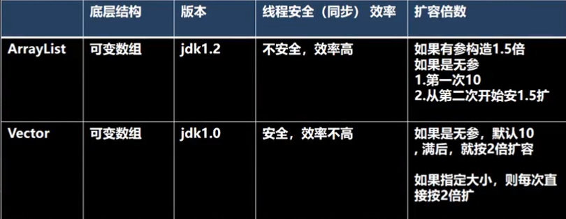
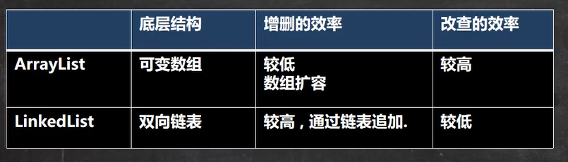

## 集合

### 数组不足

- 长度开始时必须指定，一旦指定，不能更改
- 保存的必须为同一类型的元素
- 使用数组进行增加/删除元素的示例代码比较麻烦

### 基本概念

- 可以动态保存任意多个对象，使用比较方便
- 提供了一系列方便的操作对象的方法：add、remove、set、get等
- 使用集合添加、删除新元素示意代码简洁

### 集合两大类

- 单例集合：Collection
  
  - List
    - ArrayList
    - LinkedList
    - Vector
  - Set
    - HashSet
    - TreeSet

- 双列集合：Map
  
  - HashMap
  - TreeMap
  - HashTable
  - Properties


## Collection单例集合

```java
public interface Collection<E> extends Iterable<E>
```

- 实现子类可以存放多个元素，每个元素可以是Object
- 有些Collection的实现类可以存放向洪福的元素，有些不可以
- 有些Collection的实现类是有序的，有些是无序
- Collection接口没有直接实现子类，是通过子接口Set和List实现的 

### Collection常用方法

- add：添加单个元素

```java
List list = new ArrayList();
//add：添加单个元素
list.add("add");
list.add("Test");
list.add(10);
```

- remove：删除指定元素

```java
List list = new ArrayList();
//add：添加单个元素
list.add("add");
list.add("Test");
list.add(10);
//remove：删除指定元素
list.remove(2);
list.remove("add");
```

- contains：查找元素是否存在

```java
List list = new ArrayList();
//add：添加单个元素
list.add("Test");
//contains：查找元素是否存在
System.out.println(list.contains("Test"));
```

- size：获取元素个数

```java
List list = new ArrayList();
//add：添加单个元素
list.add("Test");
//获取元素的个数
System.out.println(list.size());
```

- isEmpty：判断是否为空

```java
List list = new ArrayList();
//add：添加单个元素
list.add("Test");
//判断元素是否为空
System.out.println(list.isEmpty());
```

- clear：清空

```java
List list = new ArrayList();
//add：添加单个元素
list.add("Test");
//清空元素
list.clear();
```

- addAll：添加多个元素

```java
List list = new ArrayList();
//添加单个元素
ArrayList arrayList = new ArrayList();
arrayList.add("这是新添加的元素1");
arrayList.add("这是新添加的元素2");
//添加多个元素
list.addAll(arrayList);
System.out.println(list);
```

- containsAll：查找多个元素是否都存在

```java
List list = new ArrayList();
//添加单个元素
ArrayList arrayList = new ArrayList();
arrayList.add("这是新添加的元素1");
arrayList.add("这是新添加的元素2");
//添加多个元素
list.addAll(arrayList);
//判断多个元素是否都存在
System.out.println(list.containsAll(arrayList));
```

- removeAll：删除多个元素

```java
List list = new ArrayList();
//添加单个元素
ArrayList arrayList = new ArrayList();
arrayList.add("这是新添加的元素1");
arrayList.add("这是新添加的元素2");
//添加多个元素
list.addAll(arrayList);
//删除多个元素
list.removeAll(arrayList);
System.out.println(list    );
```

### Collection接口遍历元素

#### 方式一：使用Iterator（迭代器）

- Iterator对象称为迭代器，主要用于遍历Collection集合中的元素
- 所有实现了Collection接口的集合类都有一个iterator()方法，用以返回一个实现了Iterator接口的对象，即可以返回一个迭代器
- 仅用于遍历集合，本身并不存放对象

```java
Iterator iterator = coll.iterator();    //得到一个集合的迭代器
//hasNext();    判断是否还有下一个元素
while(iterator.hasNext()){
    //next();    1、指针下移    2、将下移以后集合位置上的元素返回
    System.out.printIn(iterator.next());
}
【提示：在调用iterator.next()方法之前必须要调用iterator.hasNext()进行检测。若不调用，且下一条记录无效，直接调用iterator.next()会抛出NoSuchElementException异常】
```

- 当退出循环Iterator迭代器指向最后的元素
- 如果需要再次遍历，需要重置迭代器

#### 方式二：for循环增强

- 增强for循环，可以代替iterator迭代器，特点：增强for就是简化版的iterator。只能用于遍历集合或数组
- 基本语法：

```java
for(元素类型 元素名:集合名或数组名){
    访问元素
}
```

### List接口

#### 基本介绍

- List集合类中元素有序（即添加顺序和取出顺序一致）、且 可重复
- List集合中的每个元素都有其对应的顺序索引，即支持索引
- List容器中的元素都对应一个整数型的序号记载其在容器中的位置，可以根据序号存储容器中的元素

#### List常用方法

- add：在index位置插入ele元素

```java
List list = new ArrayList();
list.add("Tom");
list.add("Jack");

//add：在index位置插入ele元素
list.add(1,"Mary");
System.out.println(list);
```

- addAll：在index位置开始将eles中所有元素添加进来

```java
List list = new ArrayList();
list.add("Tom");
list.add("Jack");
//addAll：在index位置开始将eles中所有元素添加进来
List list1 = new ArrayList();
list1.add("add1");list1.add("add2");
list.addAll(2,list1);
System.out.println(list);
```

- get：获取指定index位置的元素

```java
List list = new ArrayList();
list.add("Tom");
list.add("Jack");
System.out.println(list.get(1));
```

- indexOf：返回obj在集合中首次出现的位置

```java
List list = new ArrayList();
list.add("Tom");
list.add("Jack");
//返回obj在集合中首次出现的位置
System.out.println(list.indexOf("Tom"));
```

- lastIndexOf：返回obj在当前结合中末次出现的位置

```java
List list = new ArrayList();
list.add("Tom");
list.add("Jack");
list.add("Tom");
//lastIndexOf：返回obj在当前结合中末次出现的位置
System.out.println(list.indexOf("Tom"));
```

- remove：移除指定index位置的元素，并返回此元素

```java
List list = new ArrayList();
list.add("Tom");
list.add("Jack");
list.add("Tom");
//移除指定index位置的元素，并返回此元素
list.remove(1);
System.out.println(list);
```

- set：设置指定index位置的元素为ele，相当于是替换

```java
List list = new ArrayList();
list.add("Tom");
list.add("Jack");
list.add("Tom");
//设置指定index位置的元素为ele，相当于是替换
list.set(1,"替换");
System.out.println(list);
```

- subList：返回从fromIndex到toIndex位置的子集合

```java
List list = new ArrayList();
list.add("Tom");
list.add("Jack");
list.add("Tom");
//返回从fromIndex到toIndex位置的子集合
List list2 = list.subList(0,1);
System.out.println(list2);
```

#### List三种遍历方式

方式一：使用迭代器

```java
//方式一：使用iterator
List list = new ArrayList();
Iterator iterator = list.iterator();
while (iterator.hasNext()) {
    Object next = iterator.next();
    System.out.println(list);
}
```

 方式二：使用增强for

```java
//方式二：使用增强for
for (Object o : list) {
    System.out.println(list);
}
```

方式三：普通for

```java
for (int i = 0; i < list.size(); i++) {
    Object o = list.get(i);
    System.out.println(o);
}
```

#### ArrayList注意事项

- permits all elements, including null, ArrayList 可以加入null，并且多个
- ArrayList是由数组来实现数据存储的
- ArrayList基本等同于Vector，除了ArrayList是线程不安全（执行效率高），在多线程情况下，不建议使用ArrayList

#### Vector

##### 基本介绍

- Vector底层也是一个对象数组，protected Object[] elementData;
- Vector是线程同步，即线程安全，Vector类的操作方法带有Synchronized
- 在开发中，需要线程同步安全是，考虑使用Vector

##### ArrayList和Vector比较



#### LinkedList底层结构

- LinkedList底层实现了双向链表和双端队列特点
- 可以添加任意元素（元素可以重复），包括null
- 线程不安全，没有实现同步

##### LinkedList底层结构

- LinkedList底层诶胡了一个双向链表
- LinkedList中维护了两个属性firest和last分别指向首节点和尾节点
- 每个节点维护prev、next、item
  - prev：前一个节点
  - next：后一个节点
  - item：数据

##### 双向链表

Node类

```java
class Node{
    public Object item;        //存放数据
    public Node next;        //指向下一个结点
    public Node pre;        //指向上一个结点

    public Node(Object item) {
        this.item = item;
    }

    @Override
    public String toString() {
        return "Node name=" + item;
    }
}
```

##### ArrayList和LinkedList比较



- 如果改查的操作多，选择ArrayList，大部分情况下使用
- 如果增删的操作多，选择LinkedList

### Set接口

#### 基本介绍

- 无序（添加和取出的顺序不一致），没有索引
- 不循序重复元素，所有最多包含一个null
- HashSet实现了Set接口
- HashSet实际上是HashMap
- 可以存储null，但是只能是一个null
- Hash不保证元素有序，取决于hash后，在确定索引的结果
- 不能有重复元素/对象

#### 常用方法

和List接口一样，Set接口也是Collection的子接口，因此，常用方法和Collection接口一样

#### 遍历方式

- 可以使用迭代器
- 增强for
- 不能使用索引方式获取

#### Set接口实现类-HashSet

- HashSet 底层是HashMap

- 添加数据 -> 先找到hash值 -> 转成索引

- 找到存储数据表table ，看这个索引是否存在元素
  
  - 如果没有直接添加
  - 如果有，调用equals比较，如果相同，则放弃添加，如果不相同，则添加到最后

- 如果一个链表的元素个数超过8个，并且table大小 >=64，就进行树化（红黑树）

#### Set接口实现类-LinkedHashSet

- LinkedHastSet 是 HashSet的子类
- LinkedHashSet底层是一个LinkedHashMap，底层维护了一个 数组+ 双向链表
- LinkedHashSet 根据元素的hashCode 值来决定元素的存储位置，同时用链表维护元素的次序
- LinkedHashSet 不允许添加重复元素

#### Set接口实现类-TreeSet

- 使用无参构造器，创建TreeSet时，仍然是无序的
- 可以使用TreeSet提供的一个构造器，传入一个比较器（匿名内部类），制定排序规则

##### 无参构造

```java
TreeSet treeSet = new TreeSet();
```

制定规则

## Map接口

### Map特点

- Map用于保存具有映射关系的数据：key -> value
- Map中的key和value可以使任何引用类型的数据，会封装HashMap$Node对象中
- Map中的key不允许重复，如果有相同的key就相当于替换
- Map中的value可以重复
- Map的key可以为null，value也可以为null，注意key为null，只能有一个，value为null，可以多个
- 常用String类作为Map的key
- key和value之间存在单向一对一关系，即通过指定的key总能找到对应的value

### HashMap常用方法

- put：添加
- remove：根据键删除映射关系
- get：根据键获取值
- size：获取元素个数
- isEmpty：判断个数是否为0
- clear：清除
- containsKey：查找键是否存在
- KeySet：获取所有的键
- entrySet：获取所有关系
- values：获取所有的值

### 遍历方式

- 第一组：先取出所有Key，通过Key取出value
  
  - 增强for循环
  - 迭代器

- 第二组：把所有的values取出
  
  - 1、增强for循环
  - 2、迭代器

- 第三组：通过EntrySet来获取key -> value

### HashTable基本介绍

- 存放的元素是键值对
- hashtable键值都不能为null
- HashTable线程安全，HashMap线程不安全

### Properties类接口

#### 基本介绍

- Properties类继承自Hashtable类并且实现Map接口，也是使用一种键值对的形式来保存数据
- 可以用于xxx.properties文件中，加载数据到Properties类对象并进行读取和修改

### 选择集合实现类

- 先判断存储的类型（一组对象【单列】或一组键值对【双列】）

- 一组对象：Collection接口
  
  - 允许重复：List
    - 增删多：LinkedList【底层维护了一个双向链表】
    - 改查多：ArrayList【底层维护Object类型的可变数组】
  - 不允许重复：Set
    - 无序：HashSet【底层是HashMap，维护了一个哈希表，即（数组 + 链表 + 红黑树）】
    - 排序：TreeSet
    - 插入和取出顺序一致：LinkedHashSet，维护数组 + 双向链表

- 一组键值对：Map
  
  - 键无序：HashMap【底层是：哈希表（JDK7：数组 + 链表  JDK8：数组 + 链表 + 红黑树）】
  - 键排序：TreeMap
  - 键插入和取出顺序一致：LinkedHashMap
  - 读取文件：Properties

### Collections工具类

#### 基本介绍

- Collections是一个操作Set、List和Map等集合的工具类
- Collections中提供了一系列静态方法对集合元素进行排序、查询和修改等操作

#### 排序操作（static方法）：

- reverse(List)：反转List中元素的顺序
- shuffle(List)：对List集合元素进行随机排序
- sort(List)：根据元素的自然顺序对指定List集合元素按升序排序
- sort(List，Comparator)：根据指定Comparator产生的顺序对List集合元素进行排序
- swap(List，int，int)：将指定list集合中的i 处元素和j 处元素进行交换

#### 工具类：

- Object max(Collection)：根据元素的自然顺序，返回给定集合中最大元素
- Object max(Collection, Comparator)：根据Comparator指定的顺序，返回给定集合中的最大元素，返回Object
- Object min(Collection)：根据元素的自然顺序，返回给定集合中最小元素
- Object min(Collection，Comparator)：根据Comparator指定的顺序，返回给定集合中的最小元素，返回Object
- int frequency(Collection，Object)：返回指定集合中指定元素的出现次数
- Void copy(List dest，List src)：将src中的内容复制到dest中
- boolean relpaceAll(List list，Object oldVal，Object newVal)：使用新值替换List对象的是所有旧值 
